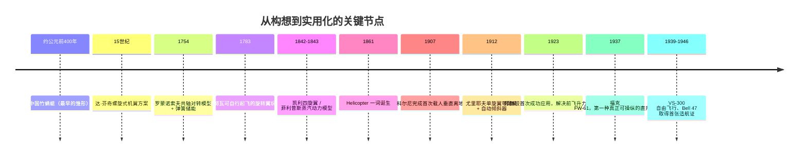
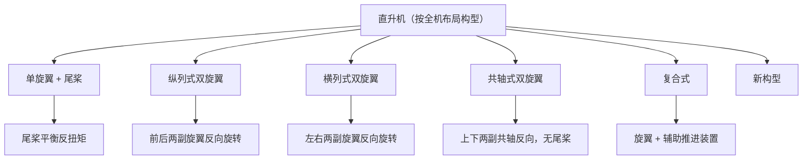
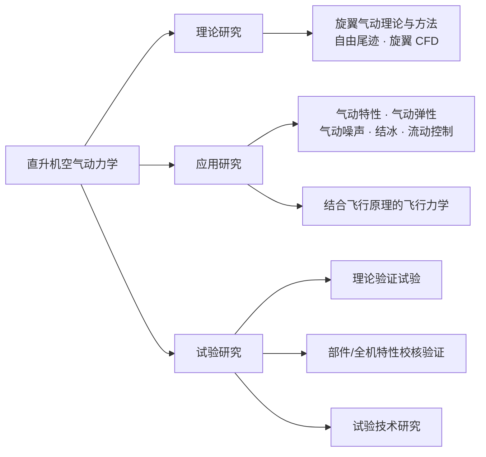

# 第 1 章 绪论

> 对应原书书内 p1–p19。
> 本章是全书的总纲：先给"直升机"下一个能用来区分其他飞行器的定义，再用发展史说明这门技术是靠什么条件成熟起来的，然后建立分类与技术代际的坐标系，最后界定"直升机空气动力学"到底研究什么。

## 本章导览

**一句话主线**：定义（是什么）→ 历史（怎么来的）→ 分类（有哪些）→ 划代与趋势（发展到哪）→ 研究内容（这门学科做什么）。

**学习目标**

| # | 目标 | 对应小节 |
|---|---|---|
| 1 | 掌握直升机的定义，能准确区分直升机与其他飞行器 | 1.1 |
| 2 | 了解直升机的常见用途 | 1.3.1 |
| 3 | 了解旋翼飞行器发展历史 | 1.2 |
| 4 | 掌握常见直升机的分类方法 | 1.3 |
| 5 | 了解直升机技术划代，掌握主要技术特征和指标 | 1.4 |
| 6 | 了解国内外直升机技术的发展趋势 | 1.5 |
| 7 | 了解国内外著名直升机型号 | 1.2 / 1.4 |

---

## 1.1 引言：什么是直升机

### 定义的三个关键特征

直升机的定义可以从三个维度拆开看，这三个维度也正好回答了"它为什么不是别的飞行器"：

| 维度 | 特征 | 由此得到的结论 |
|---|---|---|
| **功能** | 具备垂直起降、空中悬停和向任意方向飞行的能力 | 属于**垂直起降飞行器** |
| **升力来源** | 升力、牵引力与操纵力均由旋翼提供 | 属于**旋翼飞行器** |
| **动力** | 旋翼由动力系统**直接驱动**旋转，并通过变距操纵改变纵横向拉力与操纵力矩 | 与**自转旋翼机**的关键区别 |

第三点是考试中容易失分的地方：自转旋翼机的前进也依靠旋翼旋转产生升力，但旋翼是被迎面气流吹转的，没有动力直接驱动——"有没有动力直接驱动旋翼"就是分界线。

### 为什么旋翼空气动力学是全书的中心

直升机飞行所需的气动力主要来自旋翼，于是旋翼的空气动力学问题成为整个直升机技术领域中最基础、也最重要的一环。它直接决定设计者关心的这些特性：

- 飞行性能（能飞多快、多高、多远、载多重）
- 飞行载荷（桨叶与桨毂承受多大交变载荷）
- 振动（旋翼是直升机最强烈的振源）
- 稳定性与飞行品质（操纵好不好用）
- 噪声（旋翼是主要噪声源）

本书的写法是：以**旋翼空气动力学特征与分析方法**为主体，同时兼顾全机气动问题。书中方法虽以旋翼气动力为对象，但其思想可以直接迁移到螺旋桨、旋翼机等气动部件的分析设计中；面对层出不穷的新概念旋翼飞行器，灵活运用这些理论本身也会催生新的成果。

---

## 1.2 直升机发展简史

这一节表面上在讲人物和年份，实际在讲**技术条件的成熟曲线**：直升机的诞生卡在两个前置条件上——必须有**足够强大的动力装置**，还必须有**有效的稳定与操纵机构**。哪一步缺失，飞行器就停在原地。

### 1.2.1 古代起源

- **竹蜻蜓**（约公元前 400 年，中国）：目前公认的直升机最早雏形，直到 14 世纪才传入欧洲，给西方科学家重要启发。
  - 工作方式：快速旋转把空气向下推，靠空气的**反作用力**获得升力，实现短暂爬升或悬停。
  - 两处局限值得记住：① 能量全部来自手掌给出的转动动能，转速衰减很快，升力随之下降，所以飞行时间短；② 让它前倾尝试前飞时，**总是向固定一侧倾倒**，无法稳定前飞——这个现象的机理要到第 2 章才讲清。
- **达·芬奇的直升机方案**（15 世纪）：把螺旋式机翼装在一根垂直轴上，转动此轴把空气向下推以获得升力。方案的外形与现代直升机相去甚远，但**指出了正确的思维方向**。2019 年美国直升机协会的学生设计竞赛以此为题目，多支队伍证明该方案在原理上可行。

时间尺度上要有概念：真正的可控飞行要到 **20 世纪 30 年代**，成批生产与实际使用要到 **20 世纪 40 年代中期**。

### 1.2.2 18 世纪：模型探索——科学的探索手段

| 年份 | 人物 | 做法 | 意义 |
|---|---|---|---|
| 1754 | 罗蒙诺索夫（俄） | 把竹蜻蜓改成**共轴对转**构型，加装缠绕式弹簧储能装置驱动 | 飞得更久、更高 |
| 1783 | 洛努瓦等（法） | 火鸡羽毛制成的双螺旋桨 + 十字弓式张紧弹簧 | 可自行起飞，爬升几米 |

这两件装置在原理上留下两点关键进步：**具备了可以储能的动力系统**，以及**旋翼采用共轴对转构型**（后者直指反扭矩问题）。

### 1.2.3 19 世纪：动力与飞行原理的探索

热气球载人飞行成功后，"如何让比空气重的飞行器飞起来"分出两条技术路线：一是按竹蜻蜓的思路靠机翼旋转推动空气向下实现垂直飞行；二是像鸟一样靠高速前飞产生升力。19 世纪中叶之前，发明家大多走第一条路线。

- **乔治·凯利**（英）：1843 年设计蒸汽动力四旋翼飞行器模型，因动力不足未能飞起来。
- **菲利普斯**（英）：1842 年制成蒸汽动力、质量 0.9 kg 的模型，实现了**有发动机驱动的飞行**——相比弹簧储能跨越了一大步。
- **"Helicopter" 一词诞生**：1861 年 4 月 8 日，法国人古斯塔夫制造了一架铝制、蒸汽动力的飞行装置并如此命名，但它从未离地。
- **爱迪生**（美，19 世纪 80 年代）：用科学试验的方法研究垂直起降技术，测试了多种旋翼外形，并且尝试用电动机驱动旋翼。他得出两条判断：要获得较好的气动效率，必须采用**大直径、小桨叶面积**的旋翼（即低的旋翼实度 $\sigma = \dfrac{Nc}{\pi R}$）；要实现旋翼飞行，必须使用更强大的动力装置。

**这一世纪的结论很干脆**：大量试验证明蒸汽机无法为直升机提供充足的动力，必须更换动力装置。

### 1.2.4 20 世纪初：走向实用化飞行

| 年份 | 人物 | 构型与贡献 | 结果 |
|---|---|---|---|
| 1907 | 科尔尼（法） | 纵列式双旋翼 | 完成动力飞行器**第一次载人垂直离地飞行**；因稳定性与操纵性缺陷未能自由飞行，算不算"第一架成功飞行的直升机"存在争议 |
| 1907 | 布雷盖兄弟（法） | 首架直升机 | 短暂自由飞行；同样缺少稳定性与有效控制方法 |
| 1909 | 西科斯基（俄） | 无人驾驶共轴原型 | 振动与发动机功率不足导致失败，转而研制固定翼 |
| 1912 | 尤里耶夫（俄） | **单旋翼带尾桨**（在当时是革命性概念） | 因发动机功率不足未成功；他是最早使用尾桨、最早提出**自动倾斜器**概念的人之一 |
| 1923 | 西尔瓦（西班牙） | 首次把**挥舞铰**成功应用于旋翼 | 解决了前飞时滚转方向的升力不平衡问题 |
| 1937 | 福克（德） | **横列式双旋翼 FW-61** | 人类第一种真正可以操纵的直升机；也是第一架反复成功演示**自转着陆**的直升机 |

补两条容易忽略的线索：

- **自动倾斜器**的专利最早可追溯到 1906 年意大利工程师克罗科；尤里耶夫则是早期独立提出该概念的人之一。
- **挥舞铰**由法国人雷纳德提出，1908 年由布雷盖获得专利，直到 1923 年才由西尔瓦首次成功用于旋翼——**专利与实用之间隔了 15 年**，这个时间差很能说明当时动力与工艺的制约。

**成败的归因**：内燃机提供的强大动力，加上多种旋翼操控机构的发明，最终促成了直升机的成功可控飞行。

### 1.2.5 推广与发展

- **1939 年**，西科斯基设计的 VS-300 试飞成功；**1940 年 3 月 13 日**，改进后的 VS-300 实现自由飞行——**直升机时代正式来临**，此后单旋翼带尾桨构型被大量生产与应用。
- **1946 年**，美国贝尔公司研制的 Bell 47 取得美国政府颁发的**第一份直升机适航证**。
- **产业规模**：到 2020 年，全球民用直升机约 **26 466 架**，军用直升机约 **20 519 架**。

---

## 1.3 直升机的分类

### 1.3.1 按用途分类

**民用**的主要领域：物资运输、人员输送、搜索救援、观光游览、防火救火、空中指挥、警用警戒、巡逻控制、农林防护、资源探测、地质勘探、海上作业。

民用价值的逻辑可以归纳成三条：

1. **对起降场地要求极低**，可以部署在多种地域环境，执行点到点任务；
2. **中短途运输效率高于固定翼**——虽然速度慢，但省去了机场与地面转运环节；
3. **能低速飞行甚至悬停作业**，因此在观光、搜救、指挥、巡逻等场景不可替代。

应急救援是把这三条发挥到极致的场景：灾害环境下，直升机往往是唯一可靠的高效运输设备。三个标志性案例——1983 年山西平陆，救援部队用"**单轮悬停**"方式让直升机一侧单轮轻触船头甲板，58 名被困群众全部获救；汶川地震中，飞行员在没有平整停机坪的情况下以"**单轮着地**"方式悬停在碎石坡上开展救援；2017 年 8 月，两架直升机再次以单轮悬停救起被困江心不足 10 m² 鹅卵石堆上的 2 人。

**军用**方面，直升机发明后首先被用于军事：特种运输、对地攻击、舰载应用；具体任务包括通信中继、侦察预警、巡逻监视、战场投送、搜潜反潜、搜索救援、战术打击、特种作战。

- **战术特长**：低空机动性好、不依赖跑道，可利用地形做**贴地机动**（15 m 以下，即所谓"一树之高"）以规避雷达、红外、光学与目视侦察。
- **越南战争**：攻击直升机首次用于战场，"**坦克杀手**"之名由此而来。
- **海湾战争**：多国部队参战的军用直升机达 1800 余架；AH-64"阿帕奇"武装直升机与坦克部队密切配合，重创伊军地面装甲部队。
- **特种作战**：2011 年 5 月 1 日，两架经过隐身、消声改装的 MH-60"黑鹰"突破防空网，把海豹突击队队员隐蔽运送至目标院落，凸显了直升机在特种作战中的地位。

一句话总结：直升机最重要的优点是**不需要跑道、可以悬停和低速机动飞行**。

### 1.3.2 按构型分类

从全机布局角度，直升机可分为：**单旋翼、纵列式双旋翼、横列式双旋翼、共轴式双旋翼、复合式**以及**新构型**。构型差异的背后其实是两个基本问题的不同解法——**反扭矩怎么平衡、推力从哪里来**。

无论哪种构型，气动上都归结为三大部件的分工：

| 部件 | 功能 |
|---|---|
| **旋翼** | 最重要的部件，**既提供升力又是操纵面** |
| **机身** | 装载机载设备与人员物资，并连接旋翼、尾桨、起落架等部件 |
| **尾桨** | 平衡旋翼旋转产生的**反扭矩**，稳定并操纵航向 |

### 1.3.3 其他分类

- 按**最大起飞重量**：小型（≤2 t）、轻型（2~4 t）、中型（4~10 t）、大型（10~20 t）、重型（≥20 t）。
- 还可按**发动机数量**、**桨毂形式**等分类。

---

## 1.4 直升机技术发展划代

划代不是按年份简单切段，而是按 5 项标准综合判定：

1. 旋翼的技术水平
2. 发动机的技术水平
3. 结构材料的使用水平
4. 航空电子系统的技术水平
5. 直升机的综合使用性能

### 四代对比总表

| 项目 | 第一代 | 第二代 | 第三代 | 第四代 |
|---|---|---|---|---|
| **年代** | 20 世纪 40 年代初–50 年代中末期 | 20 世纪 60 年代初–70 年代中期 | 20 世纪 70 年代中期–80 年代末 | 20 世纪 90 年代至今 |
| **典型标志** | 活塞发动机 + 木质桨叶 | 涡轮轴发动机 + 金属桨叶 | 复合材料桨叶 + 大规模集成电路 | 复合材料 + 电传操纵 + 隐身性能 |
| **发动机** | 活塞式，功重比约 1.3 kW/kg | 第一代涡轮轴，功率重量比约 3.6 kW/kg | 新一代涡轮轴 + 自由涡轮，耗油率 0.36 kg/(kW·h) | 先进第三代涡轮轴 + 全数字控制与监测，耗油率 0.28 kg/(kW·h) |
| **桨毂/桨叶** | 金属铰链式桨毂；钢管、木材、布料桨叶，寿命数百小时 | 金属桨叶，寿命上千小时；非对称翼型 + 尖削、后掠桨尖 | 弹性轴承式桨毂；复合材料桨叶，寿命数千小时；专用翼型 + 大负扭转 | 球柔性、无轴承桨毂；碳纤维、凯芙拉桨叶，寿命超过直升机寿命；复合材料占比达 70% |
| **悬停效率** | 约 0.6 | 0.65~0.7 | 超过 0.7 | 进一步提升 |
| **机身与操纵** | 全金属桁架式，空重比约 0.65；机械操纵 | 铝合金薄壁结构，空重比约 0.5；仍为机械操纵 | 复合材料与先进工艺；机械与电子混合操纵，自动增稳增控普及 | 电传操纵取代机械式操纵 |
| **振动 / 噪声** | 0.25g / 110 dB | 0.15g / 约 100 dB | 0.1g / 95 dB | 持续下降 |
| **最大平飞速度** | 约 200 km/h | 250 km/h | 300 km/h | 超过 315 km/h |
| **代表机型** | 美国 Bell 47、苏联 Mi-4 | 美国 UH-1、法国 SA321"超黄蜂" | 中国直-9（法国"海豚"）、美国 UH-60A"黑鹰" | 美国 S-92、欧洲 EH-101 |

**三个持续被拿来衡量的指标**：振动水平、最大平飞速度、噪声水平。

**一点提醒**：许多型号在原始型号定型后，经过工艺、材料、机载设备与发动机的持续升级，已经与原始型号有天壤之别。因此**不能轻率断言某一架具体的直升机属于第几代**。

---

## 1.5 直升机技术发展趋势

### 1.5.1 常规构型：更快、更重、更强、更隐身

| 方向 | 代表 | 关键数据 |
|---|---|---|
| **更快** | 英国的 BERP 桨尖用于"山猫"直升机 | 1986 年创下 **400.87 km/h** 的常规构型直升机最高飞行速度世界纪录 |
| **载重更大** | 苏联 Mi-26 系列重型直升机 | 1977 年首飞，最大起飞重量 **56 t**，至今仍是世界上仍在服役的最大、最重直升机 |
| **隐身** | 美国 RAH-66"科曼奇" | 1988 年开始研制（世界第一架隐身直升机），1995 年首飞；虽最终停止研发，其设计理念仍有重要指导意义 |

**载荷—航程的边界**：把现有直升机的最大有效载荷与最大航程画在一张图上，会发现它们基本被限制在一条**反比例边界**之内——载重最大的 Mi-12 航程很小，航程大的机型又不具备重载能力。与 C-130J 这样的固定翼运输机相比，直升机在航程和飞行速度上仍有很大差距，这限制了应用范围的扩大。

图上有两个**尚未有机型填补的空白区域**：大航程 + 中等载重、大载重 + 中等航程。它们既是技术上的难点，也是未来可能的发展方向。

### 1.5.2 新构型与特殊用途旋翼飞行器

**（1）倾转旋翼机**

属于垂直起降（VTOL）飞行器，通过改变旋翼方向在悬停与前飞之间切换。核心价值是把直升机的垂直起降能力与固定翼的速度、航程结合起来；主要技术挑战是**空气动力干扰**和**过渡飞行阶段的气动问题**。代表机型：贝尔-波音 V-22"鱼鹰"、阿古斯塔-韦斯特兰 AW-609、贝尔 V-280。

**（2）高速直升机**

通常采用复合式或共轴式旋翼结构，并配备辅助推力装置（螺旋桨、涵道风扇或喷气发动机），目标是提高速度、航程和性能，同时保留垂直起降、悬停与低空低速飞行能力。

| 项目 | X2（美国西科斯基） | X3（欧洲空客） |
|---|---|---|
| 构型 | 共轴式复合：两个反转四叶旋翼 + 后置螺旋桨 | 单旋翼式复合：一对前置螺旋桨 + 一对辅助机翼 |
| 动力 | 1 台 LHTEC T800 涡轮轴发动机 | 2 台 RTM322-01 发动机 |
| 设计目标 | 最大速度 250 kt（约 460 km/h），低噪声、低振动、高机动 | 最大巡航速度 220 kt（约 407 km/h），兼顾成本与悬停效率 |
| 首飞与纪录 | 2008 年首飞；2010 年创造**非官方**旋翼飞行器世界速度纪录 260 kt（约 480 km/h） | 2010 年首飞；2013 年创造**官方**世界速度纪录 255 kt（约 472 km/h） |
| 后续发展 | 派生 S-97"侵袭者"、SB>1"挑衅者" | 仍在飞行试验，计划用于欧洲下一代高速复合式直升机 |

可以看出，直升机速度纪录从 1986 年"山猫"的 400.87 km/h，到 X2/X3 的 472~480 km/h，靠的已经不是常规构型内部的优化，而是构型本身的改变。

**（3）电动垂直起降飞行器（eVTOL）**

eVTOL（electric vertical takeoff and landing）即电动垂直起降飞行器，也被称为"空中出租车"或"飞行汽车"：以电力驱动多个螺旋桨或旋翼，追求低噪声、低排放、高效率，目标是给城市与郊区提供一种快速、便捷、安全、环保的交通方式。

- **发展速度**：2021 年 8 月全球已有超过 300 个 eVTOL 项目；到 2023 年，这一数字增长到 800 多个。
- **代表企业**：美国的 Joby Aviation、德国的 Lilium、英国的 Vertical Aerospace，以及中国的亿航智能（EHang）和峰飞航空（Autoflight）。
- **三种分类维度**：
  1. 按用途——载人 / 无人；
  2. 按动力类型——全电动 / 混合动力（电力结合汽油、柴油、氢气等）；
  3. 按旋翼结构——单旋翼（一个主旋翼 + 一个尾桨）、复合式（主旋翼 + 其他推进装置）、共轴式（两个反转主旋翼、无须尾桨）、多旋翼（多个固定或可变倾角的小型旋翼）。
- **与直升机的关系**：同属垂直起降飞行器，同样要解决悬停、过渡、巡航三个飞行阶段的挑战；差别在于电动驱动系统、分布式推进系统与自动化控制系统。共同或类似的问题则包括电池技术、空域管理、认证标准与社会接受度。结论是：eVTOL 需要**借鉴并创新**直升机技术，才能走向商业化与普及化。

**（4）特殊用途旋翼飞行器**

- **火星直升机"机智号"（NASA）**：设计上要面对三重挑战——火星大气密度只有地球的 **1%**，需要更大的桨叶面积和更高的转速才能产生足够升力；火星重力约为地球的 **40%**，直接影响重量与结构；温度在 **−90 ℃ 到 20 ℃** 之间剧烈变化，对材料提出更高要求。
- **跨介质直升机**：能够自主适应不同介质环境并保持性能与效率，例如水陆两栖直升机。三个方向及难点：**跨速域**（短距离瞬时低跨超飞行，对外形、结构、材料提出新要求）、**跨空域**（天地往返、地外起落，稀薄/稠密气体动力学与飞行器防护是瓶颈）、**跨介质**（入水瞬间承受强载荷，对入水速度、角度、结构与材料都极为苛刻）。
- **军用飞行汽车**：结合直升机与军用汽车的优点，具有高速、高机动、高火力、高防护特点；美国 Advanced Tactics 公司在 2014 年率先完成名为"变形黑骑士"的飞行卡车首飞。

---

## 1.6 直升机空气动力学研究内容概述

### 学科定义

直升机空气动力学是**阐明直升机与周围空气相互作用的空气动力现象、研究直升机在不同飞行状态下的气动载荷、估算飞行性能和分析直升机品质**的一门科学。

与固定翼相比，固定翼飞行器的空气动力学具有**定常、对称**等特性；而直升机的主要升力来源是旋翼，再加上尾桨等部件，受力情况与流场环境都格外复杂——这正是这门学科的关键性与难点所在。

（概念上严格地说：空气动力学 ⊂ 气体动力学 ⊂ 流体力学 ⊂ 力学。本书讨论的现象都发生在空气环境中，因此书中"气动力"与"空气动力"含义一致。）

### 三条研究途径

| 途径 | 研究内容 | 关键要点 |
|---|---|---|
| **理论研究** | 直升机气动理论与方法 | 关注点集中在**旋翼空气动力学**：研究旋翼与周围空气相互作用的现象与机理，建立理论、分析模型与方法，以求更准确地计算气动特性。当前及未来很长一段时间主要集中在**自由尾迹方法**与**旋翼 CFD 方法**上 |
| **应用研究** | 基于气动原理的应用基础研究 | 以直升机研制为目标，涵盖气动特性、气动弹性、气动噪声、结冰模拟、流动控制，还包括气动原理结合飞行原理的**直升机飞行力学**研究；内容包括开发先进的设计与分析工具，并从中提炼新的飞行器设计概念 |
| **试验研究** | 直升机气动特性试验 | 三类内容：针对气动理论的**验证试验**；针对部件或全机的气动特性**分析、校核与验证试验**；针对试验技术本身的**基础与应用研究** |

### 为什么试验研究不可替代

- 直升机飞行时流场环境极为复杂，不仅产生复杂的空气动力现象，还会带来较严重的振动问题；**气动弹性耦合**进一步加剧了研究难度。
- 目前通过气动与动力学分析软件得到的计算结果与实际情况仍有差距，很多重要问题还要靠**全尺寸飞行试验**来解决，这直接导致新型直升机研制周期延长、风险增大。
- 因此，开展气动特性试验技术研究，对新型直升机研制以及旋翼空气动力、动力学、气弹稳定性研究都十分重要。

### 本书的阅读地图

基本参数与工作原理 → 滑流（动量）理论、叶素理论、涡流理论 → 直升机 CFD → 飞行性能计算 → 特殊飞行状态 → 气动设计与气动噪声 → 试验方法。

---

## 1.7 习题

1. 列举直升机的构型特点以及其军用、民用价值。
2. 总结提炼直升机发展历史背后的技术发展脉络。
3. 简述直升机的技术发展，分析每个阶段的发展特点。
4. 简述现代直升机的划代及对应关键技术和指标。
5. 未来直升机发展与 eVTOL 的发展有什么异同？
6. 简述直升机空气动力学的研究内容。

**整理者补充的追问**

- 为什么"自动倾斜器 + 挥舞铰"这两个机构的出现，会被称为直升机走向可控飞行的关键？
- 如果把"大直径、小桨叶面积"翻译成无量纲参数，对应的是哪个量？它为什么能提高气动效率？
- 第四代之后，如果按"动力形式"而不是"材料与操纵"划线，直升机会不会多出"电动化"这一代？

---

## 本章小结

1. **定义**决定了边界：功能上是垂直起降飞行器，升力来源上是旋翼飞行器，动力上是"旋翼被直接驱动"——最后一条把直升机与自转旋翼机分开。
2. **历史**是一条技术条件的成熟曲线：从弹簧储能、蒸汽机到内燃机，动力一步步够用；从共轴对转、自动倾斜器到挥舞铰，操纵机构一步步补齐。两个条件同时满足，才有了 1937 年的 FW-61 与 1939 年的 VS-300。
3. **分类**的背后只有两个基本问题：反扭矩怎么平衡、推力从哪里来。无论怎么分类，气动上都落到旋翼、机身、尾桨三大部件。
4. **划代**提供了量化标尺：振动、噪声、速度三个指标持续改善，但划代本身具有相对性。
5. **趋势**由矛盾驱动：常规构型受"载荷—航程反比边界"限制，于是有了两条出路——极限方向的空白区，以及倾转旋翼、高速复合、eVTOL、跨介质等新构型路线。
6. **研究内容**分理论、应用、试验三条途径；正因为流场复杂、气弹耦合、计算与实测仍有差距，试验研究不可替代。

[查看本章思维导图 →](chapter1/mindmap.md)
