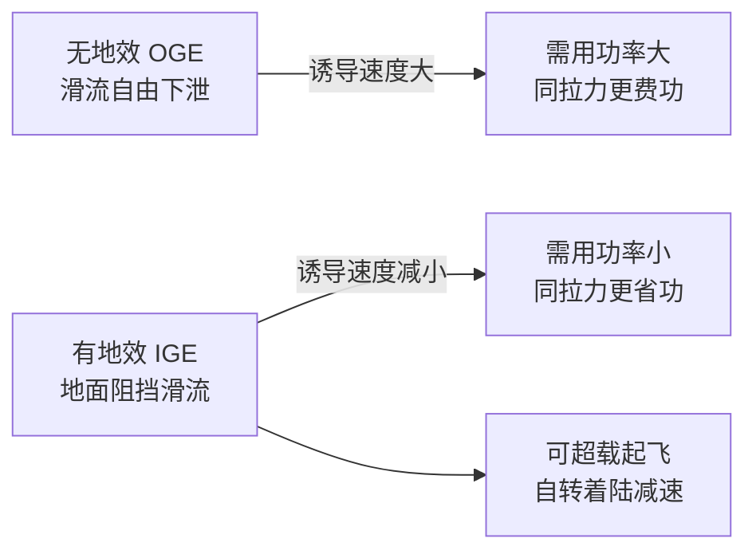
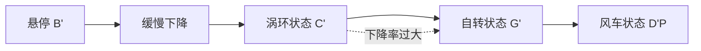
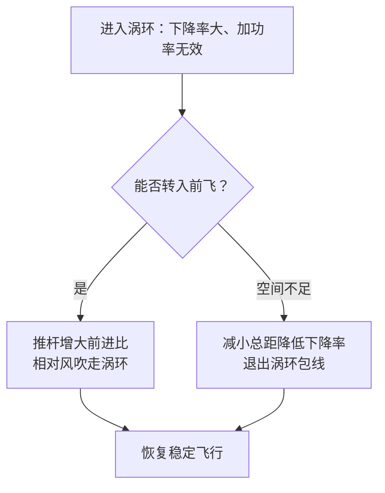
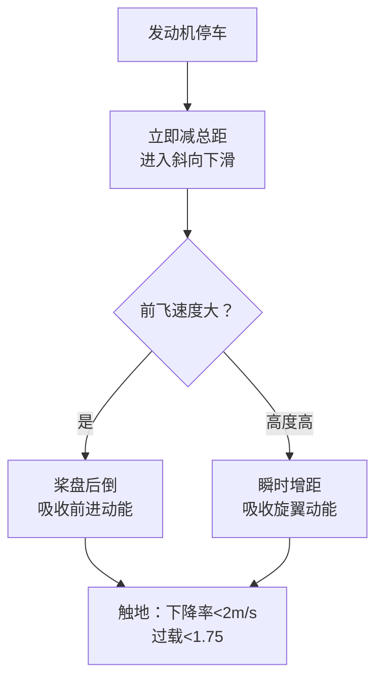

# 第 10 章 直升机特殊飞行状态

> 对应原书书内 p235–p254。
> 本章与前面各章"常规定常性能"的写法不同：它把直升机在地面上、海洋上、自转中、机动中遇到的若干**特殊而又彼此独立**的飞行状态分别拎出来讲。主线可以概括为一句话——**这些状态的共同点，是旋翼/机身所处的流场偏离了常规滑流假设，要么被地面、舰船、沙尘改造，要么进入了非定常、自维持的涡结构，要么干脆靠相对气流而不是发动机驱动旋翼**。

## 本章导览

**一句话主线**：地面效应（地面改造滑流→悬停更省功率）→ 沙盲（沙尘改造流场→视野与发动机受害）→ 着舰（舰船改造流场→强扰动）→ 涡环状态（下降尾流与诱导流对冲→危险的涡结构）→ 自转飞行（发动机失效后靠气流自转→安全着陆的最后保障）→ 机动飞行（强交叉耦合下的战术动作）。

**学习目标**

| # | 目标 | 对应小节 |
|---|---|---|
| 1 | 讲清地面效应为什么提高悬停效率，区分有/无地效悬停升限 | 10.2 |
| 2 | 说明沙盲的形成条件、危害与沙漠环境操作要点 | 10.3 |
| 3 | 列举舰面着舰面临的舰尾流、甲板运动等气动扰动 | 10.4 |
| 4 | 解释涡环状态的流动机理、进入条件、危险性与改出方法 | 10.5 |
| 5 | 理解自转飞行的能量来源与操纵要点，说明为什么它是安全最后保障 | 10.6 |
| 6 | 了解机动飞行的载荷特点与典型动作 | 10.7 |

---

## 10.1 引言

前面章节讨论的是"常规"性能问题：垂直/前飞状态的定常假设下，速度不随时间变化，可用滑流理论、叶素理论较规范地计算。但实际飞行会遇到更复杂的情形——**复杂气流环境**（地面、舰船、沙尘改变了旋翼流场）与**自身非定常运动**（自转、机动、涡环）。这些状态在数学模型上缺少精确描述，却在实战与日常飞行中经常出现，必须了解和应对。

本章内容相对独立，可以分块学习，不必强求前后推导连贯。从本章起，注意力从"性能算得多准"转向"特殊状态下气流到底怎么变、飞行员该怎么办"。

---

## 10.2 地面效应

#### 现象与定义

当直升机贴近地面悬停（离地高度 $h$ 与旋翼直径 $D$ 同量级）或低速飞行时，会出现两类现象：

- 在**相同功率**下，旋翼产生的拉力比远离地面时大；
- 在**相同拉力**下，旋翼需要的功率比远离地面小。

这种贴地时旋翼效率提升的现象称为**地面效应**（in ground effect, IGE），也叫"气垫效应"。它对起飞、着陆意义重大：在地效范围内可以**超载起飞**提高载重；自转垂直降落时地効还能起到减速作用，略微减小垂直着陆速度。

#### 为什么地面会提高效率

本质原因只有一个：**地面阻挡了诱导速度的竖直分量，使旋翼桨盘处的等效诱导速度减小**。

从滑流（动量）理论看，诱导功率 $P_i = T\,v_i$。地面把向下吹的滑流挡住，桨盘处诱导速度 $v_i$ 必定小于无地面效应（out of ground effect, OGE）时的值，产生同样拉力所需诱导功率随之下降。

从叶素理论看（对比有/无地效两种情况），若两者拉力相等，则桨叶剖面实际迎角应相同。由于地效使诱导速度 $v_i$ 减小，桨叶上需要施加的操纵量降低，剖面升力后倾角度减小，于是剖面诱导阻力 $dQ$ 减小，驱动旋翼的需用扭矩与功率随之下降。

地面不仅减小诱导速度，还改变了它在桨盘上方的分布；离地越低、桨盘载荷 $C_T/\sigma$ 越小，地面效应越强。

#### 等效诱导速度与经验公式

根据诱导速度分布可算出桨盘平面等效诱导速度、诱导功率和拉力增益。原书图 10.4 给出定功率悬停时拉力的变化，并给出基于飞行试验的**经验公式**（图 10.5）：

$$ \frac{T}{T_0}=1.0+0.01\,x\,(1.0+0.5\,x) $$

$$ x = 4.0\,\frac{(h/D)^{1.2}}{\sqrt{C_T/\sigma}} $$

其中 $T_0$ 为无地效时的拉力，$h$ 为离地高度，$D$ 为旋翼直径，$C_T/\sigma$ 为桨盘载荷（桨叶载荷）。该经验式表明：离地高度越低、桨盘载荷越小，地面效应越强，拉力增益越大（具体曲线以原书图 10.5 试飞数据为准）。

#### 前飞时地面效应的消失与地面涡

直升机由悬停转入前飞后，旋翼尾流向后方倾斜，地面对尾流的阻挡作用减弱，地面效应随速度增加迅速减小直至消失。但在**低速阶段**（前进比 $\mu < 0.08$），受地面限制，旋翼尾流折向前方的部分与相对风会合，在旋翼前部形成**地面涡**。随着飞行速度改变，地面涡强度及相对位置变化，使旋翼入流速度的大小与分布剧烈变化，旋翼气动特性也随之变化。

---

## 10.3 沙盲

#### 形成条件与机制

直升机执行救援等任务时，常把贴地飞行作为基本使用要求。在**沙漠或沙尘环境**起降、近地飞行时，旋翼下洗气流激起的沙石尘土弥漫在机身周围，使飞行员视野受限，严重时甚至盲视、看不见地面与机外环境，这就是**沙盲**。

据美军统计，与低能见度环境相关的飞行事故和损失中，沙盲约占 60%。其形成机制可归纳为：下洗流**轰击起沙**→沙粒**直接夹带**进入流场→细颗粒**短期悬浮**，在机身周围形成旋转沙尘幕。

#### 对人员的影响

沙盲出现时舱内光线暗淡甚至漆黑，飞行员极易发生视觉错误、分不清天地：

- 弥漫的旋转沙尘使对外观察模糊，看不清地面障碍与地标，无法有效收集地表信息，从而对姿态、速度、位置产生误判，对着陆条件判断失误，易引发着陆安全事故；
- 能见度极低还会严重干扰地面人员与其他飞行员的观察，可能导致更严重的事故。

#### 对装备的影响

整机被沙尘包裹，对机体与动力系统影响严重：

1. 大量沙尘对机体的冲击摩擦导致机械损伤，机件加速老化，摩擦产生静电干扰机载电子设备；
2. 沙尘在传动环节、注油点堆积，导致关节润滑不足、甚至操纵不灵；
3. 发动机进气口高密度沙尘使进气量不足、功率下降，大颗粒沙尘易诱发涡轮叶片损坏，导致空中停车。

#### 应对措施

1. 加强传动环节除沙清洁与润滑：着陆后及时清理传动环节、注油点、润滑脂表面沙尘并补脂，发现油脂污染立即更换；
2. 重要设备做防沙密封保护、加装密封套；室外停放盖好蒙布、堵好堵盖，沙尘过后全面除沙维护；
3. 把好"放飞关"：检查清理发动机进气道沙尘；沙盲环境下禁止试车；沙尘过后起动前用中性洗涤剂或专用清洗液清洗发动机；
4. 改进发动机防沙技术，在进气道加装高效沙尘清除装置，发展惯性分离器+涡流管分离的复合型分离器；
5. 对飞行人员进行针对性模拟训练，建立实地或虚拟沙盲起降训练场；
6. 飞行中最大限度规避沙尘，及时掌握气象、预测天气与大气环境变化，绕开沙盲区域。

---

## 10.4 着舰

#### 着舰的难点

直升机垂直起降、悬停能力强，非常适合与舰船编队扩展任务包线。但甲板尺寸、舰船随浪运动、海面强风等因素使该科目非常危险。舰载训练需克服以下难点：

1. 甲板有限尺寸限制起降动作；
2. 舰面机动易处于强风环境；
3. 旋翼下洗流、舰船空气流、海面三者互相干扰；
4. 甲板作为平台易产生浮沉运动；
5. 飞行员后视、下视能见度严重受限。

与甲板接触的瞬间最重要。舰载直升机着陆垂直速度通常是陆基直升机的 2 倍，使起落架与机身配件承受更高载荷，因此起落架既要吸收冲击又要高阻尼防回弹，降落后用甲板锁固定机身。

#### 典型着舰过程

1. 以约 $30^\circ$ 滑翔斜率从舰船后方靠近，距船体及建筑 $1.5\sim2$ 倍旋翼半径时在机库高度处悬停；
2. 机身平行于机库大门移动，直至悬停在舰船中线位置；
3. 在舰船相对平稳时靠近甲板尝试着陆。

#### 甲板气流与舰尾流

飞行甲板多装在舰尾、机库一侧。机库上方气流是典型钝头体（锐化边缘）分离流。若气流从船首吹来，库顶分离气流与最终贴甲板气流对整个流场起主导作用；分离气流与甲板的贴合点随时间变化，直升机在该流场中横穿进入甲板。受旋翼下洗影响，机库上方分离流被完全改变，在旋翼前方与机库门间产生一个重要循环区，使舰载训练极具挑战；船上建筑又使气流进一步分离，加大难度。

#### 风限图

**风限图**（起降风限图）是指某一特定直升机/舰船组合，在给定工况与进场方式下，关于风速与风向的最大安全边界；在其范围内有较好的操纵量与姿态角并满足功率要求。早期靠大量海上实船试飞获得，费时费力风险大；现在多用 **CFD 数值模拟与海上试飞结合**：先数值算理论风限圈，再试飞验证边界，确定最终风限圈。原书图 10.13 给出某型机在舰船上方 3 m 处典型风限图。

---

## 10.5 涡环状态

#### 理论背景与速度公式

垂直飞行能力是直升机特殊优点。由滑流理论，拉力系数表达式为

$$ C_T = 4\kappa V_i^2 $$

其中 $V_i = V_y + v_i$ 是通过旋翼的气流速度，$V_y$ 为垂直速度（爬升取正），$v_i$ 为诱导速度。为使公式适用于垂直下降（$V_y<0$），须保证特征速度 $V_i$ 总为正：

$$ C_T = 4\kappa |V_i|\,v_i \tag{10.2} $$

进而得到通过旋翼的气流合速度公式：

当 $V_y + v_i > 0$ 时，

$$ \frac{V_i}{v_{ih}} = \sqrt{ \left(\frac{V_y}{v_{ih}}\right)^2 + \frac{V_y}{v_{ih}} + 1 } \tag{10.3} $$

当 $V_y + v_i < 0$ 时，

$$ \frac{V_i}{v_{ih}} = \sqrt{ \left(\frac{V_y}{v_{ih}}\right)^2 - \frac{V_y}{v_{ih}} + 1 } \tag{10.4} $$

式中 $v_{ih} = \sqrt{C_T/(4\kappa)}$ 为悬停时的诱导速度。曲线 ABG 由式 (10.3) 确定，曲线 EDF 对应式 (10.4)。

#### 垂直下降的流态演化

但实际垂直下降时，旋翼诱导速度与飞行相对气流方向相反，两股反向气流相遇形成紊乱旋涡，旋翼周围不再是均匀滑流，滑流理论失效。原书图 10.15 给出五种流态：

- **(a) 悬停**：通过桨盘气流仅为诱导气流，对应图 10.14 的 B′ 点；
- **(b) 缓慢下降**：桨盘处诱导气流仍主导，但尾流开始紊乱；
- **(c) 典型涡环状态**：对应 C′ 点，下降率近似等于桨盘处向下合速度，桨尖涡不能被吹离旋翼而聚集，部分排出气流又被吸入、绕旋翼外缘打转，流态很不稳定；
- **(d) 自转状态**：对应 G′ 点，桨盘部分区域气流向上通过、部分向下穿过，旋翼从相对气流获取能量维持转动，不需发动机驱动；
- **(e) 风车状态**：对应 D′P 段，相对气流自下而上穿过旋翼提供能量，周围有稳定滑流。

严格说，图 10.14 上 B′ 至 D′ 之间统属涡环状态范围，旋翼周围存在或强或弱的涡流区。一般在下降率约为 $(0.4\sim 2.0)\,v_{ih}$ 时会感到明显不稳定，最严重约在 $1.4\,v_{ih}$ 附近。烟流试验显示，旋翼周围会形成近乎封闭的大气泡，鼓风使之胀大，每隔约 1–2 s 气泡破裂一次，形成大范围气流紊乱后重新形成——爆破口不固定，使升力、俯仰与滚转力矩都变化，直升机颠簸摇晃。

#### 涡环状态的危险与成因

在涡环状态中飞行极为困难：**即使增加功率也难以减小下降率**；同时桨叶发生局部失速，需用功率比悬停时更大。垂直下降陷入涡环的事故并不少见，尤其高气温引起发动机功率不足、或单发意外停车时；顺风中减速或做 $180^\circ$ 转弯，也可能使旋翼进入自身排出的尾流形成涡环而下沉。

#### 判据与边界（多种模型）

涡环给飞行带来巨大危险，需给飞行员可靠提示。判据分**理论近似模型、半经验模型、经验模型**三类，最终都体现为前飞速度 $V_x$ 与垂直下降速度 $V_y$ 两速度构成的包线。

**(1) 理论近似模型**

- **Newman 判据**：以尾流外部自由流速度与尾流内部流动速度的平均定义尾流中涡强度积累量：

  $$ V_{WTV} = \sqrt{k^2 v_i^2 + (v_i + V)^2} \tag{10.5} $$

  涡环出现在 $V_{WTV}/v_{ih}$ 低于临界值（取 0.74，$k=0.65$）时，即净速度不足以让涡对流离开旋翼。前飞中与实况吻合不佳，假定 $V_y$ 比 $V$ 效率低，得修正式：

  $$ V_{WTV,E} = \sqrt{k^2 v_i^2 + (v_i + V)^2} \tag{10.6} $$

- **Peters 判据**：基于动力入流与动量理论，当自由来流速度矢量 $\mathbf V$ 在尾流速度矢量 $\mathbf W$ 上的投影为负时进入涡环，解析式为：

  $$ \frac{\mathbf V\!\cdot\!\mathbf W}{|\mathbf W|\,\sqrt{u^2+(v-v_i)^2}} < 1 \tag{10.7} $$

- **Wolkovitch 边界**：以桨尖涡的垂向运动速度为零作为进入条件。设桨尖涡速度等于内侧入流与外侧自由来流平均，进入边界：

  $$ \bar{v}_i + v_d/2 = 0 \;\;\Rightarrow\;\; \bar{v}_i = -v_d/2 \tag{10.9} $$

  退出边界取桨尖涡向上运动：

  $$ \bar{v}_i = -0.75\,v_{ih} \tag{10.10} $$

**(2) 半经验模型**

- **高正–辛涡环边界**：南京航空航天大学高正教授与辛宏博士在旋臂机大量试验，首次发现进入涡环的重要特征——**旋翼轴扭矩异常变化**，并修正 Peters 判据：当相对来流速度矢量在旋翼尾流速度矢量反方向上的投影超过 $-0.28\,v_{ih}$ 时进入涡环：

  $$ \frac{\mathbf V\!\cdot\!\mathbf W}{|\mathbf W|} = -0.28\,v_{ih} \tag{10.11} $$

- **ONERA 边界**（Taghizad）：认为桨尖涡运动速度为桨盘内外侧流动平均，边界式为：

  $$ \sqrt{(v_i/k)^2 + (v_i + v_d/2)^2} = v_{ih} $$

  其中 $k$、$\varepsilon$ 由试飞匹配确定为约 4 与 0.2。

**(3) 经验模型**

- **NASA（Johnson）边界**：以浮沉运动速度不稳定性区间作为进入/退出界定，并把边界取为 $d(\bar v_i+v_{ih})/d\bar v_i = 0$ 的分界点，给出上下边界：

  $$ \bar v_{i,N} = -0.975 + 0.525\left(1-(V_x/0.95)^2\right)^{0.5} \tag{10.13a} $$

  $$ \bar v_{i,X} = -0.975 - 0.525\left(1-(V_x/0.95)^2\right)^{1.5} \tag{10.13b} $$

#### 尾桨涡环与改出

尾桨也可能陷入涡环：机头向"前行桨叶"一侧悬停回转，或机身向"后行桨叶"一方侧飞时，尾桨可能陷入自己的尾流，感到蹬舵失效、直升机加速旋转。**摆脱策略是尽快转入前飞**，靠飞行相对气流把尾桨周围涡环吹走。

对主旋翼涡环，通用改出原则是**增大前飞速度、减小下降率、退出涡环包线**：向前推杆增大前进比，或减小总距降低下降率，让旋翼脱离自身尾流的再吸入区。

---

## 10.6 自转飞行

#### 自转的定义与适用场合

自转飞行指直升机空中遭遇发动机失效、传动故障等动力不可用时，利用自身**势能、动能、旋翼旋转动能**之间的转换安全着陆的动作。自转下滑状态下，桨叶旋转不再依赖发动机，而由自下而上的来流形成空气动力驱动。

通常采用自转下滑寻求安全降落的情形：

1. 发动机或主旋翼传动系统故障，旋翼无法获取驱动力；
2. 尾桨失效或尾传动卡滞，无法平衡旋翼反扭矩；
3. 需要陡下降且要避免进入旋翼涡环状态时。

自转旋翼机（旋翼机）与直升机不同：其旋翼始终由前方来流吹转、始终处于自转，发动机停车可直接靠自转着陆；直升机则需要一个操纵转换进入自转的过程，因此旋翼机没有低速回避区、更安全。

#### 自转的力矩平衡与转速控制

垂直下降率达到某值时，旋翼不再需发动机驱动，由气流获取能量维持恒速旋转，即**自转状态**。此时叶素气动合力 $dF$ 平行于旋翼轴，在旋转平面投影为零。由此得到自转角速度关系：

$$ \phi - \theta = \arctan\!\left(\frac{dR}{dF_y}\right) \tag{10.14} $$

其中 $\phi$ 为桨距（操纵量）、$\theta$ 为来流角。若 $(\phi-\theta) > \arctan(dR/dF_y)$，合力 $dR$ 前倾，驱动旋翼加速旋转；反之合力后倾，旋翼减速旋转。于是驾驶员可用**总距操纵**改变 $\phi$，调节自转转速；在一定桨距与转速下，对应固定的垂直下降率。

整片桨叶上，桨根周向来流小、迎角大，合力向前倾斜**驱转**；叶尖合力向后倾斜**阻转**；稳态自转即驱转区与阻转区扭矩平衡。

#### 理想自转与下降率估算

若假定翼型无阻力（$C_{Dx}=0$），则 $dR=dF_y$，自转条件变为 $(\phi-\theta)=0$，即无气流穿过旋转平面（$V_i=0$），称为**理想自转**。

理想自转时旋翼像一块不透气的圆形平板，其拉力即迎风阻力：

$$ T = C_{Dx}\,\frac{1}{2}\rho A V_y^2 \tag{10.15} $$

而由滑流理论，悬停拉力 $T = \rho A \cdot 2 v_{ih}^2$（即 $C_T = 4\kappa \lambda_i^2$ 的等价形式）。两式联立，令圆形平板力系数 $C_{Dx}=1.28$，可得：

$$ \left|\frac{V_y}{v_{ih}}\right| \approx 1.8 \tag{10.17} $$

实际自转还要克服翼型阻力并带动尾桨、液压泵等附件，需合力前倾产生驱动力矩，故需要**更大的下降率**；一般垂直自转下降率约为悬停诱导速度的 2 倍。

#### 自转着陆过程（桨盘后倒与瞬时增距）

发动机停车后，驾驶员应**立即减小总距**并调整驾驶杆，使直升机进入斜向下滑。以经济速度前飞时需用功率最小、自转下降率最小；以有利速度飞行滑翔距离最远，可在自转可达区域内选择着陆点。

着陆是减小前进分速与垂直下降分速的过程：

- 若**前飞速度较大**，采用"**桨盘后倒**"：操纵使桨盘后倒、增大旋翼迎角，吸收前进动能，增加向后与向上分力，减小前进与垂直下降分速；
- 若**飞行高度较高**，采用"**瞬时增距**"：触地前瞬时增加桨距，吸收旋翼旋转动能增加拉力，减小垂直下降速度；
- 实际多用两者综合。典型训练自转着陆：高度 35–25 m 开始拉驾驶杆，25–15 m 开始提距（使触地时桨距刚好最大），5–6 m 持平阶段推杆调整机身避免尾撞，触地后降距到最小并刹车。

**瞬时增距的能量关系**：定常自转下滑时 $T\approx G$、需用功率为零，即

$$ P_{eq} = T(v_{ih}+V_{equ}) + P_{pf} = 0 \tag{10.18} $$

其中 $V_{equ}$ 为下降率（取负）、$P_{pf}$ 为型阻功率。瞬时增距时 $v_{ih}$、$V_{equ}$ 增大使 $P_{eq}>0$，旋翼转速降低；若保持桨叶迎角在临界值，则拉力系数最大：

$$ C_{T,\max} = \frac{1}{2}\sigma C_{y,\max},\qquad T = C_{T,\max}\rho\pi R^2(\Omega R)^2 \tag{10.19} $$

旋翼释放的旋转动能为：

$$ \frac{1}{2}I(\omega_1^2-\omega_2^2) = \int P\,dt \tag{10.20} $$

高转速旋翼的动能有时比整机直线运动动能大几倍，正是用于着陆减速的"救命能量"。驾驶得当可使触地下降率 $|V_y|<2\ \text{m/s}$、过载小于 1.75。

#### 回避区

在某一速度/高度范围内若发动机停车，直升机仍可能坠毁，这一范围称为**回避区**（图 10.22）：

- 上限按转入最佳定常自转所掉高度而定：前飞速度为零时上限最高，随前飞速度增加更易转自转，上限降低；
- 下限按下降率与起落架承载能力而定：悬停时下限最低，随前飞速度增加下限提高（有前进动能可利用）；
- 高速、低高度尤其危险，因撞地前缺乏操纵时间。近年驾驶员手册有把高速回避区压缩甚至取消的趋势——发动机停车时旋翼转速减小、前进比加大，旋翼后倒角自动增大使直升机仰头爬高，争取了宝贵时间；
- 双发直升机单发停车概率低，回避区大幅缩小，在安全边界内可仅靠单发功率着陆，边界外甚至不必着陆、可继续前行；
- 回避区也适用于**尾桨失效**：虽发动机有功率，但反扭矩无法平衡，必须转入自转消除。

直升机因有自转下滑与"瞬时增距"能力，迫降后不需或只需很短滑跑即可停住，着陆安全性优于固定翼（后者需足够长而平坦的场地）。

---

## 10.7 机动飞行

#### 机动飞行的分类

机动飞行是战术动作，灵活改变高度、速度、方向与姿态，用于隐蔽接近、突袭或规避。按轨迹分：

- **水平面内**：加速/减速、盘旋、转弯、水平"8"字、蛇形；
- **铅垂面内**：急跃升、俯冲；
- **空间立体简单**：盘旋下降、战斗转弯、跃升中回转与转弯；
- **空间立体复杂**：筋斗、横滚、莱维斯曼、倒飞等。

按运动特性分**稳定机动**（加速度不变，如稳定盘旋）与**不稳定机动**（变加速度）。实际机动往往同时含爬升/下滑、转弯、加速/减速，可用能量转换法一般讨论。

#### 来流不对称与交叉耦合

与固定翼不同，直升机机动须重视**旋翼来流的不对称性**：两侧来流强不对称导致操纵中存在强**交叉耦合**，使机动操纵相当困难（Prouty 称其为航空界"独一无二"的难点）。例如滚转中机身气动力阻尼易诱发侧滑，需经验与操纵性/机动性设计来消除。随电传操纵发展，这些平衡工作更可能交给控制系统；但目前因交叉耦合复杂，成熟大型直升机上电传尚未普遍应用。

#### 典型机动动作

- **水平直线加速**（图 10.23）：施加操纵使桨盘更前倾，拉力前向分量更大、速度增加；速度加大后机身阻力随之增大，须继续增大桨盘倾角与拉力，否则加速度减至零、在大速度平飞。
- **水平转弯**（图 10.24）：等高等速右转时桨盘侧倾，拉力大于重力；纵向分力平衡重力（法向过载 $n=1$ 维持高度），水平分力指向转弯内侧平衡惯性力。
- **垂直机动/筋斗**（图 10.25）：铅垂面圆圈飞行需持续变化拉力以保持向心力恒定指向圆心；筋斗底部拉力须数倍于机重，多数直升机难以做到，常只能做变速非圆轨迹，已属非正常。
- **莱维斯曼**（图 10.26）：大仰角快速爬升躲避防空火力后，绕旋翼轴机身旋转 $180^\circ$ 指向地面转入对地攻击（"半筋斗倒转"）。
- **向心回转**（图 10.27）：空中机身回转、始终机头指向地面固定目标并可攻击；尾部向心回转因视野限制难度更高。
- **殷麦曼翻转**（图 10.28）：半筋斗接半滚转，快速获取高度——大仰角爬升完成半筋斗后在高点翻转 $180^\circ$ 平飞，再绕纵轴转 $180^\circ$ 恢复平飞。

---

## 10.8 习题

1. 直升机地面效应是如何形成的？地效飞行时飞行性能与控制飞行时有什么区别？
2. 直升机近地（面）飞行时，性能、操纵等与在空中飞行时有何差异？
3. 涡环状态对直升机极其危险，降落时有哪些规避涡环状态的方法？
4. 飞机设计有句名言"为减轻 1 g 重量而不懈奋斗"，这句话在旋翼设计上是否适用？为什么？
5. 自转飞行状态通常应用于哪些场合？简要描述典型自转着陆过程的重要节点及操纵策略。
6. 描述直升机自转下滑回避区的含义。
7. 列举几个常见机动飞行科目，描述其飞行轨迹与姿态改变。

---

## 本章小结

把各状态串成一条逻辑链：

1. **地面效应**——地面阻挡诱导速度竖直分量，使等效诱导速度减小、诱导功率下降，悬停更省功；离地越低、桨盘载荷越小越强，前飞后随尾流后倾迅速消失并可能在低速产生地面涡。
2. **沙盲**——沙漠/沙尘环境下旋翼下洗激沙，形成旋转沙尘幕，既致飞行员盲视误判，又冲击机体、堵塞发动机进气致空中停车；靠除沙润滑、密封、放飞关把控与规避应对。
3. **着舰**——舰船有限甲板、强风、舰尾流与甲板浮沉叠加，流场极复杂；靠风限图界定安全边界，靠规范进场与甲板锁保障。
4. **涡环状态**——垂直下降时诱导流与相对气流反向对冲，形成自维持、周期性破裂的涡气泡，升力与力矩剧烈变化，加功率也难减小下降率；多种判据给出进入/退出包线，改出靠转入前飞或减小下降率退出包线。
5. **自转飞行**——发动机失效后靠气流驱动旋翼自转，是安全着陆的最后保障；驾驶员以总距控制转速，以"桨盘后倒+瞬时增距"利用前进与旋转动能着陆；存在速度/高度回避区。
6. **机动飞行**——旋翼来流强不对称导致操纵交叉耦合，是直升机独有难点；典型动作由轨迹与姿态改变组合，须用能量转换观点理解。

---

## 自测题

**原书习题（见 10.8）**：1–7 题。

**整理者补充的追问**

- 地面效应公式里 $T/T_0$ 随离地高度单调变化，但涡环状态却恰在"下降"时出现——这两个现象是否都源于"旋翼尾流被某物改变/阻挡"？其物理本质的异同是什么？
- 涡环状态的 Newman、Peters、高正–辛判据分别偏重"理论近似"与"半经验修正"，若让你给飞行员做一个简洁的进入警示，你会用哪一条、为什么？
- 自转着陆的"瞬时增距"依赖旋翼旋转动能，而回避区又告诉我们某些速度/高度下根本来不及操纵——这两个事实共同说明了飞行前什么准备最重要？

---

[查看本章思维导图 →](chapter10/mindmap.md)
