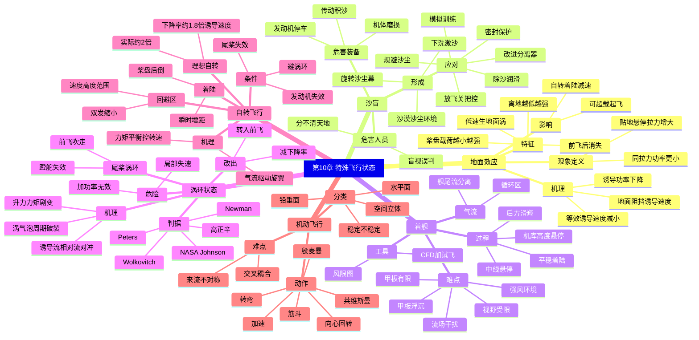

# 第 10 章 直升机特殊飞行状态 · 思维导图

> 本章各特殊状态彼此独立，可分别学习。本图帮助建立"每个状态都回答三件事——什么条件下发生、气动机理是什么、飞行员如何处置"的统一框架。

## 章节逻辑脉络

```mermaid
flowchart TD
  Root["第10章 特殊飞行状态"]
  Root --> A["地面效应 IGE"]
  Root --> B["沙盲"]
  Root --> C["着舰"]
  Root --> D["涡环状态"]
  Root --> E["自转飞行"]
  Root --> F["机动飞行"]

  A --> A1["条件：贴地悬停/低速"]
  A --> A2["机理：地面阻挡诱导速度→更省功"]
  A --> A3["处置：超载起飞/自转着陆减速"]

  B --> B1["条件：沙漠沙尘环境"]
  B --> B2["机理：下洗激沙→旋转沙尘幕"]
  B --> B3["处置：除沙密封/规避/放飞关"]

  C --> C1["条件：舰船甲板强扰动"]
  C --> C2["机理：舰尾流+甲板运动"]
  C --> C3["处置：风限图/规范进场"]

  D --> D1["条件：垂直下降率大"]
  D --> D2["机理：诱导流与相对流对冲成涡"]
  D --> D3["处置：转入前飞/减下降率"]

  E --> E1["条件：发动机/尾桨失效"]
  E --> E2["机理：气流驱动旋翼自转"]
  E --> E3["处置：桨盘后倒+瞬时增距"]

  F --> F1["条件：战术机动"]
  F --> F2["机理：来流不对称交叉耦合"]
  F --> F3["处置：能量转换/电传辅助"]
```

## 核心判断

1. **地面效应是"被地面改善"的滑流**：离地越低、桨盘载荷越小，等效诱导速度越小、悬停越省功率；前飞后迅速消失。
2. **沙盲的根因是流场被沙尘改造**：既害人员（盲视误判）又害装备（发动机进气受阻、空中停车），靠"清沙+密封+规避"三管齐下。
3. **涡环状态是下降时的自维持涡结构**：加功率也难减小下降率，是最危险的垂直下降状态，必须主动脱离自身尾流再吸入区。
4. **自转飞行是安全最后保障**：能量来自势能/动能/旋翼旋转动能的转换，靠总距控转速、靠瞬时增距释放旋转动能着陆；存在速度-高度回避区。
5. **机动飞行的独有难点是交叉耦合**：旋翼来流强不对称导致操纵相互牵连，需用能量转换观点理解各动作。

## 完整思维导图

---

[← 返回第 10 章正文](chapter10/README.md)
