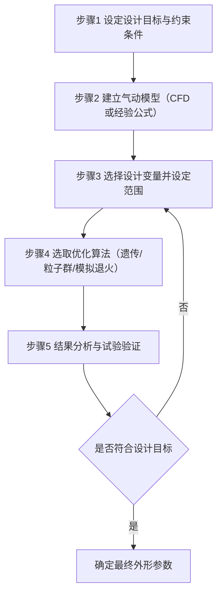
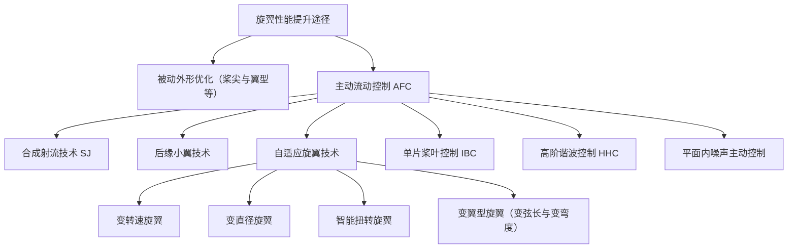

# 第 11 章 直升机气动设计

> 对应原书书内 p237–p262（PDF p255–p281）。
> 本章在总体设计的基础上，聚焦旋翼这一核心气动部件的外形详细设计：从翼型配置、扭转、弦长、桨尖等"设计准则"出发，讲清旋翼直径如何初步定算、茹氏（茹科夫斯基）最优旋翼的思想与局限，再通过若干典型案例展示不同旋翼的设计取向，最后介绍以主动流动控制为代表的前沿主被动技术。

## 本章导览

**一句话主线**：设计准则（气动目标）→ 直径初算（拉力需求）→ 扭转设计（茹氏最优与工程折中）→ 设计案例（各型旋翼取向）→ 主动控制（突破被动外形瓶颈）。

**学习目标**

| # | 目标 | 对应小节 |
|---|---|---|
| 1 | 掌握旋翼气动设计的一般要素与特征 | 11.1 / 11.2 |
| 2 | 理解旋翼基本参数的选取与外形设计的权衡关系，以及不同桨尖外形的作用 | 11.2 / 11.3 |
| 3 | 了解旋翼气动外形设计的一般流程与优化方法 | 11.2.4 |
| 4 | 理解茹氏旋翼的思想、结论及其未被工程应用的原因 | 11.4 |
| 5 | 了解典型旋翼（常规、尾桨、共轴刚性）的设计取向差异 | 11.5 |
| 6 | 了解旋翼设计领域常见的前沿主动控制技术及其解决的问题 | 11.6 |

---

## 11.1 引言

直升机气动设计是在总体设计之上，对各气动部件的外形做详细设计、确定外形参数的过程，目标是让直升机具备良好的气动性能。现代直升机气动设计横跨多门学科：既要关注整体飞行性能，也要兼顾旋翼与机体的载荷、振动水平、外部与内部噪声，以及操纵性与稳定性。

气动设计主要包含三大部分：**旋翼气动设计、机身气动设计、尾桨气动设计**。其中旋翼是核心：它提供直升机绝大部分拉力与操纵力，承担了直升机四个操纵中的三个（总距、纵向周期变距、横向周期变距），第四个平衡反扭矩的侧向力由尾桨提供。同时，旋翼旋转产生的噪声是直升机最主要的外部气动噪声源。因此旋翼气动性能的优劣，直接决定了最大前飞速度、载重与噪声水平等硬指标。本章把重心放在旋翼气动设计上。

---

## 11.2 旋翼桨叶气动外形设计准则

高性能旋翼是现代直升机的重要标志，而桨叶气动外形设计是其中最关键环节之一。桨叶的三维气动外形主要由四个参数决定：**翼型配置、扭转分布、弦长分布、1/4 弦线分布**。这四个量共同决定了悬停效率、前飞升阻比、桨盘载荷、功率载荷等总体气动指标。下面分四个角度展开。

#### 旋翼翼型设计原理

翼型是构成旋翼的基本元素，其气动特性直接决定机动性、可操纵性、续航能力等性能。不同总体性能对翼型有不同需求，例如：

| 直升机总体性能 | 对旋翼翼型气动特性的需求 |
|---|---|
| 高机动、大过载 | 高最大升力系数 |
| 大飞行速度 | 高阻力发散马赫数 |
| 强续航能力 | 高升阻比 |
| 易操纵 | 低力矩系数 |
| 满足结构强度要求 | 足够的厚度与截面积 |

在不同飞行状态下，旋翼面临的气流环境差异很大：垂直飞行要求高升阻比、低阻力；前飞时前行侧要低阻力（即高阻力发散马赫数）、后行侧要高升力；机动飞行则要求高最大升力系数。

由于旋翼剖面的来流是非定常、强压缩性、变来流、带展向流且可能动态失速的复杂环境，理想翼型应在宽马赫数、宽迎角、宽雷诺数范围内都表现良好，具体体现在五点：

1. 在较宽马赫数范围内有较高的静态与动态最大升力系数，以适应机动过载；
2. 在大马赫数、小迎角下有较大阻力发散马赫数，推迟前行桨叶激波失速与阻力发散；
3. 在中等马赫数、中等迎角下有较高升阻比，提高悬停效率；
4. 在小马赫数、大迎角下有较好失速特性，延缓后行桨叶气流分离；
5. 在整个包线内有较小的俯仰力矩系数，降低桨叶操纵载荷。

ONERA 提出的展向翼型配置目标（原书图 11.1、表 11.3）把桨叶沿展向分为三段，给出了明确的设计指标：

| 飞行条件 | 桨叶内段（0~0.8R） | 桨叶中段（0.8~0.9R） | 桨叶尖部（0.9~R） |
|---|---|---|---|
| 前飞 $C_L=0$ 时阻力发散马赫数 $M_{DD}\ge$ | 0.75 | 0.80 | 0.85 |
| 悬停 $M_a=0.5\sim0.6,\ C_L=0.6$ 时 $L/D\ge$ | 80 | 75 | 85 |
| 机动 $M_a=0.3$ 时 $C_{l,\max}\ge$ | 1.5 | 1.4 | 1.0 |
| 几何相对厚度 $t/c$ | 0.13 | 0.12 | 0.09 |

其设计逻辑是：内段较厚，要有大升力系数与小力矩系数以满足机动与操纵；尖部翼型要求高阻力发散马赫数与大升阻比，满足悬停与前飞；中段则要同时具备极高的升力系数、阻力发散马赫数与升阻比。

#### 桨叶三维外形设计原则

**扭转分布**：不同飞行状态下对扭转的需求不同。悬停时，把各剖面安装角设为使该剖面升阻比最大的角度（即让翼型处于最大 $L/D$ 迎角）；前飞时，前行桨尖处于跨声速，为降低阻力与功率，常把桨尖附近安装角设到 $0^\circ$ 左右，而内段仍按最大升阻比设计。工程上还需兼顾主要设计点，且速度增大时，中等几何扭转率更有利于限制振动。

**弦长分布**：弦长与最大升力能力相关，主要由过载要求与所选翼型的升力能力决定。一般在主要升力段采用较大弦长，低速段剖面弦长可适当减小。

#### 桨尖外形设计原则

桨尖虽只占桨叶很小一部分，却极为关键。从前飞状态桨尖剖面的气动环境（原书图 11.2）看，前行侧处于低拉力（小迎角）—高亚声速/跨声速，后行侧处于高升力（大迎角）—低马赫数。

由于桨尖来流速度最大，激波往往最先在此出现并导致阻力发散；同时力臂大，桨尖扭矩在旋翼总功率消耗中占比很高。从升力看，桨尖来流速度高、升力大，会产生强烈桨尖涡，引发桨/涡干扰、涡/面干扰等问题。因此优秀桨尖外形能显著改善性能，常见形式有尖削、后掠、下反及其组合。其重要性体现在四方面：

1. **减小桨/涡干扰**：合理桨尖可改变桨尖涡的强度、结构与脱落位置，抑制桨/涡干扰噪声，提升稳定性与操控性；
2. **延缓激波产生**：合理外形可让旋翼在更高速度下工作，薄翼型与后掠还能降低厚度噪声与高速脉冲噪声；
3. **优化载荷分布**：改变表面载荷分布、减缓载荷梯度，降低载荷噪声；
4. **提高气动效率**：减小阻力、增加升力，提高悬停效率与前飞升阻比。

英国韦斯特兰（Westland）公司采用"前缘先向前掠再后掠"的方案，并把后掠部分整体前移、使气动中心落在变距轴线上，解决剖面气动中心后移带来的气弹问题——这一思路发展为著名的 **BERP 桨叶**。1986 年搭载 BERP III 旋翼（原书图 11.3）的 Lynx 直升机创下 400.87 km/h 的速度纪录。2011 年欧洲直升机公司设计了大尺度后掠-前掠的 **Blue edge** 旋翼（原书图 11.4），在解决气动中心后移的同时削弱桨尖气流分离，改善气动与降噪。国内作者团队设计的 **CLOR** 系列前掠-后掠桨尖旋翼，在同功率下可提高拉力系数并降低气动噪声。

#### 旋翼桨叶气动优化设计通用方法

旋翼气动优化的一般流程（原书图 11.5）可归纳为五步：

- 步骤1：确定优化目标（最大升力、最小阻力、最大升阻比等）与约束（气动、强度、马赫数限制）；
- 步骤2：建立能预测各工况性能的气动模型；
- 步骤3：选择并可调节的几何/气动设计变量，并给定范围；
- 步骤4：选用遗传算法、粒子群、模拟退火等搜索最优解；
- 步骤5：分析验证，并用试验数据校核。

需注意，这是通用框架，具体实施会因目标旋翼而异。

---

## 11.3 旋翼直径的初步设计

旋翼直径是最直接的尺寸参数，直接影响升力与承载能力。直径选择通常依据总重量、预期飞行速度与环境条件。

从空气动力学看，计算问题分两类：已知参数估算性能的**校核计算**，以及按技术指标选取参数的**设计计算**。例如给定起飞总重 $G$、发动机出轴功率 $P_M$、悬停升限（静升限）$H$，从气动角度确定旋翼直径。

先引入两个特性参数：

**单位桨盘载荷**

$$p=\frac{G}{\pi R^2}$$

表示单位扫掠面积承受的重量，一般 $p=150\sim450\ \mathrm{N/m^2}$。

**单位功率载荷**

$$q=\frac{G}{P_M}$$

表示发动机单位额定功率（海平面）能举起的重量，一般 $q=30\sim60\ \mathrm{N/kW}$。

发动机出轴功率随高度变化，引入**高度特性系数**

$$A=\frac{P_t}{P_M}$$

其中 $P_t$ 为海平面额定功率，$P_M$ 为某高度额定功率。非高空式发动机的 $A$ 随高度降低。此外，出轴功率不能全部被旋翼利用，需引入**功率传递系数**（功率利用系数）$C$：

$$P_{\text{可用}}=C\,P_M,\qquad C=\eta_{\text{传动}}\eta_{\text{散热}}\eta_{\text{尾桨}}\eta_{\text{其他}}$$

统计值：传动 $0.94\sim0.96$、散热 $0.95\sim0.97$、尾桨 $0.92\sim0.95$、其他 $0.99$，综合 $C=0.80\sim0.88$，且随速度变化。

在悬停（乃至一般飞行状态）下，由 $T\approx G$ 及旋翼需用功率关系，可把 $p$ 与 $q$ 结合、消去桨尖速度，得到设计用的综合关系：

$$q\sqrt{p}\approx 1000\sqrt{2}\left(A\eta_0\sqrt{\frac{\rho}{\rho_0}}\right)$$

式中 $\eta_0$ 为悬停效率（figure of merit），$A$ 为高度特性系数，$\rho/\rho_0$ 为大气相对密度。该量最大值不超过 $1565.25$；在海平面一般为 $630\sim1050$。进一步整理可得到直径的下限公式：

$$G^{3/2}\approx 1000\sqrt{\frac{\pi}{2}}\left(A\eta_0\sqrt{\frac{\rho}{\rho_0}}\right)P_M D\approx 1253\left(A\eta_0\sqrt{\frac{\rho}{\rho_0}}\right)P_M D$$

其中 $G$ 以牛顿（N）计，$P_M$ 以千瓦（kW）计，$D$ 以米（m）计。由此，已知 $G$ 与 $P_M$，给定悬停升限（即 $\rho/\rho_0$）并由同类机型估算 $\eta_0$，即可求出旋翼直径的下限。结论很直观：**给定发动机功率时，$D$ 与 $G^{3/2}$ 成正比；给定起飞总重时，$D$ 与 $P_M$ 成反比。**

物理上，较大直径（小 $p$ 值）只需较小诱导速度即可拉起同等质量空气，诱导功率更小、$q$ 值更大；较小直径则需更大诱导速度、诱导功率更大。早期受活塞发动机笨重限制，不得不取较小 $p$ 值、机身庞大；随着涡轮轴发动机功重比提高，现代直升机 $p$ 值已达 400 以上，倾转旋翼机甚至超过 1000。

---

## 11.4 茹氏旋翼及扭转设计

合理的扭转分布能显著提高性能：负扭转可重新分布气动载荷、减小诱导功率，故悬停时采用较大负扭转可提升悬停效率；但前飞时较大负扭转会导致升力与推进力损失、降低高速巡航性能。因此扭转参数是悬停与前飞需求互相权衡的结果。

茹科夫斯基（Joukowsky）曾证明：**当诱导速度沿桨盘均匀分布时，诱导功率最小。** 要保持诱导速度沿径向不变，需满足（茹氏条件）

$$r\,c(r)\,C_y(r)=\bigl[r\,c\,C_y\bigr]_{0.7}=\text{const}$$

即环量沿半径不变。此时拉力系数可积分得到

$$C_T=\int_0^1 \frac{\sigma}{2}\,C_y\,\mathrm{d}\bar{r}$$

其中 $\sigma$ 以 $\bar{r}=0.7$ 处特征剖面相对宽度代入。

茹氏条件把 $c(r)$ 与 $C_y(r)$ 联系起来：矩形桨叶下（$c$ 为常数），由上式得 $C_y(r)\propto 1/r$；再结合迎角与升力系数的线性关系，桨叶安装角满足

$$\theta(r)\propto \frac{1}{r}$$

即**安装角与半径成反比，叶根处大、桨尖处小，负扭转变化非常急剧**。悬停状态下矩形茹氏旋翼的角度分布同样呈 $\theta(r)\sim 1/r+\text{常数}$ 的形式——可见飞行状态不同，扭转规律也不同。

从气动上说，茹氏旋翼是"性能最好"的旋翼：相同 $C_T$ 时 $C_P$ 最小，或相同 $C_P$ 时 $C_T$ 最大（对某一设计状态而言）。但它有三个致命缺陷，导致未被工程应用：

1. 从一种飞行状态到另一种状态的适应性小；
2. 工艺制造不方便；
3. 桨叶刚度降低，易发生弯曲与扭转变形。

鉴于此，工程上通常不采用最佳扭转，而是采用简单的**线性扭转规律**作为折中。

---

## 11.5 旋翼桨叶气动外形设计案例

#### 旋翼翼型静态设计

早期直升机速度低，多用对称翼型，但大迎角下上表面易分离。20 世纪 60 年代国外通过"前缘下垂"改善大迎角性能，在提高最大升力系数的同时保持较小零升俯仰力矩与最小阻力。随着前飞桨尖局部马赫数接近 1，基于"超临界翼型"理论的专用翼型应运而生。

美国波音 VR 系列翼型已用于 CH-47 等（原书图 11.6），其设计采用势流/边界层干扰分析与跨声速数值方法。英国 RAE 与韦斯特兰合作研制前缘弯曲的 RAE 系列（原书图 11.7），著名的 BERP-III 桨叶即采用 RAE 配置：相对 NACA 0012，RAE 9645（$t/c=12\%$）最大升力系数提高近 30%；RAE 9648 后缘上曲更大、抬头力矩更明显；RAE 9634（$t/c=8.5\%$）阻力发散马赫数高，利于抑制跨声速影响。

#### 旋翼翼型动态设计

旋翼翼型处于强非定常、非对称来流中，仅靠静态设计无法满足需求，必须计入周期变距、在动态环境下优化。动态失速下阻力与力矩系数在大迎角会发散形成峰值，因此优化目标设为：在保持升力不恶化的约束下，降低阻力与力矩系数的峰值。目标函数与约束可写为

$$\min\sum_{i=1}^{N}\left(C_{d,i}^{2}+C_{m,i}^{2}\right),\qquad \text{s.t. } C_{l,i}\ge C_{l0,i},\quad 0.95\,t_{\max,0}\le t_{\max}\le 1.05\,t_{\max,0}$$

式中 $C_l,C_d,C_m$ 为同一振荡周期内不同迎角下的升力、阻力、力矩系数，$t_{\max}$ 为最大厚度（下标 0 为基准翼型），$\alpha$ 为迎角，$N$ 为一个振荡周期的时间步数。

以 SC1095 为基准翼型、用 CST 参数化（上下表面各 6 个变量，共 12 个），在缩减频率 $k=0.1$、马赫数 $0.3$、雷诺数 $3.75\times10^6$、迎角 $\alpha=10^\circ+8^\circ\sin(\omega t)$ 下优化。结果（原书图 11.8~11.10）：优化翼型弯度与前缘半径更大，最大厚度由 $0.095c$ 增至 $0.098c$，面积由 $0.0066c^2$ 增至 $0.0073c^2$；一个周期内阻力与力矩最大值减小约 80%，而升力最大值未减，有效延缓了动态失速、抑制了动态失速涡。

#### 常规旋翼桨叶外形设计

Blue edge 旋翼是常规设计的典型案例，其夸张的前凸后掠外形旨在减小桨/涡干扰噪声并降低高速前飞功率消耗，试验表明在保证气动性能基础上可大幅降噪（约 5 dB），已用于空客 H160。

其方案源于 1991 年 ONERA 与 DLR 合作的 ERATO（声学优化旋翼）项目。以 7AD 为基准，对弦长、1/4 弦线、扭转、翼型沿展向分布优化（原书图 11.11），ERATO 桨叶相较基准的主要变化：

1. 最大弦长位于 $0.65R$，把升力由桨尖向内侧重新分配；
2. 桨尖用前凸后掠组合外形，让桨/涡干扰由平行变为斜干扰，减轻干扰强度并缓解桨尖压缩性；
3. $0.7R$ 以内用高升力新翼型、桨尖用超临界翼型，减缓高速激波；
4. 采用更大负扭转，把升力重新分配到更内侧。

ERATO 将 BVI 噪声降低 6 dB，并用于 4~6 t 级直升机（原书图 11.12）。ONERA 与空客在此基础上引入 CFD，提出前后掠组合桨尖方案（原书图 11.13），所有方案悬停效率均高于参考桨叶 CO，其中 C4 构型最好；研究指出效率提升主要来自增加的扭转与桨尖下反。最终选 C4 为基准优化桨尖（>0.9R 的扭转与下反），选出 BVI 噪声最低的 C4P-OPT，经气动/噪声/结构综合优化得到 Blue edge 旋翼。试飞（原书图 11.14、11.15）显示：大拉力下悬停效率最高提升 7%，前飞功率与基准相当；在 111 km/h、8° 斜下降时 BVI 噪声平均降低 3~4 EPNdB，单麦克风最大降低约 5 EPNdB。

#### 尾桨与涵道尾桨外形设计

尾桨/涵道尾桨用于平衡反扭矩并操纵航向，也是重要噪声源，且与旋翼尾迹存在复杂干扰。本节重点介绍涵道尾桨（原书图 11.16）：它由涵道与尾桨构成，悬停时涵道壁拉力可达总拉力约 50%。引入**拉力分配因子**（涵道拉力与总拉力之比）衡量性能。

优化后涵道唇口前半段曲率增大、后半段减小、过渡段加长、唇口面积更大（原书图 11.17）。数值模拟（原书图 11.18）表明，在等量拉力下功率需求降低约 3%，最大悬停效率提升约 2%。

#### 高速共轴刚性旋翼桨叶外形设计

高速共轴刚性旋翼是当前研究热点。其上下两副反转刚性旋翼采用"前行桨叶概念（ABC）"，升力主要由前行侧产生，后行侧卸载，形成横向载荷不对称与**升力偏置**（lift offset，原书图 11.19），靠上下旋翼力矩相互抵消平衡滚转、扭矩相互抵消平衡反扭矩。

高速前飞时后行侧根部形成大范围反流区，若沿用常规尖后缘翼型易分离、增阻。西科斯基在 X2 上于桨叶根部引入**双钝头翼型**（原书图 11.20），并配合根部正扭转以最小化反流区的负升力与高阻力；桨尖配高阻力发散马赫数翼型、中部配高升力低阻力翼型。此外，把桨叶面积从中内侧重新分配至中外侧呈"椭圆"分布（原书图 11.21），新一代更引入后掠尖削桨叶应对前行桨尖强压缩性。衡量其性能的重要指标是**前飞升阻比**。

---

## 11.6 主动控制技术

被动外形优化（如新型桨尖）只能在特定状态改善流场，无法在工作过程中实时控制、兼顾多飞行状态，单纯靠外形设计很难再上台阶。主动流动控制（AFC）另辟蹊径，在流场临界点集中输入能量，抑制气流分离、缓解失速，进一步提高性能。常用方法包括合成射流、后缘小翼、自适应旋翼、单片桨叶控制、高阶谐波控制等。

#### 合成射流技术

合成射流（SJ）是零质量射流，结构紧凑、可瞬时控制，适合旋翼高离心力场非定常流场。它能推迟翼型气流分离、延缓动态失速，使后行桨叶分离气流偏转甚至重附，恢复升力。其控制作用来自射流的法向与切向分量（原书图 11.22）：法向分量把边界层外主流引入低能边界层、增强掺混；切向分量直接向边界层注入能量、缓解逆压梯度。原书图 11.23 给出控制前后 $r=0.75R$ 剖面（迎角 $17^\circ$、来流 10 m/s）的速度分布与流线：基准状态上表面明显分离、升力下降，控制后分离消失，说明合成射流可抑制分离、改善特性、推迟失速迎角。

#### 后缘小翼技术

后缘小翼（原书图 11.24）通过合理偏转产生附加气动力/力矩，影响流场与气动弹性响应，可抑制振动噪声、提高性能、增加动力学稳定性。后缘结构空间大、重量轻、需用功率小、带宽高，可每片桨叶设置一片或多片，增加控制自由度。原书图 11.25 显示：随小翼偏转幅值 $\delta_m$ 增大，拉力系数 $C_T$ 显著增大、扭矩系数 $C_Q$ 减小，有利于缓解动态失速引起的大扭矩响应、提高前飞速度。

#### 自适应旋翼技术

自适应旋翼（主动/智能旋翼）广义上归为主动控制，本书主要指变体旋翼与变转速旋翼，包括变转速、变直径、智能扭转、变翼型（变弦长、变弯度）等。

1. **变转速旋翼**：飞行中改变转速以优化升阻比、降低需用功率，提升航时航程与升限。已用于欧洲 bluecopter 验证机；X2 前飞时转速降低 20% 以减小前行桨尖压缩性。研究表明优化转速可消除后行桨叶失速导致的功率突增，拓展飞行包线（原书图 11.26）。
2. **变直径旋翼**：悬停/小速度用大直径、高速前飞减小直径，兼顾悬停与高速性能（西科斯基 1960 年代提出，原书图 11.27/11.28）。因实现难度大尚未推广。
3. **智能扭转旋翼**：直接改变剖面迎角沿展向分布，可增大内侧载荷、降低需用功率；高速时负扭转智能变化可推迟失速、缓解桨尖压缩性（原书图 11.29/11.30，BO-105 缩比模型显示控制律 4 下需用功率降低 3.3%）。
4. **变翼型旋翼**：①变弦长——改变实度与载荷，使剖面迎角靠近最大 $L/D$ 迎角以降低功率（原书图 11.31，高总重/高海拔时效果更显著）；②翼型变弯度——增大弯度可增大升力、平缓上表面压力分布、延缓大拉力失速（原书图 11.32/11.33，但失速迎角会减小、阻力增大）。

#### 单片桨叶控制

单片桨叶控制（IBC）通过桨根激励实现噪声控制，抑制桨/涡干扰噪声的原理与高阶谐波控制相似。区别在于：HHC 激励器在自动倾斜器下方，IBC 在上方；HHC 受旋翼旋转频率倍数限制，IBC 可对各片桨叶单独施加激励，更灵活、对性能影响更小、驱动功率更低（原书图 11.34）。IBC 整体降噪效果更好、对飞行状态适应性优于 HHC。

#### 高阶谐波控制

高阶谐波控制（HHC，原书图 11.35）在常规总距/周期变距基础上，由装在自动倾斜器不旋转环上的激励器对各片桨叶同时施加高阶谐波输入，改变特定方位角迎角。其对桨/涡干扰的抑制体现在三方面：改变气动载荷与环量分布、加大桨/涡垂直干扰距离；改变桨叶挥舞与弹性变形、增大干扰距离；减小特定方位角处桨尖涡强度。风洞试验表明 BVI 噪声最高可降低 4~5 dB。

#### 平面内噪声主动控制

桨叶外形可抑制高速脉冲噪声，各类主动控制可抑制桨/涡干扰或载荷噪声，但**厚度噪声**更难处理：它衰减慢、传播远、主要沿桨盘面辐射，且存在于任何状态，其形成与桨尖形状密切相关（而桨尖又关乎气动性能）。基于声场相消原理，可在桨尖布置可控非定常激励力，产生与厚度噪声相位相反的反噪声予以抵消（原书图 11.36）。目前研究较多的是主动后缘小翼法：小翼高频转动产生平面内非定常阻力，并引起主桨叶弹性扭转，其迎角变化产生的升力在平面内形成非定常气动力分量。

---

## 11.7 习题

1. 直升机总体性能主要有哪些？这些性能对旋翼翼型分别有哪些要求？
2. 旋翼桨尖的重要性主要体现在哪些方面？
3. 茹氏旋翼有何特点？为何没有被广泛应用？
4. 简述旋翼气动优化设计的一般流程。
5. 简述共轴刚性旋翼桨叶在翼型配置上与常规单旋翼直升机桨叶的区别及其原因。
6. 旋翼主动控制技术主要有哪些？

**整理者补充的追问**

- 桨尖后掠为什么能"一箭双雕"地同时改善前行桨叶压缩性（激波/阻力发散）与厚度/高速脉冲噪声？下反又能额外解决什么问题？
- 茹氏条件 $r\,c\,C_y=\text{const}$ 与"诱导速度沿半径均匀"之间的因果链条是怎样的？为什么矩形桨叶下会推出 $\theta\propto 1/r$ 的急剧负扭转？
- 主动控制技术里，合成射流、后缘小翼、单片桨叶控制、高阶谐波控制，分别主要解决"失速/分离""振动噪声""桨/涡干扰"中的哪一类问题？它们之间是替代还是互补关系？

---

## 本章小结

1. **设计准则由气动目标驱动**：悬停效率、前飞升阻比、失速裕度、噪声与振动之间存在取舍；翼型按展向分段（内/中/尖）差异化配置，扭转与弦长按主要设计点优化，桨尖外形（后掠、下反、BERP/Blue edge/CLOR 型）以"减小桨/涡干扰、延缓激波、优化载荷、提高效率"为目标。
2. **直径由拉力需求初算**：通过单位桨盘载荷 $p$ 与单位功率载荷 $q$ 联立、消去桨尖速度，得到 $G^{3/2}\approx1253(A\eta_0\sqrt{\rho/\rho_0})P_M D$，从而由总重与功率定出直径下限；大直径小 $p$ 值本质是用"低诱导速度"换"低诱导功率"。
3. **茹氏旋翼是理论最优但工程折中**：诱导速度均匀 → 环量沿半径不变 → 矩形桨叶下安装角 $\theta\propto 1/r$（急剧负扭转），诱导功率最小；但其适应性差、难制造、刚度低，故工程上改用线性扭转。
4. **案例体现设计取向差异**：VR/RAE 系列解决专用翼型与跨声速；Blue edge/ERATO 以前凸后掠+更大负扭转+内侧加载兼顾悬停效率与 BVI 降噪；涵道尾桨靠唇口优化提升悬停效率；高速共轴刚性旋翼以双钝头根部翼型、正扭转、椭圆弦长分布应对反流区与强压缩性。
5. **主动控制突破被动瓶颈**：外形优化是"被动适应"，合成射流/后缘小翼/自适应旋翼（变转速、变直径、智能扭转、变翼型）/IBC/HHC/厚度噪声主动控制则"实时干预"，分别针对分离失速、振动噪声、桨/涡干扰与厚度噪声，主被动手段互补。

[查看本章思维导图 →](chapter11/mindmap.md)
