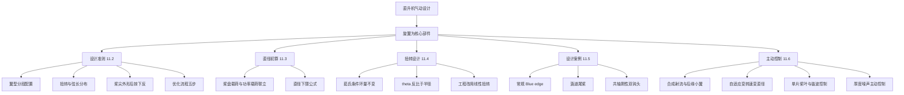
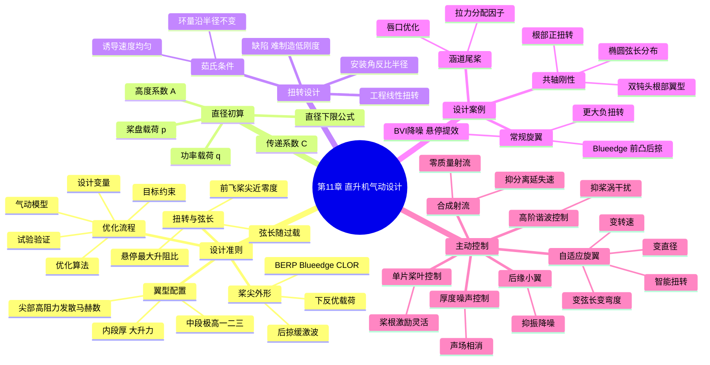

# 第 11 章 直升机气动设计 · 思维导图

> 本章主线：旋翼气动设计以悬停效率、前飞升阻比、失速裕度、噪声与振动之间的权衡为核心，从设计准则出发，经直径初算与扭转设计，落到各型旋翼的设计取向，再用主动控制突破被动外形瓶颈。

## 章节逻辑脉络

## 核心判断

1. **桨尖是性价比最高的设计杠杆**：后掠缓解前行桨尖压缩性与厚度噪声，下反改善载荷分布与悬停效率，BERP、Blue edge、CLOR 都是这一思想的工程演化。
2. **直径初算本质是能量守恒**：大直径靠低诱导速度换取低诱导功率，公式 $G^{3/2}\approx1253(A\eta_0\sqrt{\rho/\rho_0})P_M D$ 给出的是直径下限而非唯一解。
3. **茹氏旋翼是理论最优但不可用**：环量沿半径不变使诱导功率最小，却导致 $\theta\propto 1/r$ 的急剧负扭转，工程以线性扭转折中悬停与前飞性能。
4. **设计取向随任务分化**：常规旋翼偏悬停效率与 BVI 降噪，高速共轴刚性旋翼用双钝头根部翼型与正扭转对抗反流区与强压缩性。
5. **主动控制补被动外形的短板**：外形优化只能被动适应特定状态，合成射流、IBC、HHC 等才实现实时干预，主被动手段互补而非替代。

## 完整思维导图

[← 返回第 11 章正文](chapter11/README.md)
