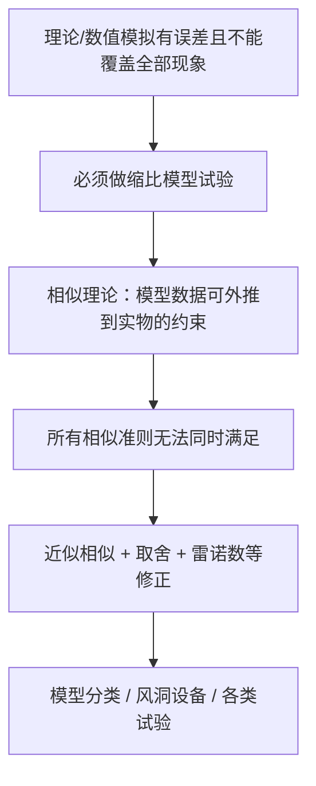

# 第 12 章 直升机气动与噪声试验

> 对应原书书内 p282–p308。
> 这是全书的最后一章。前面 11 章从基本参数与工作原理，一路走到滑流理论、叶素理论、涡流理论、旋翼 CFD、飞行性能、特殊飞行状态、气动设计与气动噪声。本章回到"验证"这一环：把纸面与屏幕上的理论，交还给风洞与试验台，讲清为什么必须做缩比试验、相似理论给了什么约束、模型与设备怎么搭、各类试验怎么做。

## 本章导览

**一句话主线**：计算与理论永远有误差且无法覆盖全部现象 → 必须用缩比模型做试验 → 相似理论给出了"模型数据可外推到实物"的数学约束 → 但所有相似准则无法同时满足，只能取舍与修正 → 由此派生出模型分类、风洞与试验台、悬停/前飞/组合/噪声等各类试验，以及测力测压测速测变形等常规手段。

**学习目标**

| # | 目标 | 对应小节 |
|---|---|---|
| 1 | 理解试验研究不可替代的原因，掌握相似理论的基本内容与三类相似 | 12.1.1 |
| 2 | 掌握量纲分析原理，能写出常用气动无量纲系数 | 12.1.2 |
| 3 | 掌握 7 个相似准则（雷诺、马赫、弗劳德、斯特劳哈尔、洛克、柯西、Da）的物理意义 | 12.1.3 / 12.1.4 |
| 4 | 理解试验模型的分类（纯气动/气动弹性）与比例因子选择 | 12.2 |
| 5 | 了解低速风洞、常用风洞、旋翼试验台与测力天平的构成 | 12.3 |
| 6 | 掌握悬停与前飞性能试验的流程，理解雷诺数修正的必要性 | 12.4 |
| 7 | 了解组合模型、噪声试验及常规测力/测压/测速/变形试验 | 12.5 / 12.6 / 12.7 |

---

## 12.1 旋翼试验的基本理论

试验研究之所以必要，可以从三条线索理解：第一，理论分析必然对复杂自然现象做简化假设，由此得到的结论必须用试验来证实，再据差异改进理论；第二，直升机空气动力学对象极复杂，部分现象至今没有令人满意的理论，只能靠单纯试验；第三，探索新领域、发现新现象、揭示新机理，都离不开试验。由此早已独立出"试验空气动力学"这门学科。本节只介绍直升机气动与噪声试验的理论、对象与方法的基本知识。

#### 12.1.1 相似理论

模型试验的根本目的，是让模型测出的数据能推广到实物。相似理论是模型试验的理论基础，它指出：由模型试验得到的数据，只能应用于与模型相似的实物，且这些数据必须以**无量纲**形式表达。

模型和实物完全相似，需同时满足 5 个条件：

1. 模型及其运动与实物属于**同类事物**；
2. **几何相似**：外形相似，对应线性尺寸成同一比例；
3. **时间条件**相对应；
4. **边界条件**相对应；
5. 所有对应点上、在对应瞬间，**同名物理量的比值相等**（矢量还要方向一致）。

然而完全相似往往很难、甚至不可能实现。实践表明，许多情况下只要满足主要相似条件、放宽或放弃次要条件，结果仍然可用——这就是**近似相似（部分相似）**。例如风洞壁和支架存在时，边界条件（条件 4）很难满足；模型与实物尺寸不同，条件 5 也只能部分满足，这正是"相似准则问题"的来源。

相似通常再细分为三种：

- **几何相似**：固体边界形状相似，对应线性尺寸成同一比例，对应夹角相等，面积、体积也成一定比例；
- **运动相似**：对应点、对应时刻的速度场相似，即同名速度方向一致、大小成一定比例；
- **动力相似**：对应点、对应时刻，作用在流体微团上的各同名力方向一致、大小成一定比例。

#### 12.1.2 量纲分析

物理量（简称"量"）用来定性区分并定量确定物理现象的属性。力学中绝大多数量彼此联系，由物理定律关联；适当选定三个基本量后，其余量可按定律导出。以国际单位制 SI 为例，力学基本量为**长度、质量、时间**，涉及热效应时再增加**热力学温度**。

**量纲**与单位相关但有区别：量纲只涉及量的本质，单位还涉及量的大小。基本量纲即基本量的量纲，力学三基本量纲记为 $L$、$M$、$T$，热力学温度记为 $\Theta$。任一物理量的量纲可写成基本量纲幂的乘积：

$$ \dim a = L^{c_1} M^{c_2} T^{c_3} \Theta^{c_4} \tag{12.1} $$

式中 $c_1\sim c_4$ 称**量纲指数**。若所有指数为零，则该量为**无量纲量（量纲一量）**；只要有一个指数非零，就是**有量纲量**。

量纲分析有两个基石：

- **量纲一致性原理**：正确的物理方程中，各项量纲必须一致；该性质与所用单位制无关。可据此校核方程或经验公式是否完整正确。
- 因各项量纲相同，用任一项通除全式，必能得到全无量纲的方程。

为方便比较与计算，通常把气动力、力矩都化为对应的无量纲量；且只有**同一坐标系、同一特征尺寸**下的气动无量纲量才能相互比较。表 12.1 列出常用有量纲物理量的量纲，表 12.2 列出常用气动无量纲系数（节选主要几项）：

| 符号 | 名称 | 量纲 | 无量纲系数 |
|---|---|---|---|
| $T$ | 旋翼拉力 | $LMT^{-2}$ | $C_T = \dfrac{T}{\frac{1}{2}\rho(\Omega R)^2\pi R^2}$ |
| $Q$ | 旋翼扭矩 | $L^2MT^{-2}$ | $C_Q = \dfrac{Q}{\frac{1}{2}\rho(\Omega R)^2\pi R^2}$ |
| $F_V$ | 旋翼垂向力 | $LMT^{-2}$ | $C_{F_V} = \dfrac{F_V}{\frac{1}{2}\rho(\Omega R)^2\pi R^2}$ |
| $F_H$ | 旋翼水平力 | $LMT^{-2}$ | $C_{F_H} = \dfrac{F_H}{\frac{1}{2}\rho(\Omega R)^2\pi R^2}$ |
| $F_{yJ}$ | 机身升力 | $LMT^{-2}$ | $C_{yJ} = \dfrac{F_{yJ}}{\frac{1}{2}\rho V_\infty^2 S_J}$ |
| $F_{xJ}$ | 机身阻力 | $LMT^{-2}$ | $C_{xJ} = \dfrac{F_{xJ}}{\frac{1}{2}\rho V_\infty^2 S_J}$ |
| $M_{sJ}$ | 机身俯仰力矩 | $L^2MT^{-2}$ | $C_{mJ} = \dfrac{M_{sJ}}{\frac{1}{2}\rho V_\infty^2 S_J l_J}$ |

注：$\rho$ 为密度，$\Omega$ 为旋翼角速度，$R$ 为半径，$V_\infty$ 为来流速度，$S_J$ 为机身特征面积，$l_J$ 为机身特征长度。

#### 12.1.3 量纲分析法和相似准则

量纲分析法的基本依据是量纲一致。对给定外形的旋翼，其拉力 $T$ 与下列物理量有关：$\rho$（密度）、$\Omega$（转速）、$\theta_{0.7}$（总距）、$\theta_{1c}$、$\theta_{1s}$（周期变距）、$R$（特征尺寸）、$V_\infty$（飞行速度）、$\alpha_s$（旋翼迎角）、$\mu$（空气黏性系数）、$a$（声速）、$g$（重力加速度）、$\Delta$（桨叶截面结构密度）；若考虑弹性，还与弹性模量 $E$（或剪切模量 $G$）、结构阻尼系数 $D$ 有关。于是可写：

$$ T = f\bigl(\rho,\;\Omega,\;\theta_{0.7},\;\theta_{1c},\;\theta_{1s},\;R,\;V_\infty,\;\alpha_s,\;\mu,\;a,\;g,\;\Delta,\;E,\;D\bigr) \tag{12.2} $$

其中 $\theta_{0.7}$、$\theta_{1c}$、$\theta_{1s}$、$\alpha_s$ 本身已是量纲一量。利用量纲一致，把上式写成各量幂的乘积，再取 $\rho$、$\Omega$、$R$ 的量纲指数为待求量，其余指数当作已知，联立方程解出后，可把拉力整理为：

$$ \frac{T}{\frac{1}{2}\rho(\Omega R)^2\pi R^2} = K_2 \cdot \Phi\!\left[\frac{V_\infty}{\Omega R},\;\frac{\mu}{\rho\Omega R^2},\;\frac{\Omega R}{a},\;\frac{g}{\Omega^2 R},\;\frac{\Delta}{\rho},\;\frac{E}{\rho(\Omega R)^2},\;\frac{D}{\rho\Omega R^3},\;\theta_{0.7},\;\theta_{1c},\;\theta_{1s},\;\alpha_s\right] \tag{12.9} $$

等号左边就是拉力系数 $C_T$；方括号内那些**无量纲参数**，就是所谓的**相似准则（相似准则数）**。要让模型试验真实反映实物，必须使模型与实物的各相似准则一一对应相等。

#### 12.1.4 相似准则的物理意义

下面逐一给出 7 个准则的表达与物理含义（特征速度取 $\Omega R$）。

| 准则 | 表达式 | 表征的物理本质 |
|---|---|---|
| 斯特劳哈尔数 $Sr$ | $Sr = \dfrac{\Omega R}{V_\infty}$ | 流动非定常特性（惯性力之比），即前进比/入流比相似 |
| 雷诺数 $Re$ | $Re = \dfrac{\rho(\Omega R)R}{\mu}$ | 流体黏性特性（惯性力/黏性力） |
| 马赫数 $Ma$ | $Ma = \dfrac{\Omega R}{a}$ | 空气压缩性（惯性力/弹性变形力） |
| 弗劳德数 $Fr$ | $Fr = \dfrac{\Omega^2 R}{g}$ | 重力场作用（惯性力/重力） |
| 洛克数 $Lo$ | $Lo = \dfrac{\rho}{\Delta}$ | 桨叶结构质量分布（空气惯性力/结构质量力） |
| 柯西数 $Ca$ | $Ca = \dfrac{\rho(\Omega R)^2}{E}$ | 桨叶结构弹性（空气惯性力/结构弹性力） |
| Da 数 | $Da = \dfrac{\rho\Omega R^3}{D}$ | 桨叶结构阻尼（空气惯性力/结构阻尼力） |

补充说明几点要点：

1. **斯特劳哈尔数** $Sr = \Omega R/V_\infty$，是旋翼非定常相似准则；保证 $Sr$ 相等，等价于保证前进比和入流比相似。
2. **雷诺数**常用特征长度为桨叶剖面弦长 $c$ 而非半径 $R$，特征速度取 $\Omega r$（$r$ 为该剖面半径），于是剖面雷诺数为：

   $$ (Re)_c = \frac{\rho\,c\,(\Omega r)}{\mu} \tag{12.13} $$

   $Re$ 相等是阻力相似的必要条件。小迎角无分离时摩擦阻力为主，$Re$ 增大到一定值后可认为总阻力与 $Re$ 无关；迎角接近或超过临界迎角时压差阻力也随 $Re$ 变，此时必须做雷诺数修正。
3. **马赫数** $Ma = \Omega R/a$，对高速运动（$Ma>0.5$）重要，压缩性导致弹性变形力不可忽略。
4. **弗劳德数** $Fr = \Omega^2 R/g$；几何相似+运动相似下 $Fr$ 相等即"重力相似"，且其相等要求模型与实物相对地面姿态相同——只有自由飞行模型试验才可能全姿态满足。
5. **洛克数** $Lo = \rho/\Delta$ 相等，即模型与实物结构密度相同，保证质量分布相似。
6. **柯西数** $Ca = \rho(\Omega R)^2/E$ 相等，保证弹性变形相似。
7. **Da 数** $Da = \rho\Omega R^3/D$ 相等，对结构动态响应（尤其共振点附近）重要；等价地要求模型与实物的**相对阻尼系数** $\zeta = D/D_c$ 相等。

---

## 12.2 试验模型要求

#### 12.2.1 试验模型的分类

按试验性质与任务，旋翼风洞模型分两类：

- **第 I 类：纯气动力模型（刚性模型）**。只考虑气动外形，各部件视为刚性构件，不考虑质量与刚度。适用于刚度较大、与弹性动态特性无关的构件（机体、桨毂、起落装置等）。要求：①几何相似；②运动相似，即 $Sr$ 相等（前进比 $\mu$、入流比 $\lambda_0$ 相等），对应操纵角相等（$\theta_{0.7}$、$\theta_{1c}$、$\theta_{1s}$ 相等）。
- **第 II 类：气动弹性结构模型（动力相似模型）**。除气动外形外，还必须考虑桨叶结构的质量、刚度与阻尼。在第 I 类基础上增加：①质量力相似，$Lo$ 相等；②弹性力相似，$Ca$ 相等；③结构阻尼力相似，$Da$ 相等（阻尼很小时可略）。

对某些特殊试验，还要额外满足：黏性相似（$Re$ 相等）、压缩性相似（$Ma$ 相等）、重力相似（$Fr$ 相等）。

#### 12.2.2 试验模型的相似性要求

**比例因子（缩比因子）**是模型与实物对应参数值之比。直升机风洞试验选三个独立比例因子：

$$ K_\Omega = \frac{\Omega_{\text{mod}}}{\Omega_{\text{act}}},\qquad K_R = \frac{R_{\text{mod}}}{R_{\text{act}}},\qquad K_\rho = \frac{\rho_{\text{mod}}}{\rho_{\text{act}}} $$

设一般参数的比例因子为 $K_A$，完全相似下有 $(A)_{\text{mod}} = K_A (A)_{\text{act}}$。三个独立因子的取值受如下限制：

1. **风洞对 $K_R$ 的限制**：试验段面积限制了模型最大尺寸。一般尽量做大，按 $\pi R^2/S_\infty = 0.2\sim 0.3$ 确定 $R$（$S_\infty$ 为试验段横截面积）。
2. **介质对 $K_\rho$ 的限制**：除氟利昂/高密度等特殊风洞外，通常用大气空气，近似 $K_\rho = 1$。
3. **$K_\Omega$ 按试验目的与设备，遵循下列准则之一确定**：

   - 按 **$Re$ 准则**（黏性相似，保证 $Re$ 相等）：$K_{Re}=K_\mu/(K_\rho K_R K_\Omega)=1$，大气下 $K_\rho=K_\mu=1$，得
     $$ K_\Omega = \frac{1}{K_R} \tag{12.22} $$
     即 $K_R<1$ 时模型转速随尺寸减小而迅速增大，离心载荷恶劣，桨毂轴承寿命短甚至很快损毁。
   - 按 **$Ma$ 准则**（压缩性相似）：$K_{Ma}=K_\Omega K_R/K_a=1$，大气下 $K_a=1$，得
     $$ K_\Omega = \frac{1}{K_R} \tag{12.23} $$
   - 按 **$Fr$ 准则**（重力相似）：$K_{Fr}=K_g/(K_\Omega^2 K_R)=1$，重力比 $K_g=1$，得
     $$ K_\Omega = \frac{1}{\sqrt{K_R}} \tag{12.24} $$

表 12.3 汇总了三准则下各参数比例因子，可归纳出三条结论：

1. 当 $K_R<1$ 时各准则得到的 $K_\Omega$ 大小：按 $Re$ 最大，按 $Ma$ 次之，按 $Fr$ 最小。
2. 三种准则都得到 $K_\sigma = K_E = 1$，即弯曲变形几何相似、对应点静动态应变相等（不含重力载荷引起的应变；定常飞行中该应变为常值，对桨叶动态特性研究误差不大）。只要 $Lo$、$Ca$、$Da$ 都相等，三种准则都能设计成第 II 类模型。
3. 当 $K_R$、$K_\rho$ 确定后，按不同准则造出的模型实际气动载荷（拉力、侧向力、后向力、需用功率等）不等：按 $Re$ 最大、$Ma$ 次之、$Fr$ 最小。由于 $Re$ 准则对模型与设备要求极高、且过高桨尖速度带来显著压缩性差异，通常**不采用**；多用 $Ma$ 或 $Fr$ 准则。对气动载荷分布要求不严的试验，可按 $Fr$ 准则设计——并非为重力相似，而是该准则下对模型与设备要求较低、结构应力水平低、安全性好。

---

## 12.3 风洞和试验设备

模拟旋翼飞行器的装置分两类：第一类是**风洞**，模型在固定位置旋转，人工气流以一定速度流过；第二类反过来，旋翼及驱动装置在大气中模拟飞行运动。风洞是产生均匀、可控气流的特殊管道，按试验段流速分低速、高速、高超音速风洞。直升机试验主要在**低速风洞**（试验段气流速度 $<135\ \text{m/s}$）进行。

#### 12.3.1 低速风洞

低速风洞按洞体分**直流式**与**回流式**，一般由稳定段、收缩段、试验段、扩散段、动力段组成。直流式靠喇叭口进风，经蜂窝器、阻尼网到稳定段消除大尺度涡，收缩段使气流均匀加速（收缩比越大气流品质越好），试验段流速最快、品质最好（长度约为横截面当量直径的 $1.5\sim 2.5$ 倍），扩散段降低速度、提高静压以减小能量损失（扩散角以 $5^\circ\sim 6^\circ$ 最佳）。回流式则从扩散段出来进入回流管道重返收缩段，功率利用率更高，试验段可为开口或闭口（开口便于安装旋翼及动力系统，但功率利用率较低）。

#### 12.3.2 常用风洞

世界上有上百座低速风洞（美国 40 余座、俄 10 余座、欧洲日本约 30 座，我国有近 10 座 3 m 量级低速风洞）。可用于直升机试验的代表性风洞包括：美国 NASA 全尺寸风洞（$24\ \text{m}\times 36\ \text{m}$ / $12\ \text{m}\times 24\ \text{m}$）、兰利 $14\times 22\ \text{ft}$ 亚声速风洞、刘易斯结冰风洞、马里兰大学格林·马丁风洞、法国 ONERA 的 F1 与 S1 跨声速风洞、德国 DNW 的 LLF 风洞、俄罗斯 T-101/T-104/T-105 立式风洞，以及 MIT、英国皇家航空研究院、法国 CEPRA19 等声学风洞。

#### 12.3.3 直升机旋翼试验台

为在风洞内研究旋翼气动与气动弹性特性，需一套专门装置，一般包括：①动力传动系统；②模型（旋翼、机身或组合）；③测试装置；④操纵装置及配套通用设备；⑤数据采集处理系统；⑥安全监视与报警系统。

- **动力传动系统**：由动力源与传动机构组成。动力源要求外廓小（减小阻塞）、转速连续可调且稳定、抗振、易维护。
- **操纵控制系统**：含旋翼操纵系统（控总距与纵/横向周期变距，以调整升力/垂向力系数、配平反扭矩与俯仰力矩）与主轴倾斜系统（改变旋翼轴倾角）。
- **测量系统**：旋翼模型上的气动力与力矩由旋翼天平测量，常用六分量天平与扭矩天平。
- **信号传输系统**：分旋转信号（扭矩、桨叶弯矩、桨距角、桨叶表面压力、变距拉杆、尾桨扭矩等）与非旋转信号（旋翼/机身/尾部件天平、机身测压等）。
- **数据采集与处理系统**：高速动态试验，关键是通道间同步精度与动态数据重复性精度。

#### 12.3.4 测力天平

天平是测力试验最核心的设备，按原理分机械、应变、压电、光纤与磁悬挂天平。近 50 年应变天平在各类风洞广泛应用，其本质是把作用于模型的空气动力转为电量/数字量输出，取决于静态与动态特性。国军标 GJB 2244A-2011 规定其设计、加工、粘贴、标定要求，精度合格指标 $0.2\%\sim 0.3\%$，准度 $0.4\%\sim 0.5\%$。

直升机测力天平含机身天平、尾桨天平、旋翼天平、扭矩天平等。多分量应变天平最大特点是**结构强耦合**，各分量相互干扰，须经过结构解耦、电桥解耦、信号解耦处理。六分量/旋翼天平机身多为盒式结构，用两端带柔性虎克铰的弹性拉杆组件（二力杆）实现结构解耦；再借助合理布局的惠斯通电桥，使某方向受载时该方向电桥有明显输出、其余方向输出近似为零，实现电桥解耦。天平加工与粘贴难免有误差，故使用前必须在标定架上用标准砝码做单元标定与综合标定，检查设计与制造质量、鉴定性能，并算出工作系数与精度、准度。

---

## 12.4 旋翼性能试验

#### 12.4.1 雷诺数修正

常压风洞中旋翼缩比模型很难同时满足 $Ma$ 与 $Re$ 相似，通常只保证 $Ma$ 相似。因此由缩比模型风洞结果预估全尺寸性能时，要做 $Re$ 数影响的修正。研究结论：给定拉力下，$Re$ 数降低则需用功率增加；随拉力增大，$Re$ 数影响增强。欧美机构（如 Boeing-Vertol、DLR、NASA 兰利 TDT 风洞）已发展较成熟的方法——Boeing-Vertol 掌握了由缩比数据估全尺寸性能的技术，DLR 则通过把模型弦长放大 10% 来削弱 $Re$ 影响。

#### 12.4.2 悬停试验

悬停是直升机特有状态，考核参数是品质因数（悬停效率 $FM$）。单独旋翼悬停试验确定旋翼悬停性能，旋翼/机身组合悬停试验获得悬停下的气动干扰特性。悬停试验也称为"旋翼桨尖 $Ma$ 数相似试验"，通常采用定转速、变总距的方法，由旋翼天平与扭矩天平分别测气动载荷与功率，得到功率-拉力曲线。

**一般步骤**：

1. 主轴倾角 $0^\circ$、总距 $0^\circ$、周期变距 $0^\circ$，采集零读数并存盘；
2. 启动动力系统升至工作转速，保持各角不变；
3. 操纵总距到试验值；
4. 采集数据、处理输出；
5. 重复步骤 3、4 完成全部试验点；
6. 总距降回 $0^\circ$；
7. 试验台停车。

风洞内悬停时，若旋翼与上、下洞壁距离不足旋停直径 1.2 倍，应把主轴倾斜 $10^\circ$ 以上并打开顶门以减小洞壁影响；距离大于 1.2 倍时与地面悬停步骤相同。需测量记录：拉力、侧向力、后向力、俯仰/滚转力矩、轴扭矩、转速、功率、总距、纵/横向周期变距、轴倾角、操纵拉杆载荷，以及时间、温度、压力、密度等。通过悬停试验可得功率系数-拉力系数曲线与品质因数 $FM$。

#### 12.4.3 前飞试验

前飞试验通常在风洞中进行，旋翼指定转速运转，用风洞来流模拟前飞。两种主要方法：①以前进比、模型姿态角（总距、周期变距、主轴倾角、侧滑角）为自变量直接控制，测气动力——简单易行、效率高，但需实时监控桨叶载荷、桨毂力矩、主轴弯矩、变距拉杆载荷以防超限；②前飞配平试验，以前进比、拉力系数、后向力系数为自变量并配平——接近真实飞行状态、便于分析，但要求试验台有较高遥测与实时监视能力、效率较低。

**带旋翼模型前飞试验一般步骤**：

1. 采集各主轴倾角状态下所有通道初始值；
2. 总距、周期变距、主轴倾角均为 $0^\circ$ 时启动至工作转速；
3. 启动风洞至所需风速，同步调整模型状态：风速增大逐渐前倾主轴、增大总距、调周期变距使俯仰/滚转力矩为零或较小；
4. 按要求操纵主轴倾角与风速，调总距达需配平拉力系数、调周期变距使俯仰/滚转力矩为零，采集信号；
5. 调整主轴倾角与风速到下一状态；
6. 重复 4、5 至完成；
7. 风速渐减、主轴回 $0^\circ$，保持桨毂力矩较小；
8. 风速归零后旋翼停车，采集各通道回零信号。

需测量记录：风速、轴倾角、转速、拉力、侧向力、后向力、俯仰/滚转力矩、轴扭矩、功率、总距、纵/横向周期变距、操纵拉杆载荷，以及时间、温度、压力、密度等。

---

## 12.5 组合模型风洞试验

#### 12.5.1 旋翼/机身组合模型风洞试验

旋翼/机身组合悬停试验，方法与单独旋翼悬停相同。由旋翼天平与扭矩天平测旋翼载荷与功率，得功率-拉力曲线；由机身天平与尾面天平（平尾、垂尾）测机身、平尾、垂尾载荷，得旋翼对机身的影响数据。试验前除检查旋翼/扭矩天平，还要加载检查机身与尾面天平。需测量：旋翼各分量载荷、各操纵角、轴倾角、拉杆载荷，以及机身升力、阻力、侧力、俯仰/滚转/偏航力矩、平尾与垂尾载荷等。比较单独旋翼与组合模型结果，可得旋翼/机身悬停干扰规律。

#### 12.5.2 旋翼/机身/尾桨组合模型风洞试验

直升机旋翼、尾桨及各部件间气动干扰大、机理复杂，是学术界与工业界评估气动干扰特性、指导型号设计的核心内容；理论预测困难，风洞试验仍是主要手段，其数据也是飞行性能分析的重要基础。

**旋翼/机身/尾桨组合前飞试验步骤**：

1. 机身调至指定状态，检查各天平、动力、数采、操纵系统正常；
2. 转速为 0 时采集各主轴倾角状态零读数并存盘；
3. 在指定总距/周期变距/主轴倾角下启动旋翼至工作转速，再启动尾桨至工作转速；
4. 风洞开车，风速与主轴倾角渐调至试验值并配平旋翼；
5. 操纵旋翼总距、周期变距到试验值；
6. 调尾桨总距到试验值并采集数据；
7. 调风速至下一试验值，重复 5、6；
8. 旋翼与尾桨回零、风速渐减到零；
9. 试验台停车。

需注意：改变旋翼主轴倾角时，为保证尾桨与旋翼/机身组合模型的相对位置，尾桨模型位置应作相应调整。该组合试验测量的参数覆盖机身、旋翼、尾桨三大部件的全部气动分量与功率。

---

## 12.6 旋翼气动噪声试验

气动噪声与结构噪声机理和传播极复杂，单靠理论无法彻底解决，必须在声学风洞与真实条件下做大量试验对比，建立噪声形成与降噪的物理模型，发展可靠计算方法并提供低噪声旋翼方案。

#### 12.6.1 噪声试验的相似性原理

旋翼气动噪声试验的相似条件为：①几何外形相似；②悬停桨尖马赫数、前进比、桨盘迎角、拉力系数相同；③雷诺数相似；④观测位置、时间相似。其中①~③与气动试验一致，④是噪声试验的额外要求。若做噪声机理类试验，还需按**气动声相似准则**确定条件：几何相似；$\lambda_0$、$Ma$、$Re$、$\alpha/\alpha_0$ 为常数；作用于物体的气动载荷相似；气流初始与边界条件相似。

#### 12.6.2 消声室

消声室是声学试验的重要场所，提供自由场或半自由场低噪声环境，其声学性能直接影响测试精度。按吸声层覆盖范围分**全消声室**（所有面铺吸声层）与**半消声室**（部分面铺设）。评价指标有二：

1. **背景噪声**：测试频率范围内，背景噪声声压级应至少比被测声源低 6 dB，最好低 12 dB；
2. **截止频率**：墙面的吸声系统保证 99% 吸声系数、满足自由场条件的最低频率；以下需修正。例如 2 m 直径模型旋翼、桨尖速度 200 m/s 时旋转频率 32 Hz，2 片桨叶的一阶噪声频率 64 Hz，则消声室截止频率需低于 64 Hz；全尺寸旋翼旋转频率一般 $<10$ Hz，通过频率 10~20 Hz。

#### 12.6.3 声学风洞试验

前飞状态旋翼气动噪声试验需在声学风洞进行。代表性声学风洞有 NASA 阿姆斯 $12\ \text{m}\times 24\ \text{m}$ 低速风洞、德荷合作的 DNW 风洞、法国 ONERA S1MA 风洞，以及我国北航建造的低速、低湍流度、低噪声回流式气动声学风洞（D5 风洞）。

适合直升机系统噪声测量的航空声学风洞应满足：①流场均匀、湍流度低于 $0.5\%$；②关注远场辐射噪声时，麦克风需布置在距桨毂 $3\sim 6R$ 处，模型半径一般最小 1 m，试验段均匀流场宽度 $4\sim 5$ m；③各噪声源在试验段及大厅产生的噪声须满足背景噪声要求（旋翼噪声应比背景至少低 6 dB）。噪声试验最大难点是试验条件难精确控制：旋翼性能受地面效应、姿态稳定、大气湍流度等影响，近地环境、地面类型、风速温度也影响传播；外场飞行试验几乎不可能完全控制每个参数，需按目的适当放宽次要参数、保证主要参数可控。

---

## 12.7 气动试验中的几类常规试验

#### 12.7.1 测力/测压试验 —— 旋翼桨叶气动载荷测量

为认识桨叶气动现象及其对性能的影响，需获得各截面气动力与力矩。因桨叶高速旋转，测载需特殊技术，常用方法：桨叶表面压力测量法、专用叶段天平测量法，先进方法是**压敏涂料（PSP）技术**。

PSP 含压力敏感发光材料，受特定波长激光照射后发射长波光（光致发光）；空气中"氧猝灭"效应使发光受周围压力调制，建立光学特性与压力的定量关系即可测表面压力。典型系统含激发光源与相机：在待测区喷涂 PSP，激光激发、相机采集发光信号，经处理转为压力分布。目前主要采用 Juliano 等 2011 年提出的**单脉冲寿命法**——脉冲激光瞬时功率极高保证信噪比，脉宽量级 10 ns，发光指数衰减，用双曝光相机连拍两张，光强比即代表发光寿命，对标定数据得压力结果；对气动加热引起的温度误差，另用 TSP 测温度场修正。

#### 12.7.2 测速试验 —— 旋翼流场测量

旋翼尾流场极复杂，研究已近一个世纪仍在发展。前飞典型流动现象包括旋翼/尾翼面干扰、前行侧桨叶噪声、桨尖涡等。

流场测量方法按原理分：①压力感应类——皮托管及三/五/七孔等多孔探头；②热交换类——热线/热膜风速仪（HWA）、飞行热线（FHWA）、脉冲热线（PWA）；③光学类——激光多普勒测速仪（LDV）、粒子图像测速仪（PIV）。其中**PIV**作为无干涉、高效率的定量解析工具作用愈来愈大。其原理：在流场散布大量示踪粒子（<10 μm）跟随流动，激光扩束成片光照亮流场，数字相机拍前后两帧粒子图像，相关计算得到切面内定量速度分布，进一步可得涡量、流线、等速度线。应用 PIV 需遵循三假设：粒子跟随流体、粒子均匀分布、判读区内速度唯一。工程上仍需发展：动态尾流场测量（浓度、标定、触发）、增加桨尖覆盖与提高分辨率（体视 PIV、三维层析 PIV）、测桨尖涡时同步记录拉力与环境温压以便定量关联。

#### 12.7.3 旋翼姿态角及弹性变形测量试验

桨叶是在离心场中工作的细长、低刚度弹性体，在交变气动载荷下易产生振动响应，既有绕根部铰的运动也有自身弹性变形。桨叶响应分析是复杂的气动弹性问题，目前计算精度只在部分状态下较好。旋翼气弹响应关系旋翼疲劳、直升机振动、桨叶/机体动力不稳定、操纵系统设计等，因此用试验预测桨叶姿态角及弹性变形是旋翼动力学的重要手段。

---

## 12.8 习题

1. 直升机气动与噪声试验的必要性是什么？
2. 气动试验的三大相似准则是什么？
3. 为什么要进行雷诺数修正？
4. 旋翼噪声试验与气动试验相似条件有何不同？
5. 简述旋翼悬停试验的试验方法。

---

## 本章小结

把全章串成一条逻辑链：

1. **为什么必须做试验**：理论基于简化假设、且有尚未建立理论的复杂现象，加上要发现新机理——所以试验不可替代，形成"理论分析 → 数值模拟 → 试验验证 → 完善理论"的闭环。
2. **相似理论给约束**：模型数据要外推到实物，必须无量纲化，并满足几何、运动、动力三类相似；完全相似往往不可能，只能近似相似。
3. **量纲分析导出准则**：由量纲一致把拉力整理为无量纲系数，方括号内即 7 个相似准则数——$Sr$、$Re$、$Ma$、$Fr$、$Lo$、$Ca$、$Da$，分别对应非定常、黏性、压缩性、重力、质量分布、弹性、阻尼。
4. **准则无法全满足 → 取舍与修正**：$Re$ 与 $Ma$ 通常不能同时满足，常压风洞只保 $Ma$，故需雷诺数修正；模型设计按 $Re/Ma/Fr$ 准则之一定 $K_\Omega$，且因 $Re$ 准则对设备要求过高，多用 $Ma$ 或 $Fr$。
5. **模型分类**：刚性（纯气动，第 I 类）只保几何+运动相似；动力相似（第 II 类）还需 $Lo$、$Ca$、$Da$ 相等。
6. **设备构成**：低速风洞（直流/回流）+ 旋翼试验台（动力、模型、测试、操纵、数采、安全）+ 多分量应变天平（需解耦与标定）。
7. **各类试验**：悬停（定转速变总距、测品质因数）与前飞（配平/非配平）；组合模型更接近真实、揭示干扰；噪声试验需消声室/声学风洞并额外要求观测相似；常规手段覆盖测力测压（含 PSP）、测速（PIV 等）、姿态角与弹性变形测量。

**全书脉络回顾**：第 1 章界定研究对象与学科边界；第 2–4 章建立旋翼空气动力学的基本参数、滑流（动量）理论、叶素理论与涡流理论；第 5 章上升到旋翼 CFD；第 6 章讲飞行性能计算；第 7 章讨论特殊飞行状态；第 8–11 章深入气动设计、气动弹性、气动噪声与流动控制；到第 12 章回到试验验证——理论、计算、试验三者互为支撑，这正是直升机空气动力学完整的体系。

---

## 自测题

1. 直升机气动与噪声试验为什么不可替代？试从理论简化、未解现象、新机理探索三方面说明。
2. 简述相似理论的三类相似（几何、运动、动力），并说明"近似相似"为何是旋翼风洞试验的常态。
3. 写出 7 个相似准则的表达式，并各用一句话说明其物理意义。
4. 设模型旋翼半径缩比 $K_R=1/4$，在常压大气下分别按 $Re$、$Ma$、$Fr$ 准则设计，模型转速比例 $K_\Omega$ 各为多少？为什么工程上通常不采用 $Re$ 准则？
5. 悬停试验为何称为"桨尖马赫数相似试验"？其一般步骤中哪些参数必须测量记录？
6. 旋翼噪声试验相比纯气动试验，多出了哪一条相似条件？消声室的截止频率对试验有什么约束？

**整理者补充的追问**

- 若一台风洞既能调密度（如氟利昂介质）又能调转速，$Re$ 与 $Ma$ 是否还有可能同时满足？这会改变模型设计的哪几个比例因子约束？
- PIV 测出的"速度场"是瞬时量还是时均量？要得到旋翼非定常尾迹的相位相关结构，触发采集应绑定到哪个信号？
- 第 II 类动力相似模型要求 $Lo$、$Ca$、$Da$ 都相等，但 $\Delta$（结构密度）、$E$（弹性模量）、$D$（阻尼）在缩比模型中往往难以同时匹配，这在工程上通常怎么折中？

[查看本章思维导图 →](chapter12/mindmap.md)
