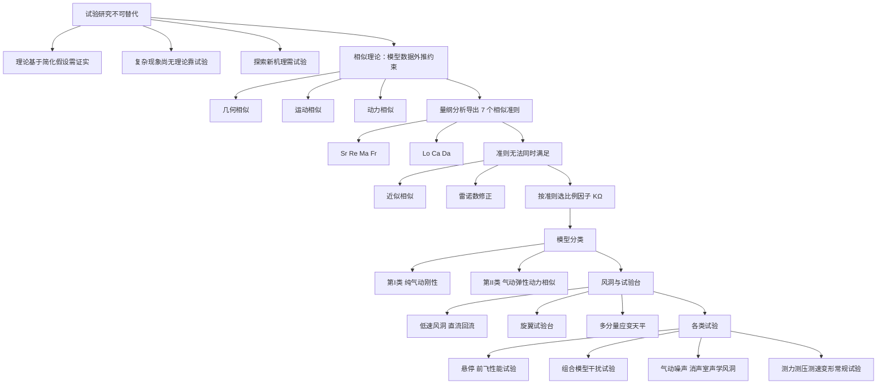
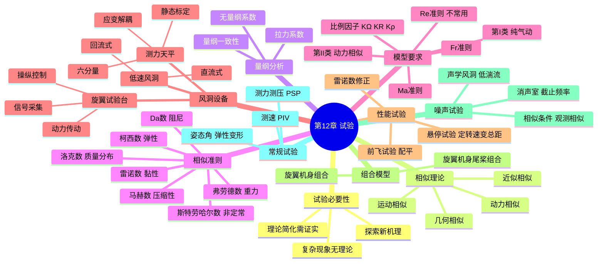

# 第 12 章 直升机气动与噪声试验 · 思维导图

## 章节逻辑脉络

## 核心判断

1. 相似理论把"缩比模型数据能否外推到实物"变成可计算的数学约束，但完全相似通常不可能，工程上只能做近似相似并做修正。
2. 七个相似准则中 $Re$ 与 $Ma$ 在常压缩比模型里几乎无法同时满足，因此常保 $Ma$、再做雷诺数修正，这是本章反复出现的核心矛盾。
3. 模型分刚性（第 I 类）与动力相似（第 II 类）两条路线：只关心气动力用前者，研究气弹动态特性必须用后者并满足 $Lo$、$Ca$、$Da$。
4. 组合模型试验比单独旋翼更接近真实飞行，是获取旋翼/机身/尾桨气动干扰数据不可替代的手段。
5. 噪声试验在气动相似之外额外要求观测位置与时间相似，因而离不开消声室与低背景噪声的声学风洞。

## 完整思维导图

[← 返回第 12 章正文](chapter12/README.md)
