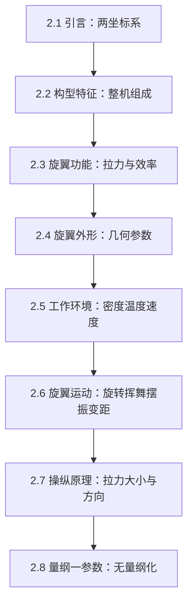
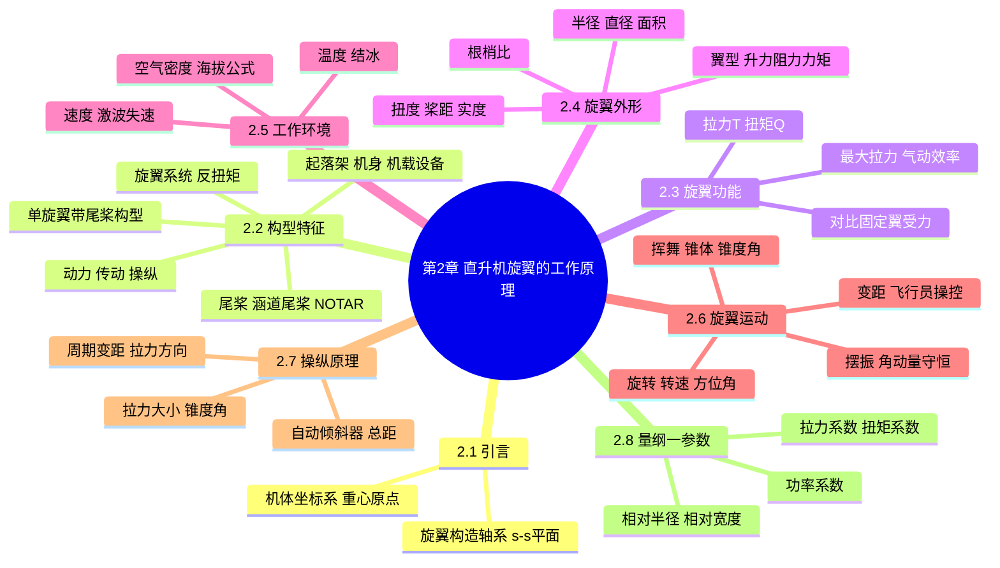

# 第 2 章 直升机旋翼的工作原理 · 思维导图

## 章节逻辑脉络

本章按"先整体后局部、先静态后动态"的顺序推进：先建立看问题的坐标系，再认识整机与旋翼，然后落到桨叶几何、工作环境，最后解析旋翼如何运动与被操纵，并用无量纲参数收口。

## 核心判断

1. 旋翼是直升机的核心气动部件，它一身兼三职——像机翼供升力、像螺旋桨供推力、像操纵面供平衡与机动，同时还能在停车后自转着陆。
2. 直升机必须有反扭矩补偿方案，单旋翼带尾桨靠尾桨、涵道尾桨或 NOTAR 来平衡旋翼反扭矩，这是构型差异的根源。
3. 旋翼拉力来自桨叶表面气动力，其大小与方向均由桨距控制；现代直升机靠变距而非变转速来改变拉力，因此转速基本恒定。
4. 挥舞是旋翼前飞受力的必然结果：悬停成对称锥体，前飞锥体前倾；挥舞铰与自动倾斜器配合，把桨距变化转化为拉力方向的改变。
5. 旋翼参数无量纲化后得到的拉力系数、扭矩系数、功率系数，是跨尺寸、跨工况比较旋翼性能的通用语言。

## 完整思维导图

[← 返回第 2 章正文](chapter2/README.md)
