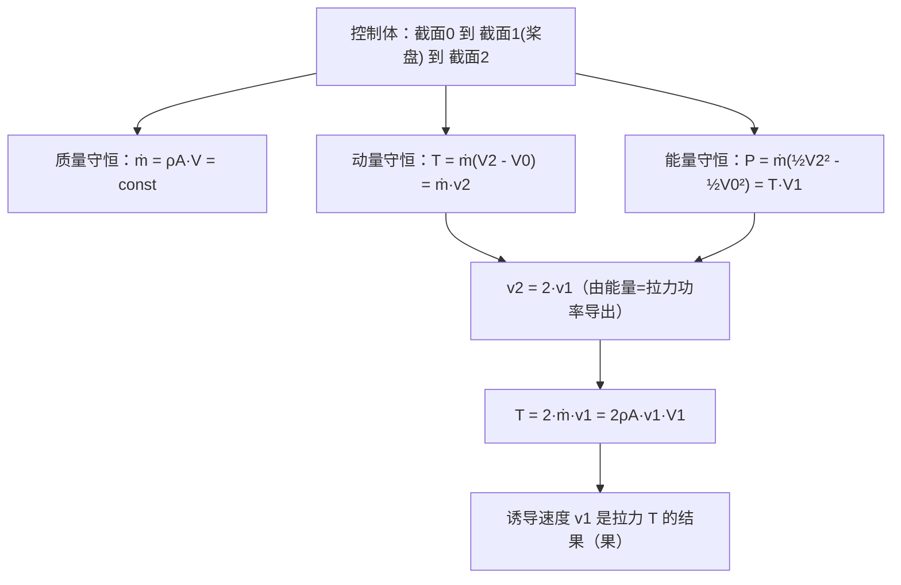

# 第 3 章 旋翼滑流理论

> 对应原书 PDF p61–p83。
> 本章是全书动量理论（滑流理论）的核心章。它用物理学三大守恒定律（质量、动量、能量守恒）去描述旋翼与空气的整体相互作用，从而在不涉及复杂流场细节的前提下，直接把旋翼的诱导速度、拉力和功率联系起来。学习时要先吃透这套理论的假设前提与不足，再顺着"假设→控制体→守恒方程→诱导速度→拉力/功率→效率"这条主线往下走。

## 本章导览

**一句话主线**：把旋翼简化成一块无限薄的作用圆盘（桨盘），用质量、动量、能量三大守恒，从"空气被向下加速"这件事里导出诱导速度、拉力和功率，并由此定义理想诱导功率与悬停效率（品质因数）。

**学习目标**

| # | 目标 | 对应小节 |
|---|---|---|
| 1 | 掌握滑流理论（动量理论）的五条基本假设及其带来的简化与不足 | 3.2.1 |
| 2 | 理解作用圆盘模型下三大守恒定律如何用于旋翼流场 | 3.2.1 |
| 3 | 掌握诱导速度的概念、物理含义及悬停/前飞下的表达式 | 3.3 |
| 4 | 掌握垂直飞行时的拉力公式、功率分解（爬升功率/诱导功率）与效率 | 3.4 |
| 5 | 掌握前飞时的拉力、功率公式及前飞升阻比 | 3.5 |
| 6 | 了解叶端损失、型阻功率、悬停效率 FM 等实际修正 | 3.4.3 / 3.6 |

---

## 3.1 引言

动量理论（又称滑流理论）是把物理学的三大基本守恒定律——质量守恒、动量守恒和能量守恒——应用到旋翼滑流上，用来估算旋翼整体气动性能的方法。为了把推导和计算尽量简化，它在多个假设之上做全局滑流分析，把"整体流速"与"旋翼拉力和功率"直接挂钩。

这套思路最早来自船用螺旋桨的研究：

- **兰金（W. J. M. Rankine）**，1865 年，提出动量理论的基本思想；
- **弗劳德（R. E. Froude）**，1885 年，进一步完善；
- **贝茨（A. Betz）**，1920 年，发展动量理论，进一步计入桨叶旋转带来的滑流效应。

本章的重点，就是把动量理论具体用到直升机旋翼上。

---

## 3.2 基本介绍

#### 3.2.1 分析基础

#### 简化假设

即便在匀速飞行中，旋翼的运动形式也很复杂，导致流场高度复杂。早期学者做气动性能分析时困难很大，于是对流场做了大幅简化，把研究目标集中在**拉力**和**功率**这两个最重要的性能参数上。采用的假设如下（共五条）：

1. **空气为无黏性流体**。实际空气有黏性，但黏性会让层流间产生摩擦、耗散能量、产生涡。采用无黏假设后，气流穿过旋翼就像在一条无形的管道里流动，计算会忽略摩擦耗能，这部分损耗可凭经验或粗略模型估计。
2. **空气为不可压缩流体**。前提是流场马赫数 $Ma \le 0.3$（气流速度约小于 100 m/s）。虽然旋翼桨尖 $M_{tip}>0.5$，但把旋翼看作作用圆盘后，盘上典型流速（悬停时约 10 m/s 量级）很低，所以用不可压假设不会带来大误差。
3. **旋翼被视为一个均匀作用于空气的无限薄圆盘（桨盘）**。几何外形（翼型、扭转、弦长、桨尖/桨根形状）全部忽略，只保留半径这一参数；桨叶的旋转、变距、挥舞、摆振等复杂运动也被极大简化。由于旋翼被简化成桨盘，悬停流场转化为定常流场。
4. **桨盘上气流速度均匀分布**。在每个截面上，流动速度被假设为均匀，不再随位置变化。
5. **滑流没有扭转（不计旋翼的旋转影响）**。桨叶旋转会给空气"搅"出绕轴的周向运动，但这一周向速度通常远小于向下的诱导速度，故忽略。

#### 理论基础

本质上，旋翼滑流理论就是牛顿定律在旋翼上的应用：把旋翼看作作用盘，它把空气推向下方，空气施加给旋翼的反作用力就是旋翼产生的**拉力**。按牛顿第二定律，这个力正比于通过旋翼的空气质量流量与空气加速度的乘积。为了计算空气流量和速度变化，要用到质量守恒、动量定理和能量守恒三条定律。

下面把三条定律写成控制体形式（设控制体固定，控制面为 $S$，流速 $\mathbf{V}$，密度 $\rho$，外法向单位矢量 $\mathbf{n}$，时间 $t$）：

- **质量守恒**（连续性方程）：

$$ \oint_S \rho \mathbf{V}\cdot\mathbf{n}\, dS = -\frac{\partial}{\partial t}\int_V \rho\, dV \tag{3.1} $$

定常条件下，净流出质量流量为零：

$$ \oint_S \rho V_n\, dS = 0 \tag{3.2} $$

其中 $V_n$ 为垂直于控制面向外的速度分量。

- **动量守恒**：控制体内（含穿过控制面的）流体动量变化率，等于作用在控制体内流体上的外力 $F$（表面力如压力、体积力如重力等）：

$$ \frac{\partial}{\partial t}\int_V \rho \mathbf{V}\, dV + \oint_S \rho \mathbf{V}(\mathbf{V}\cdot\mathbf{n})\, dS = F \tag{3.3} $$

定常条件下：

$$ \oint_S \rho \mathbf{V}(\mathbf{V}\cdot\mathbf{n})\, dS = -\oint_S p\mathbf{n}\, dS + \int_V \rho\mathbf{g}\, dV + \cdots \tag{3.4} $$

- **能量守恒**：对理想流体（无黏、无热传导），控制体内流体动能变化率等于外力与内力功率之和：

$$ \frac{\partial}{\partial t}\int_V \frac{1}{2}\rho V^2\, dV + \oint_S \frac{1}{2}\rho V^2 \mathbf{V}\cdot\mathbf{n}\, dS = -\oint_S p\mathbf{V}\cdot\mathbf{n}\, dS + \cdots \tag{3.5} $$

定常、不计重力、不可压时，上式用于一根流管即得简化的**伯努利方程**：

$$ p_1 + \frac{1}{2}\rho V_1^2 = p_2 + \frac{1}{2}\rho V_2^2 = \text{const} \tag{3.7} $$

伯努利方程明确给出无黏不可压流场中速度与压强的关系——"速度越大压强越小，速度越小压强越大"，即已知速度场可定压强场。但必须注意：**伯努利方程只能沿连续流线使用，不能用于间断流线**；旋翼桨盘处压强有突跃，故不能跨桨盘使用。

#### 3.2.2 垂直飞行

#### 质量守恒的应用

垂直飞行时，旋翼上方气流受作用向下运动，穿过桨盘继续向下流动。旋翼通过接触空气产生升力。按无黏假设，穿过桨盘的气流是层流，不与周围空气对流，于是可把通过桨盘的空气看成在一条管道内流动，管道在桨盘处的截面就是桨盘本身。

实验观测表明，下洗气流在桨盘附近呈"上宽下窄"的流动形态，于是可把它简化为一条竖直的一维流管。这条流管有三个重要截面：

- **截面 0**：旋翼上方足够远处，空气属性与环境一致，但已受旋翼作用开始产生向下的运动速度。若旋翼相对静止大气以速度 $V_0$ 垂直飞行，则把参考系放在桨盘上时，通过截面 0 的气流速度为 $V_0$。
- **截面 1**：即桨盘。气流受桨盘加速，定义桨盘处气流速度为 $V_1$，分解为 $V_0 + v_1$（$v_1$ 为桨盘处诱导速度）。
- **截面 2**：桨盘下方足够远处，气流速度达到最大，记为 $V_2 = V_0 + v_2$（$v_2$ 为远下游诱导速度）。

对桨盘升力可这样理解：桨盘上表面对应翼型上表面，气压低于环境大气压，把截面 0 的气流"吸"向截面 1 加速；桨盘下表面对应翼型下表面，气压高于环境大气压，把气流向下方远处截面 2 加速。注意流线虽连续，但**通过桨盘时压强发生突跃**，所以此处不能用伯努利方程。

基于质量守恒：

$$ \dot{m} = \rho_0 A_0 V_0 = \rho_1 A_1 V_1 \tag{3.8} $$

不可压时 $\rho_0=\rho_1$，于是流速与截面积成反比：

$$ A_0 V_0 = A_1 V_1 \tag{3.9} $$

可见速度小处滑流截面大、速度大处截面小。气流从截面 0 到截面 2 一直加速，故 $A_0 > A_1 > A_2$；而收缩最剧烈的位置正是压强变化最大的桨盘处。

#### 动量守恒的应用

对滑流应用定常动量定理。设桨盘对气流的作用力为 $T'$。滑流边界无切向力（无黏），仅受法向压力；滑流轴对称，侧面压力的水平/横向分量相抵，轴向分量与截面 0、截面 2 所受总压力互相平衡。因此滑流所受外力合力就是 $T'$，轴向速度由 $V_0$ 增至 $V_2$，于是：

$$ T' = \dot{m}(V_2 - V_0) \tag{3.10} $$

气流对桨盘的反作用力就是旋翼拉力 $T$，方向与滑流增速方向相反：

$$ T = T' = \dot{m}(V_2 - V_0) = \dot{m} v_2 \tag{3.11} $$

从这里可直接得出三条结论：

1. 相同拉力下，通过桨盘的流量越大，诱导速度越小；
2. 相同拉力、相同爬升速度下，桨盘面积越大的旋翼诱导速度越小；
3. 相同拉力下，空气密度减小，诱导速度增大。

#### 动能守恒的应用

对滑流应用定常能量守恒。截面 0 与截面 2 上压力做功功率互相抵消，侧壁压强与流速垂直、功率为零，所以滑流的动能变化所需能量完全来自旋翼。旋翼对空气做功的功率等于滑流动能变化率：

$$ P = \dot{m}\left(\frac{1}{2}V_2^2 - \frac{1}{2}V_0^2\right) \tag{3.12} $$

另一方面，从拉力与桨盘处气流速度也可得旋翼功率：

$$ P = T V_1 = T V_0 + T v_1 \tag{3.13} $$

比较式 (3.11)、(3.12)、(3.13)，得到 $v_1$ 与 $v_2$ 的定量关系：

$$ v_1 = \frac{1}{2} v_2 \tag{3.14} $$

即**桨盘处诱导速度等于远下游诱导速度的一半**。把这一关系代回拉力式，得到垂直飞行的核心拉力公式：

$$ T = 2\dot{m} v_1 = 2\rho A v_1 V_1 = 2\rho A (V_0 + v_1) v_1 \tag{3.34} $$

整个推导链条可归纳如下：

#### 3.2.3 前飞

直升机前飞时，旋翼处在斜吹气流中。前飞动量理论沿用轴流中的处理思路：先以宏观的一股理想气流斜向流过桨盘来分析。假设与轴流类似：

1. 气流无黏性；
2. 截面处气流速度均匀分布；
3. 气流无周向运动；
4. 桨尖平面平行于旋翼构造平面；
5. 以旋翼桨尖平面为桨盘；
6. 滑流边界在桨盘处总是以旋翼直径为直径的一个正圆，该圆垂直于当地气流速度方向。

#### 格劳特假设

按格劳特（Glauert）的建议，无论何种飞行条件，滑流边界在桨盘处总是一个以旋翼直径为直径的正圆，且垂直于当地气流速度方向。直觉上这不完全符合实际，但计算结果表明它对滑流总流量的估算相当正确。只有轴流状态这个正圆才与桨盘重合，前飞时两者是相交的。

#### 两套坐标系与前进比、入流比

采用两个坐标系：

- **速度轴系 $OX_vY_vZ_v$**：原点在桨毂中心，$OX_v$ 指飞行速度方向，$OY_v$ 在纵向对称平面内向上，$OZ_v$ 按右手定则向右。
- **旋翼锥体轴系 $OX_DY_DZ_D$**：原点仍在桨毂中心，$OY_D$ 垂直叶尖平面向上，$OX_D$ 沿飞行速度在叶尖平面上的投影方向指向前，$OZ_D$ 向右。

桨盘迎角 $\alpha_D$ 是 $X_v$ 与 $X_D$ 的夹角。正常平飞或爬升时 $\alpha_D < 0$，下滑时 $\alpha_D > 0$（沿用机翼迎角定义）。把相对气流速度 $V_0$ 分解为沿 $X_D$ 和 $Y_D$ 两个方向的分量，用系数表示：

$$ \mu_D = \frac{V_0\cos(-\alpha_D)}{\Omega R}, \qquad \lambda = \frac{V_0\sin(-\alpha_D)}{\Omega R} \tag{3.15} $$

其中 $\mu_D$ 为**前进比**（飞行状态特性系数），$  \lambda $ 为**入流比**（垂直于桨盘的气流速度系数，向上为正）。

前飞状态的结果在形式上与轴流完全一致：旋翼拉力

$$ T = 2\rho A V_1 v_1 \tag{3.26} $$

其中 $V_1$ 是桨盘处总速度（远前方来流与桨盘处诱导速度的矢量和）的大小，$v_1$ 为桨盘处诱导速度的大小；且**桨盘处诱导速度在数值上等于下游远处诱导速度的一半、方向上两者平行**（与轴流结论一致）。总需用功率化为无黏理想条件下的简洁形式：

$$ P = T\bigl[v_1 + V_0\sin(-\alpha_D)\bigr] = T v_1 + T V_0\sin(-\alpha_D) \tag{3.29} $$

---

## 3.3 诱导速度

#### 3.3.1 悬停和垂直飞行的诱导速度

按 3.2 节对三个截面的定义，考察各截面上速度及其组成（见图 3.8）：

- 截面 0（面积 $A_0$）：速度 $V_0$，压强为环境大气压 $p_0$；
- 紧贴截面 1 之前（面积 $A_{1前}$）：速度增至 $V_1 = V_0 + v_1$，压强 $p_{1前} < p_0$；
- 紧贴截面 1 之后（面积 $A_{1后}$）：速度仍为 $V_1$（桨盘无限薄、流动连续），但压强突跃为 $p_{1后} = p_{1前} + \Delta p$，且 $p_{1后} > p_0$；
- 截面 2（面积 $A_2$）：速度增至 $V_2 = V_0 + v_2$，压强降回环境大气压 $p_0$。

用伯努利方程可推出上、下游控制体内压强沿轴向的分布（对应原书式 (3.30)、(3.31)）：气流从上游远场到桨盘前，压强下降量小于桨盘处压强突增量的一半；从桨盘后到下游远场，压强下降量大于桨盘处压强突增量的一半。令 $V_0 = 0$ 即得悬停时压强沿轴向的分布：桨盘后的压强增加值等于桨盘前压强降低值（绝对值）的 3 倍。

**诱导速度的定义**：由于某种作用，在均匀流场或静止空气中所引起的速度改变量（包括大小与方向的改变）。在上半控制体内，空气速度从 $V_0$ 增至 $V_1$，增量就是 $v_1$。但这一过程空气并未与桨盘接触，并不给桨盘上的拉力提供帮助。**本质上，诱导速度 $v_1$ 是因拉力而产生——拉力是因，诱导速度是果。**

由式 (3.14)，桨盘处气流速度等于上下游气流速度之和的一半，等价于：

$$ v_1 = \frac{1}{2} v_2 \tag{3.33} $$

把式 (3.11) 写为：

$$ T = 2\dot{m} v_1 = 2\rho A v_1 V_1 = 2\rho A (V_0 + v_1) v_1 \tag{3.34} $$

可见：在相同拉力、桨盘面积、空气密度下，垂直飞行速度 $V_0$ 越大，诱导速度 $v_1$ 越小。

**悬停诱导速度（特性速度）**：直升机悬停时旋翼原地工作，从四面八方吸入空气再向下排出。定义"特性速度" $v_{i0}$，即与其他飞行状态保持同样拉力系数 $C_T$ 的悬停状态桨盘处诱导速度。令 $V_0 = 0$，结合式 (3.11) 与 (3.33)：

$$ v_{i0} = \sqrt{\frac{T}{2\rho A}} = \sqrt{\frac{L}{2\rho}} \tag{3.35} $$

其中 $L = T/A$ 为**桨盘载荷**。上式清楚表明：悬停诱导速度取决于桨盘载荷——相同拉力下，桨盘面积越大的旋翼诱导速度越小。总之，相同拉力时通过桨盘的空气流量与诱导速度成反比；空气密度、桨盘半径、飞行速度任一改变都会改变流量，进而影响诱导速度。

#### 3.3.2 前飞时诱导速度

桨盘处气流速度 $V_1$ 是远前方来流 $V_0$ 与桨盘处诱导速度 $v_1$ 的矢量和。用无量纲形式分析：

- $V_1$ 在 $(-X_D)$ 方向的分量为**前进比**：$\mu = \dfrac{V_0\cos(-\alpha_D)}{\Omega R}$；
- $V_1$ 在 $(-Y_D)$ 方向的分量为**入流比**：$(-\lambda_1) = (-\lambda_0) + \lambda_{i1}$，其中 $\lambda_0 = \dfrac{V_0\sin(-\alpha_D)}{\Omega R}$ 为来流入流比，$\lambda_{i1} = v_1/(\Omega R)$ 为诱导入流比。

由于 $V_1$ 是 $V_0$ 与 $v_1$ 的矢量和，其大小为：

$$ V_1 = \sqrt{\mu^2 + (-\lambda_1)^2} = \sqrt{\mu^2 + \lambda_1^2} \tag{3.37} $$

代入拉力系数公式得（形式与轴流一致）：

$$ C_T = 2\lambda_1 V_1 = 2\lambda_1\sqrt{\mu^2 + \lambda_1^2} \tag{3.39} $$

整理后得到关于 $\lambda_{i1}$ 的方程，给定 $V_0/v_{i0}$ 与 $\alpha_D$ 即可解出桨盘处诱导速度 $v_1$。以 $(-\alpha_D)$ 为参考，画出 $(v_1/v_{i0})$ 随 $(V_0/v_{i0})$ 的变化曲线（原书图 3.11）：

由图可见：**随着前飞速度增大，诱导速度显著降低**——因为质量流量随前飞速度增大，产生一定拉力所需的诱导速度减小。前飞速度较大时 $(-\alpha_D)$ 的影响不显著，各条曲线趋于重合；当 $(V_0/v_{i0}) > 2$ 且 $(-\alpha_D)$ 在 $10^\circ$ 以内（约巡航水平飞行）时，诱导速度与桨盘迎角基本无关，可近似为：

$$ \frac{v_1}{v_{i0}} \cdot \frac{v_{i0}}{V_0} - 1 \approx 0 \tag{3.42} $$

---

## 3.4 垂直飞行时气动力计算

#### 3.4.1 拉力公式和功率公式

由式 (3.13)，旋翼功率等于拉力 $T$ 与桨盘处气流速度 $V_1$ 的乘积。在滑流理论中：

$$ P = T V_1 = T V_0 + T v_1 = P_c + P_i \tag{3.43} $$

- **$P_c = T V_0$**：爬升功率（有效功率），对应直升机势能的变化；
- **$P_i = T v_1$**：诱导功率，是产生拉力不可避免的损失，与势能/动能变化无直接关系。

由于桨盘处诱导速度等于下游诱导速度的一半，拉力公式也可写为：

$$ T = 2\dot{m} v_1 \tag{3.34'} $$

对应的无量纲形式（按 $T = 2\rho A v_1 V_1$，$V_1 = V_0 + v_1$ 无量纲化）：

$$ C_T = 2\lambda_1 V_1, \qquad C_P = C_T\lambda_1 \tag{3.44/3.45} $$

悬停时退化为 $C_T = 2\lambda_{i0}^2$，$C_P = 2\lambda_{i0}^3$。

#### 3.4.2 旋翼的效率

按定义，效率是爬升功率与全部消耗功率之比。垂直飞行理想情况下：

$$ \eta = \frac{P_c}{P} = \frac{T V_0}{T(V_0 + v_1)} = \frac{V_0}{V_0 + v_1} = \frac{1}{1 + v_1/V_0} \tag{3.46} $$

可见 $v_1/V_0$ 越小效率越高；但 $\eta$ **永远小于 1**，因为诱导速度不可能为零（否则就没有拉力）。写成无量纲式：

$$ \eta = \frac{C_T V_0}{C_P} = \frac{V_0}{V_1} \tag{3.47} $$

#### 3.4.3 旋翼悬停时的效率

令 $V_0 = 0$，桨盘处 $V_1 = v_{i0}$，下游远场 $V_2 = v_2 = 2v_{i0}$，则有：

$$ T = \dot{m} v_2 = 2\dot{m} v_{i0}, \qquad P = \dot{m}\frac{v_2^2}{2} = T v_{i0} \tag{3.56/3.57} $$

设下游滑流截面半径为 $R_2$，则 $\dot{m} = \rho\pi R^2 v_{i0} = \rho\pi R_2^2 (2v_{i0})$，故下游滑流截面半径与桨盘半径之比：

$$ \frac{R_2}{R} = \frac{1}{\sqrt{2}} \approx 0.707 \tag{3.58/3.59} $$

实验结果表明该比值约为 0.78，略大于 0.707，源于经典滑流理论未充分考虑某些因素。无量纲形式：

$$ C_T = 2\lambda_{i0}^2, \qquad C_P = C_T\lambda_{i0} = 2\lambda_{i0}^3 \tag{3.60/3.61} $$

**实际旋翼的修正（叶端损失）**：实际旋翼的桨毂及桨根剖面不产生拉力，桨尖处拉力也因气流绕流而削弱。把这部分损失对应的面积从桨盘面积中扣除，得到实际产生拉力的面积：

$$ A_{ac} = (\bar{r}_1^2 - \bar{r}_0^2)\pi R^2 = \kappa \pi R^2 \tag{3.48/3.49} $$

其中 $\bar{r}_0 \approx 0.2$（叶根无拉力部分），$\bar{r}_1 \approx 0.98$（叶尖折合有效部分），故叶端损失系数 $\kappa = (\bar{r}_1^2 - \bar{r}_0^2) \approx 0.92$。引入 $\kappa$ 后实际拉力：

$$ T_{ac} = \kappa T_{th} = 2\rho(\kappa\pi R^2) v_1 V_1 \tag{3.50} $$

即要产生同样的拉力，实际诱导速度会比理论值略大：

$$ v_{1,ac} = \frac{1}{2}\left[-V_0 + \sqrt{V_0^2 + \frac{2T}{\rho\kappa\pi R^2}}\right] \tag{3.52} $$

实际功率还要计入摩擦、激波、速度不均、气流扭转等被假设略去的其他损失：

$$ P_{ac} = T_{ac} V_0 + \sum P_{loss} \tag{3.53} $$

实际效率 $\eta_{ac}$ 则为理想效率再乘上系数 $\kappa$ 及各项损失修正。

**悬停效率（品质因数，Figure of Merit, FM）**：悬停时爬升功率为零，不能再按前述效率定义，于是采用"相对效率"或悬停效率 $\eta_{i0}$ 来表示。它等于理想诱导功率与实际功率之比：

$$ \eta_{i0} = \frac{T^{3/2}}{\sqrt{2\rho A}\, P} \tag{3.66} $$

化为无量纲形式：

$$ \eta_{i0} = \frac{C_T^{3/2}}{\sqrt{2}\, C_P} \tag{3.67} $$

常见直升机的 $\eta_{i0}$ 一般在 **0.6–0.82** 之间，优秀旋翼可达约 0.8。由于直升机整体还有驱动尾桨、传动等辅助设备耗功，悬停时诱导功率只占总功率的 **60%–65%**。工程中还会用到**功率载荷** $q = T/P$（传统习惯中拉力常用千克力或克力）。

---

## 3.5 前飞时气动力计算

#### 3.5.1 拉力公式和功率公式

由式 (3.29)，前飞时旋翼需用功率同样由两部分组成：克服诱导损失的部分，与用于向前推进的部分。

- 诱导功率：$P_i = T v_1 \tag{3.69}$
- 爬升功率：$P_c = T V_0\sin(-\alpha_D) \tag{3.70}$

当 $(-\alpha_D) = 90^\circ$ 时，功率公式退化为垂直飞行结果。当旋翼处于自转下滑状态、$P = 0$ 时：

$$ T v_1 + T V_0\sin(-\alpha_D) = 0 \tag{3.71} $$

即诱导速度恰好抵消相对气流垂直于桨盘的轴向分量，总体上没有气流穿过桨盘，此时：

$$ v_1 = V_0\sin\alpha_D \tag{3.72} $$

对应的旋翼拉力为：

$$ T = 2\rho\pi R^2 (V_0\cos\alpha_D)(V_0\sin\alpha_D) = \rho\pi R^2 V_0^2\sin 2\alpha_D \tag{3.74} $$

需说明：滑流理论推导的自转下滑关系是有问题的，因为此时可能已不存在理想滑流——这里讨论的只是"理想自转下滑"。

定常前飞时，拉力和功率化为无量纲形式：

$$ C_T = 2\lambda_1 V_1 = 2\lambda_1\sqrt{\mu^2 + \lambda_1^2} \tag{3.75} $$

$$ C_P = C_T\lambda_{i1} + C_T\lambda_0 \tag{3.77} $$

式中第一项称为**诱导功率系数**，第二项称为**爬升功率系数**（$\lambda_0 = V_0\sin(-\alpha_D)/(\Omega R)$）。

实际计算时同样要计入叶端损失，引入系数 $\kappa \approx 0.91\sim 0.94$，于是：

$$ T = 2\rho\kappa\pi R^2 V_1 v_1, \qquad C_T = 2\kappa\lambda_1 V_1 \tag{3.78} $$

#### 3.5.2 前飞升阻比

悬停用悬停效率评价，前飞则可用**前飞升阻比**来评价。孤立匀速平飞状态，旋翼功率由诱导功率和型阻功率组成，即 $P = P_i + P_d$；按 $F = P/V_\infty$ 可折算成等效阻力，而此时旋翼升力为 $T\cos\alpha_D$，于是前飞升阻比：

$$ \frac{L}{D} = \frac{T\cos\alpha_D \cdot V_\infty}{P_i + P_d} \tag{3.79} $$

---

## 3.6 其他考虑因素

把滑流理论的结果用于实际，还需注意以下几点：

1. **必须补回被假设略去的损失**。最初假设不计空气摩擦、不计气流扭转、不计诱导速度分布不均，但实际都要考虑：

$$ P_{ac} = T_{ac} v_1 + T_{ac} V_0\sin(-\alpha_D) + \text{其他功率} \tag{3.80} $$

分析表明，气流扭转损失影响不大，粗略计算可不考虑；空气摩擦损失在叶素理论（第 5 章）中考虑；诱导速度分布不均对诱导功率的影响随前飞速度增大而增大，将在前飞涡流理论（第 6 章）详述。

2. **流场混乱时理论失效**。若气流流动中出现混乱，滑流理论就失去存在基础——例如直升机以小速度下滑时极易发生这种情况。

---

## 3.7 习题

1. 假定某直升机在垂直飞行状态发动机功率有 84% 传递给旋翼，且悬停时型阻功率为诱导功率的一半（实际悬停功率由诱导功率和型阻功率组成），叶端损失系数 $\kappa = 0.92$。
   - (a) 求海平面标准大气条件下悬停时桨盘外的诱导速度；
   - (b) 求悬停时桨盘诱导功率、相对功率和直升机单位功率载荷；
   - (c) 若以 $V_0 = v_{i0}$ 的速度垂直爬升，此时桨盘处诱导速度多大？诱导功率多大？若型阻功率与悬停时相同，旋翼消耗总功率多大？
2. 上题中若飞行重量增大 20%，除增大桨距外保持其他条件及型阻功率不变，求悬停诱导功率和相对效率。
3. F-35B 升力风扇直径 1.4 m，可产生 88.9 kN 升力，消耗功率约 21625 kW；AW149 直升机最大起飞重量 8100 kg，旋翼直径 14.6 m，装两台 CT7-2E1 发动机（单台 1476 kW）。试用本章知识比较分析这两种飞行器。
4. 某旋翼在风洞中吹风试验，风速 $V_0 = 30$ m/s，旋翼迎角 $\alpha_D = -10^\circ$，后方远处测得滑流速度 $V = 31.6$ m/s，下洗角 $\varepsilon_2 = 10.8^\circ$。求桨盘处诱导速度 $v_1$ 与滑流下洗角 $\varepsilon_1$。
5. 某直升机在 $H = 1000$ m 高度水平飞行，速度 $V_0 = 90$ km/h，桨盘迎角 $\alpha_D = -7.5^\circ$。求此时诱导功率，并计算其与同高度悬停时诱导功率之比。
6. 选择题：直升机水平前飞状态与悬停状态相比，其 (a) 通过旋翼的气体质量流量、(b) 旋翼诱导功率、(c) 每片桨叶挥舞幅度、(d) 挥舞运动消耗功率，分别如何变化？

---

## 本章小结

1. **假设决定了一切**：滑流理论把旋翼简化为"无黏、不可压、无限薄均匀作用圆盘"，气流在桨盘上均匀分布、无扭转。这些假设极大地简化了流场，但也决定了它只能给出整体性能、且必然高估效率——摩擦、扭转、速度不均等损失都要事后补回。
2. **三大守恒导出核心关系**：在截面 0（上游远场）—截面 1（桨盘）—截面 2（下游远场）的控制体上，质量守恒定流量、动量守恒定拉力、能量守恒定功率，三者共同给出 $v_1 = v_2/2$ 与 $T = 2\rho A v_1 V_1$。
3. **诱导速度是拉力的果**：它因拉力而生；悬停时 $v_{i0} = \sqrt{T/(2\rho A)}$，只取决于桨盘载荷，与是否前飞无关，前飞时随速度增大而减小。
4. **功率可拆成两块**：理想功率 $P = P_c + P_i = T V_0 + T v_1$，爬升功率是"有用功"，诱导功率是"不可避免的损失"。
5. **效率永远小于 1**：垂直飞行效率 $\eta = V_0/(V_0+v_1)$；悬停时用品质因数 FM（悬停效率）$\eta_{i0} = T^{3/2}/(\sqrt{2\rho A}\,P)$ 来度量，优秀旋翼约 0.8，且诱导功率仅占总功率 60%–65%。
6. **实际要打折**：引入叶端损失系数 $\kappa\approx 0.92$ 修正有效桨盘面积；摩擦、扭转、速度分布不均等损失需借助叶素理论（第 5 章）和涡流理论（第 6 章）进一步处理。

---

## 自测题

1. 原书习题 1–6（见上节 3.7），任选 3 道完整计算，重点核对诱导速度与功率的量纲与数量级。
2. 为什么滑流理论中"桨盘处不能用伯努利方程"？请从压强在桨盘处的突跃这一事实说明。
3. 悬停诱导速度 $v_{i0} = \sqrt{T/(2\rho A)}$ 只含桨盘载荷 $L=T/A$ 与密度 $\rho$。若把桨盘面积加倍而保持拉力不变，诱导功率将如何变化？请用 $P_i = T v_{i0}$ 与 FM 两个角度分别解释。
4. 前飞时诱导速度随速度增大而减小，这与"诱导功率随前飞速度如何变化"是什么关系？为什么说高速前飞时诱导功率不再是总功率的主要部分？
5. 为什么悬停效率（FM）不能像垂直飞行效率那样用"爬升功率/总功率"来定义？它本质上衡量的是哪两部分功率之比？

[查看本章思维导图 →](chapter3/mindmap.md)
