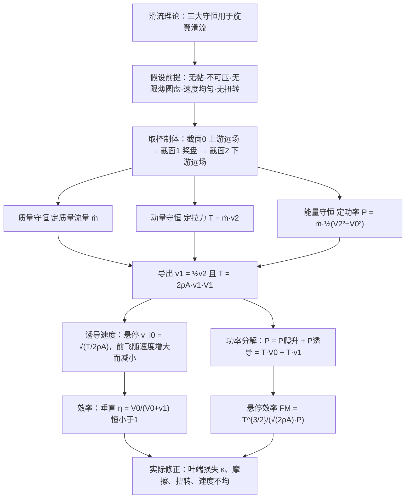
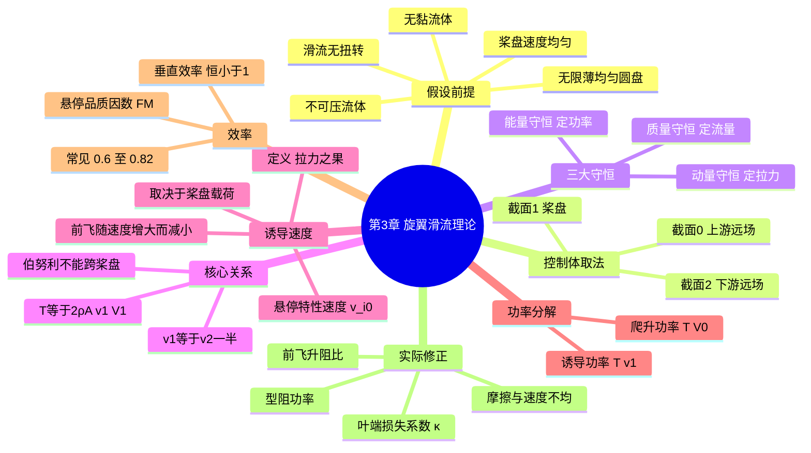

# 第 3 章 旋翼滑流理论 · 思维导图

## 章节逻辑脉络

## 核心判断

1. **滑流理论是整体模型而非细节模型**：它用五条强假设把旋翼压成一个"作用圆盘"，只回答拉力和功率这两个整体量，因此必然高估效率，实际损失要事后补回。
2. **拉力是因、诱导速度是果**：诱导速度不是外加的，而是桨盘把空气向下加速的结果；相同的拉力下，流量越大、桨盘越大、密度越高，诱导速度越小。
3. **理想功率永远含一项不可避免的损失**：诱导功率 $P_i = T v_1$ 是产生拉力的代价，与势能变化无关；所以任何飞行状态的效率都严格小于 1。
4. **悬停用品质因数 FM 衡量优劣**：悬停时爬升功率为零，改用 FM 表示理想诱导功率与实际功率之比，优秀旋翼约 0.8，可作为旋翼气动设计水平的标尺。
5. **前飞让诱导速度下降、诱导功率退居次席**：质量流量随前飞速度增大，所需诱导速度减小，高速前飞时型阻功率等其他项占比上升。

## 完整思维导图

[← 返回第 3 章正文](chapter3/README.md)
