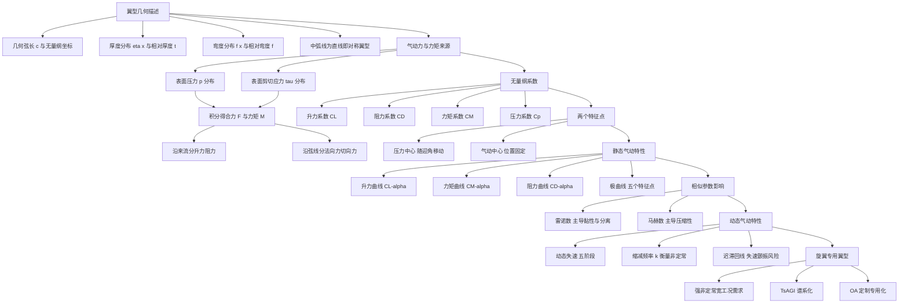
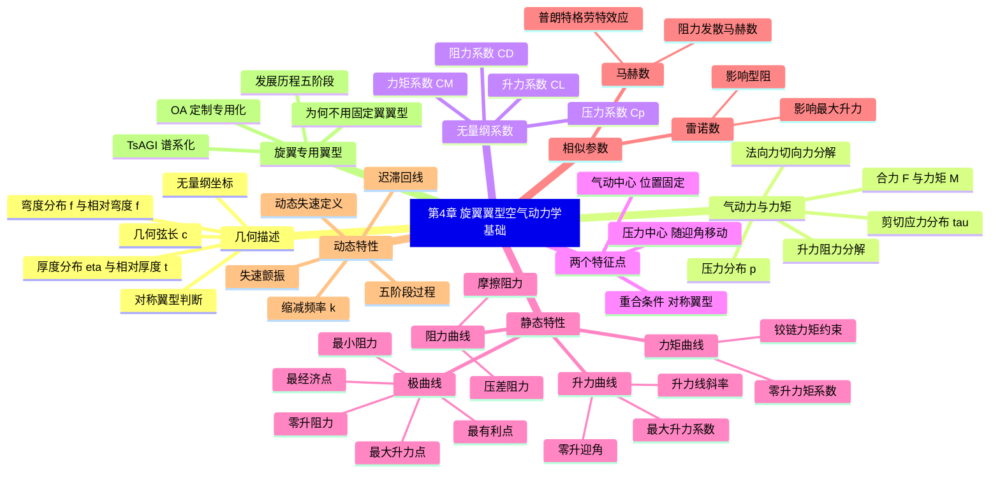

# 第 4 章 旋翼翼型空气动力学基础 · 思维导图

> 本章把所有内容串成一条逻辑链：先用几何参数定量描述翼型，再从表面应力积分得到气动力与力矩，建立静态特性与极曲线，引入雷诺数与马赫数两大相似参数，最后落到旋翼特有的动态失速与专用翼型需求。

## 章节逻辑脉络

## 核心判断

1. 翼型的全部气动力归根结底只来自表面的压力与剪切应力，几何参数（厚度、弯度）只是间接改变这两种分布的手段。
2. 压力中心随迎角移动、气动中心位置固定，二者重合与否取决于是否有弯度；变距轴过气动中心可锁定操纵力矩。
3. 极曲线是空气动力合力的矢量曲线，最小阻力、最有利、最经济、最大升力、零升阻力五个特征点把"性能优劣"量化成可读的坐标。
4. 雷诺数管黏性分离、马赫数管压缩性，前者抬高最大升力、后者在抬高升力线斜率的同时压低最大升力并引出阻力发散马赫数。
5. 旋翼处于旋转强非定常环境，动态失速靠失速涡推迟分离却又带来力矩突增与负阻尼，因此必须发展固定翼所没有的专用翼型。

## 完整思维导图

[← 返回第 4 章正文](chapter4/README.md)
