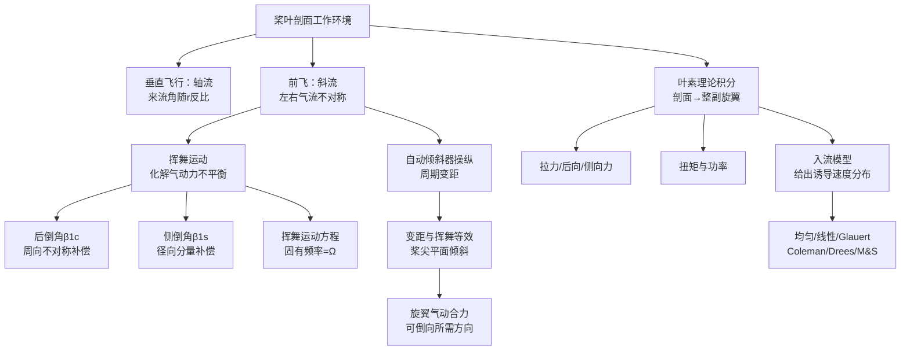

# 第 5 章 桨叶运动与叶素理论

> 对应原书书内 p98–p135。
> 本章是全书篇幅最大、公式最密集的一章：先在桨叶（叶素）这一最底层尺度上厘清桨叶剖面的工作环境，再解释前飞时左右气流不对称如何引发挥舞、挥舞又怎样把气动力不平衡"自动抚平"，然后建立挥舞运动方程、讲清自动倾斜器的操纵原理，最后用叶素理论把局部剖面气动力积分成整副旋翼的拉力、后向力、侧向力、扭矩与功率，并给出常用入流模型。建议边推公式边对照思维导图。

## 本章导览

**一句话主线**：桨叶剖面在垂直/前飞时看到的相对气流不同（前飞左右不对称）→ 必须挥舞来化解气动力不平衡 → 挥舞运动方程描述这种周期运动 → 自动倾斜器+变距+挥舞配合产生操纵力矩 → 叶素理论把剖面气动力积分成旋翼总气动力与功率 → 入流模型给出积分所需的桨盘诱导速度分布。

**学习目标**

| # | 目标 | 对应小节 |
|---|---|---|
| 1 | 掌握桨叶剖面工作环境：速度分量、来流角、前进比、入流比、反流区 | 5.2 |
| 2 | 讲清前飞气流不对称 → 挥舞的因果链，理解后倒角、侧倒角的成因 | 5.3 |
| 3 | 掌握挥舞运动方程的建立、共振特性与偏置铰/无铰旋翼的处理 | 5.3 |
| 4 | 理解自动倾斜器操纵原理、周期变距、变距与挥舞等效、挥舞调节系数 | 5.4 |
| 5 | 能用叶素理论推导旋翼拉力、后向力、侧向力、扭矩（功率） | 5.5 |
| 6 | 掌握常用入流模型（均匀/线性/Glauert/Coleman/Drees/Mangler）的适用 | 5.6 |

---

## 5.1 引言

第 3 章的滑流（动量）理论把旋翼桨盘看作无限薄的圆盘，只从气流速度变化来研究旋翼气动力，没有涉及旋翼的几何外形、运动细节与气流黏性。叶素理论则是现代直升机旋翼空气动力学分析的基础：把桨叶看成由沿展向无限多个桨叶微段（叶素）组成，考查每个叶素的运动与受力，找出叶素的几何、运动、气动三者之间的关系，再对每片桨叶积分，得到整副旋翼的拉力与功率表达式。

与滑流理论相比，叶素理论分析了旋翼附近流动细节与桨叶剖面的工作环境，能把旋翼性能、气动特性与桨叶设计参数（弦长、扭度、翼型等）关联起来，从而可用于旋翼设计。注意：桨叶运动知识在叶素理论和 CFD 方法中都起关键作用，学习者应充分理解桨叶运动机理与叶素理论，并留意相关公式的推导。

---

## 5.2 桨叶剖面的工作环境

旋翼流场复杂，主要体现在三点：① 运动复杂——匀速飞行中桨叶也可能同时包含旋转、挥舞、摆振、扭转四种运动；② 入流复杂——上游空气穿过桨盘并与之作用，桨盘处气流状态很复杂；③ 二者耦合——桨叶运动与桨盘入流相互影响，形成显著耦合效应。为降低难度，先从最简单的垂直飞行状态入手。

#### 5.2.1 垂直飞行状态

垂直飞行时各方位角状态一致。取叶素坐标系 $OXYZ$（原书图 5.1）：叶素平面垂直于桨叶变距轴线，原点 $O$ 位于叶素平面与变距轴线交点（通常取 1/4 弦点）。$Z$ 轴与变距轴线重合（桨根指向桨尖），$X$ 轴平行于构造旋转平面（$s$–$s$ 平面）并指向旋转方向，$Y$ 轴向上。匀速垂直飞行时挥舞角不变且很小，分析时可忽略挥舞，叶素翼型与挥舞后截出的翼型仅差厚度（原书图 5.2）。

以距旋转中心 $r$ 处的叶素为例，相对气流速度由三部分合成：垂直飞行相对速度 $V_c$、旋转相对速度 $\Omega r$、桨盘处诱导速度 $v_i$（只计轴向分量）。相对来流大小与来流角 $\phi$ 为

$$v=\sqrt{(\Omega r)^2+(V_c+v_i)^2} \tag{5.1}$$

$$\phi=\arctan\frac{V_c+v_i}{\Omega r} \tag{5.2}$$

由于 $(V_c+v_i)\ll \Omega r$，小角度下 $\phi\approx\sin\phi\approx\dfrac{V_c+v_i}{\Omega r}$，来流角 $\phi$ 与 $r$ 近似成反比。若叶素安装角为 $\theta$，则迎角 $\alpha$、安装角 $\theta$、来流角 $\phi$ 三者关系为

$$\alpha=\theta-\phi=\theta-\arctan\frac{V_c+v_i}{\Omega r} \tag{5.3}$$

可见若安装角 $\theta$ 沿展向不变，各剖面迎角将随 $r$ 剧烈变化。为使不同半径处迎角都接近最佳（有利）迎角，应让安装角随半径增大而减小——这就是桨叶采用**负扭转**设计的基本原理。但飞行状态变化时来流角 $\phi$ 也变，驾驶员只能操纵总距、不能改变桨叶扭度，所以设计扭度时只保证主要飞行状态并兼顾一般状态。

#### 5.2.2 前飞状态

垂直飞行属轴流状态（远处来流沿旋翼轴）；悬停是垂直飞行的特例。前飞时远处来流斜吹向旋翼，进入**斜流状态**（原书图 5.3）。

采用旋翼构造轴系：原点在旋翼中心，竖轴 $OY_s$ 沿构造旋转轴向上，纵轴 $OX_s$ 指向前方（与速度在 $s$–$s$ 平面投影重合）。来流 $V_0$ 与 $s$–$s$ 平面夹角 $\alpha_s$ 定义为旋翼构造迎角。把相对气流分解到 $X_s$、$Y_s$ 两方向并除以桨尖转速 $\Omega R$，得到两个速度系数（原书图 5.4）：

**前进比**（平行于 $s$–$s$ 平面）：

$$\mu=\frac{V_0\cos\alpha_s}{\Omega R} \tag{5.4}$$

**轴向来流系数（入流比）**：

$$\lambda_0=\frac{V_0\sin\alpha_s}{\Omega R} \tag{5.5}$$

要点：悬停时 $V_0=0$，故 $\mu=\lambda_0=0$，$\alpha_s$ 无意义；垂直下降时 $\alpha_s,\lambda_0>0$，垂直上升时 $\alpha_s,\lambda_0<0$；前飞（爬高、匀速平飞）时旋翼在负迎角下工作，来流从斜上方吹来，$\lambda_0<0$。普通直升机平飞时 $\alpha_s\approx -5^\circ\sim -10^\circ$，而固定翼飞机机翼通常处于小正迎角。

若计入旋翼处等效轴向诱导速度 $v_{equ}$，则轴向相对气流为 $(V_0\sin\alpha_s-v_{equ})$，轴向来流系数写为

$$\lambda=\frac{V_0\sin\alpha_s-v_{equ}}{\Omega R} \tag{5.6}$$

**桨叶的相对气流**（原书图 5.5）。在斜流中，旋转平面内多了前飞相对速度投影 $\mu\Omega R$，对方位角 $\psi$ 不同的桨叶影响不同。约定 $\psi$ 从 $-X_s$ 轴（旋翼正后方）算起，$\psi=0^\circ$；方位角 $0^\circ\sim 180^\circ$ 为**前行桨叶**，$180^\circ\sim 360^\circ$ 为**后行桨叶**。在 $\psi$ 处、$r$ 处叶素相对气流分量为

$$\text{周向分量}=\Omega r+\mu\Omega R\sin\psi \qquad \text{径向分量}=\mu\Omega R\cos\psi \tag{5.7}$$

周向分量对桨叶气动特性最重要。相对气流随方位角周期变化，气动力也随之周期变化——这正是旋翼比固定翼复杂之处。

**反流区**：后行侧靠近桨毂、且旋转速度小于 $\mu\Omega R$ 的一段桨叶上，$\Omega r+\mu\Omega R\sin\psi\le 0$ 即相对气流自后缘吹向前缘。由边界 $r\le -\mu R\sin\psi$ 知反流区是 $180^\circ\sim 360^\circ$ 内直径等于 $\mu R$ 的圆形区域（原书图 5.5）。其面积占旋翼总面积很小（<5%）、气流速度也小，且桨根 $r/R<0.2$ 通常无翼型剖面，一般不特别指明时忽略反流区影响。前飞速度越大，左右不对称越严重，这正是旋翼气动问题比固定翼/普通螺旋桨多的根源。

**前飞叶素速度分量**（无量纲，长度除以 $R$、速度除以 $\Omega R$，上划线表示无量纲，原书图 5.6）：

$$V_x=\bar{r}\cos\beta+\mu\sin\psi \tag{5.8a}$$

$$V_z=\mu\cos\psi\cos\beta-(\bar{\lambda}_1-\lambda_0)\sin\beta \tag{5.8b}$$

$$V_y=(\bar{\lambda}_1-\lambda_0)\cos\beta+V_\beta+\mu\cos\psi\sin\beta \tag{5.8c}$$

其中 $\bar{\lambda}_1=V_0\sin\alpha_s/(\Omega R)$ 为桨叶入流比，$V_\beta$ 为无量纲挥舞速度

$$V_\beta=\bar{r}(\beta_{1c}\sin\psi-\beta_{1s}\cos\psi) \tag{5.11}$$

由有量纲挥舞速度 $\dot{\beta}=r\Omega(\beta_{1c}\sin\psi-\beta_{1s}\cos\psi)$ 除以 $\Omega R$ 得到。剖面迎角由安装角 $\theta$ 与来流角 $\phi_1$ 计算：

$$\alpha=\theta-\phi_1,\qquad \phi_1=\arctan\frac{V_y}{V_x} \tag{5.12}$$

小角度假设下速度分量简化为

$$V_x\approx\bar{r}+\mu\sin\psi$$

$$V_z\approx \mu\cos\psi-(\bar{\lambda}_1-\lambda_0)\beta$$

$$V_y\approx (\bar{\lambda}_1-\lambda_0)+V_\beta+\mu\beta\cos\psi \tag{5.13}$$

即便如此简化，桨叶剖面仍出现二阶谐波脉动速度；再考虑周期变距与几何扭转带来的 $\theta$ 变化、诱导速度不均匀分布，旋转一周中迎角变化相当复杂。

对旋翼气动性能分析，诱导速度通常取至一阶谐波即可（原书图 5.7 给出某旋翼在 $\mu=0.3$ 时桨盘迎角分布与 $r/R=0.9$ 处剖面"8 字圈"）：

$$\bar{\lambda}_1=\bar{\lambda}_0(r)+\bar{\lambda}_{1c}(r)\cos\psi+\bar{\lambda}_{1s}(r)\sin\psi \tag{5.14}$$

后行侧迎角大于前行侧（为平衡两侧升力，后行侧需更大迎角）。$\mu$ 越大，"8 字圈"越明显，可用它检查前行桨叶是否达阻力突增临界马赫数、后行桨叶是否失速，从而判断最大速度。

---

## 5.3 旋翼的挥舞运动

#### 5.3.1 挥舞运动起因

若桨叶固接在旋转轴上，前飞时左右拉力不对称（前行大、后行小）会形成侧倾力矩使直升机倾转；桨叶像长悬臂梁，根部受大交变弯矩，易疲劳损坏。**铰接式旋翼**用挥舞铰连接桨叶根部与旋转轴（忽略弹性变形），桨叶可绕挥舞铰上下挥舞（原书图 5.8）。挥舞中偏离 $s$–$s$ 平面向上的角度称挥舞角 $\beta$，挥舞所在平面（挥舞平面）垂直于 $s$–$s$ 平面。

悬停时各桨叶周向相对气流不随方位角变，若无周期操纵，各桨叶抬起同样角度 $\beta=\beta_0$，旋翼呈倒置圆锥（原书图 5.9），$\beta_0$ 为**锥度角**，桨尖轨迹称桨尖平面（$D$–$D$ 平面）。垂直飞行未加周期操纵时桨尖平面平行于 $s$–$s$ 平面（"均匀挥舞"），不影响气动力对称性。

前飞时斜流使气动力沿方位角周期变化，桨叶做周期挥舞，锥体大致向侧后方倾倒。把 $\beta$ 展成傅里叶级数（原书图 5.10、5.11、5.12）：

$$\beta=\beta_0-\beta_{1c}\cos\psi-\beta_{1s}\sin\psi-\beta_{2c}\cos2\psi-\beta_{2s}\sin2\psi-\cdots \tag{5.15}$$

各项意义：

- $\beta_0$：不随方位角变的常数，表示锥体锐钝程度（悬停时 $\beta=\beta_0$）。
- $-\beta_{1c}\cos\psi$：桨叶在正前方（$\psi=180^\circ$）上抬最高、正后方（$\psi=0^\circ$）下垂最低，锥体**向后倒** $\beta_{1c}$ 角，$\beta_{1c}$ 称**后倒角**。
- $-\beta_{1s}\sin\psi$：锥体向 $\psi=90^\circ$ 方位倾倒 $\beta_{1s}$ 角，$\beta_{1s}$ 称**侧倒角**。
- 二阶及以上谐波：桨叶相对锥面高阶运动，使锥面起皱（母线仍直）。

各阶谐波幅值随阶数迅速减小，通常只取到一阶：

$$\beta=\beta_0-\beta_{1c}\cos\psi-\beta_{1s}\sin\psi \tag{5.16}$$

桨尖平面相对 $s$–$s$ 平面的变化 $\Delta\beta=\beta-\beta_0=-\beta_{1c}\cos\psi-\beta_{1s}\sin\psi$。挥舞角最大（最小）方位由

$$\psi(\beta_{\max,\min})=\arctan\frac{\beta_{1s}}{\beta_{1c}} \tag{5.17}$$

给出；挥舞角速度

$$\dot{\beta}=\Omega(\beta_{1c}\sin\psi-\beta_{1s}\cos\psi) \tag{5.18}$$

其最大（最小）方位由 $\dfrac{d\dot{\beta}}{d\psi}=0$ 得

$$\psi(\dot{\beta}_{\max,\min})=\arctan\!\left(-\frac{\beta_{1s}}{\beta_{1c}}\right) \tag{5.19}$$

即挥舞角达极值比挥舞角速度达极值**恰好超前 $90^\circ$**（滞后四分之一周）：桨叶挥舞速度最大后再转 $1/4$ 圈才到最高/最低位置。

**后倒角 $\beta_{1c}$ 的成因**（原书图 5.13）：源于旋转平面上周向相对气流的不对称。桨叶由 $\psi=0^\circ$ 向前转，周向流速增大→升力增大→上抬；上抬同时产生向下相对气流使剖面迎角减小，不让升力继续增大——挥舞速度像"水涨船高"自动调节升力。$\psi=90^\circ$ 上挥速度最大、迎角最小；$\psi=180^\circ$ 上挥速度减为 0、桨叶最高；转入后行侧后下挥，迎角增大会补偿周向流速减小导致的升力下降，$\psi=270^\circ$ 下挥速度最大。由此左右气流不对称被挥舞"抚平"，侧倾力矩消除。

**侧倒角 $\beta_{1s}$ 的成因**（原书图 5.14）：主要受锥度角 $\beta_0$ 影响。桨叶上翘偏离 $s$–$s$ 平面后，径向流速分量不再与桨叶平行，使前半圆剖面迎角增大（ $\psi=180^\circ$ 处最大）、后半圆减小（ $\psi=0^\circ$ 处最大），引起类似 $\beta_{1c}$ 的挥舞调节，右旋旋翼桨尖轨迹呈左高右低。此外，由前向后线性增大的轴向诱导速度使后半圆迎角急剧减小，$\beta_{1s}$ 增大；不同飞行状态诱导速度分布不同也改变 $\beta_{1s}$。

#### 5.3.2 挥舞运动方程

挥舞平面内除重力、拉力、离心力外还有挥舞惯性力，对挥舞铰力矩和为 0：

$$M_T+M_g+M_c+M_\beta=0 \tag{5.20}$$

重力力矩 $M_g$ 较小可忽略。离心力力矩（原书推导）

$$M_c=-\beta\Omega^2 I_\beta,\qquad I_\beta=\int_0^R m r^2\,dr \tag{5.21}$$

$I_\beta$ 为桨叶对挥舞铰的质量惯矩。挥舞惯性力矩

$$M_\beta=-I_\beta\frac{d^2\beta}{dt^2}=-I_\beta\Omega^2\frac{d^2\beta}{d\psi^2} \tag{5.22}$$

代入 (5.20) 整理得挥舞近似微分方程

$$\frac{d^2\beta}{d\psi^2}+\beta=-\frac{M_T}{\Omega^2 I_\beta} \tag{5.23}$$

两点特征：

1. 挥舞是周期振动，固有角频率恰好等于旋翼旋转角频率 $\Omega$，一阶挥舞恒处于共振。对比质量–弹簧–阻尼系统 $m\ddot{x}+c\dot{x}+kx=F$，挥舞桨叶相当于质量项，离心力力矩相当于弹簧恢复力，气动阻尼与激振含在 $M_T$ 中。对一阶气动力谐波共振，位移（挥舞角）相对激振（气动力矩）相位滞后 $90^\circ$——这正是左右气流不对称引起后倒角、$\beta_0$ 造成的迎角不对称引起侧倒角的根源。
2. 拉力力矩不随方位角变化。将 (5.16) 代入 (5.23)：

$$\frac{d^2\beta}{d\psi^2}+\beta=\beta_0 \tag{5.26}$$

得 $M_T=\beta_0\Omega^2 I_\beta$（与 $\psi$ 无关）。这是铰接式旋翼基本特点之一（拉力自身仍随方位角变，只是沿径向分布的合力矩不变）。

偏置铰式（挥舞铰外伸量 $l_\beta$，频率修正系数 $\varepsilon$）：

$$\frac{d^2\beta}{d\psi^2}+(1+\varepsilon)\beta=-\frac{M_T}{\Omega^2 I_\beta} \tag{5.28}$$

固有频率略高于 $\Omega$。$\varepsilon$ 一般很小（$l_\beta/R\approx 0.05$），常近似为中心铰处理；但 $D$–$D$ 与 $s$–$s$ 不平行时，因 $l_\beta\neq 0$ 出现附加桨毂力矩，对平衡、操纵性、稳定性影响大。

**无铰式旋翼**：挥舞靠桨叶柔性或桨毂柔性元件实现（原书图 5.15）。可用一等效挥舞铰外伸量+铰处扭簧的刚性桨叶近似，挥舞系数略小，但桨毂力矩大，显著改善操纵性、稳定性与总体布局。

---

## 5.4 旋翼操纵原理

自动倾斜器是直升机普遍采用的旋翼操纵机构（原书图 5.16）。桨叶升力自动调节使：左右气流不对称→桨尖平面后倒；前后迎角不对称→桨尖平面侧倒。只要在相差（提前）$90^\circ$ 方位人为减小桨叶迎角，就能使气动合力倒向所需方位。

自动倾斜器由不旋转环（与驾驶杆相连）与旋转环（随桨叶同步旋转）组成，两环可一同向任一方向倾斜；旋转环经拉杆连接各桨叶变距摇臂，桨叶根部有变距铰，自动倾斜器偏转即带动变距。一般桨距随方位角变化为

$$\theta=\theta_0+\theta_{1s}\sin\psi+\theta_{1c}\cos\psi \tag{5.29}$$

$\theta_0$ 为总距，$\theta_{1s}$ 为纵向周期变距，$\theta_{1c}$ 为横向周期变距，均由自动倾斜器（操纵平面 $C$–$C$）偏转造成：

$$\Delta\theta=\theta_{1s}\sin\psi+\theta_{1c}\cos\psi \tag{5.30}$$

设操纵节点 $A$ 在挥舞铰轴线上、旋翼为中心铰式。$C$–$C$ 平面相对 $s$–$s$ 后倾角（ $\psi=0^\circ$ 处向下）为 $\chi$、侧倾角（ $\psi=90^\circ$ 处向下）为 $\eta$。由几何关系（原书图 5.17、5.18），$C$–$C$ 平面后倒 $\chi$ 引起桨距变化 $\delta\theta=\chi\sin\psi$，侧倒 $\eta$ 引起 $\delta\theta=-\eta\cos\psi$，故自动倾斜器造成的周期变距

$$\delta\theta=\chi\sin\psi-\eta\cos\psi \tag{5.31}$$

$C$–$C$ 平面倾斜使桨距作周期变化（幅值等于倾斜角、相位滞后 $90^\circ$）；周期变距又引起周期挥舞（$D$–$D$ 平面倾斜相位超前 $90^\circ$），二者叠加后 $D$–$D$ 倾斜方向与 $C$–$C$ 相同。即**变距与挥舞等效**： $|\delta\theta|=|\delta\beta|$，操纵引起的挥舞

$$\delta\beta=-\chi\cos\psi-\eta\sin\psi \tag{5.32}$$

这是悬停变距操纵时（不含吹风挥舞）的桨尖平面情形。前飞时既有吹风挥舞又有操纵挥舞：

$$\beta_{1c}=\beta_{1c0}+\chi,\qquad \beta_{1s}=\beta_{1s0}+\eta \tag{5.33}$$

不计升力径向分布沿方位角变化，旋翼气动合力 $F_R$ 可认为垂直于桨尖平面。由 (5.33)，施加适当 $\chi,\eta$ 可得所需 $\beta_{1c},\beta_{1s}$，使 $F_R$ 倒向所需方向，分力（原书推导）为

$$T\approx F_R,\qquad H_s\approx F_R\sin\beta_{1c}\approx F_R\beta_{1c},\qquad S_s\approx F_R\sin\beta_{1s}\approx F_R\beta_{1s} \tag{5.34}$$

例如前飞为克服阻力需 $H_s$ 指向 $-X_s$（即 $\beta_{1c}<0$），要求足够大的 $-\chi$ 操纵。总距操纵（自动倾斜器平移）同时等量改变所有桨叶桨距，使合力增减；它总与发动机功率操纵联动——若只增总距而不增功率，扭矩增大会使转速下降、拉力反而上不去。

若变距节点 $A$ 不在挥舞铰轴线上，挥舞会引起桨距附加变化（原书图 5.19）：

$$\Delta\theta=-K\beta \tag{5.35}$$

$K$ 为**挥舞调节系数**（ $K>0$ 时上挥减小桨距，起削弱挥舞作用）。此时操纵平面与变距、挥舞关系较 (5.33) 复杂，但影响小，前述结论仍适用。综合自动倾斜器与挥舞调节，桨距可写为

$$\theta=\theta_0+\theta'_{1c}\cos\psi+\theta'_{1s}\sin\psi,\qquad \theta'_{1c}=-K\beta_{1c},\ \theta'_{1s}=-K\beta_{1s} \tag{5.35b}$$

---

## 5.5 旋翼的空气动力特性

本节从剖面气动力出发，积分得到整片乃至整副旋翼的气动力与功率。

#### 5.5.1 垂直飞行状态

观察叶素剖面（原书图 5.20），弦长 $c$，相对气流合速度 $V$，翼型升力、阻力

$$dF_L=\tfrac{1}{2}\rho V^2 c C_L\,dr,\qquad dF_D=\tfrac{1}{2}\rho V^2 c C_D\,dr \tag{5.36}$$

$C_L,C_D$ 与翼型形状、迎角、雷诺数、马赫数有关。气动合力 $dF$ 在旋翼轴方向分量为拉力 $dT$，在构造旋转平面分量为旋转阻力 $dF_Q$（逆旋转方向为正）。因 $dF_L$ 与来流垂直、$dF_D$ 顺来流，且 $dF_L$ 与 $dT$ 夹角为来流角 $\phi$：

$$dT=dF_L\cos\phi-dF_D\sin\phi \tag{5.37}$$

$$dF_Q=dF_D\cos\phi+dF_L\sin\phi$$

扭矩 $dQ=dF_Q\cdot r$，功率 $dP=dF_Q\cdot\Omega r$。对 $N$ 片桨叶积分（含桨根/尖损失，积分限取 $r_0\sim r_1$，或用桨尖损失系数 $\kappa$ 保持 $0\sim R$）：

$$T=N\int_0^R dF_L\cos\phi\,dr-N\int_0^R dF_D\sin\phi\,dr$$

$$P=N\int_0^R dF_Q\,\Omega r\,dr \tag{5.39}$$

小角度下 $\cos\phi\approx 1,\ \sin\phi\approx\phi\approx(V_c+v_i)/(\Omega r)$，并略去 $dF_D$ 中相对于 $dF_L$ 的小项，对拉力、功率无量纲化（ $C_T=T/[\rho\pi R^2(\Omega R)^2]$，$C_P=P/[\rho\pi R^2(\Omega R)^3]$，$\bar{r}=r/R$，$\bar{c}=c/R$）：

$$C_T=\frac{\sigma a_\infty}{2}\int_0^1 \bar{r}^2\alpha\,d\bar{r},\qquad C_P=\frac{\sigma}{2}\int_0^1 \bar{r}^3(C_D+C_L\phi)\,d\bar{r} \tag{5.41}$$

矩形桨叶（ $\bar{c}$ 为常数，实度 $\sigma=Nc/\pi$ ）：安装角 $\theta=\theta_{0.7}+\theta_{tw}(\bar{r}-0.7)$，来流角 $\phi=\bar{\lambda}_1/\bar{r}$（ $\bar{\lambda}_1$ 为平均诱导速度，暂假设沿桨盘均匀）。升力系数 $C_L$ 沿半径取为常值 $C_{L_{0.7}}$（用拉力修正系数 $K_T$ 计入分布不均匀），则

$$C_T=\frac{\sigma a_\infty}{2}K_T C_{L_{0.7}} \tag{5.44}$$

对常用线性扭转矩形桨叶 $K_T\approx 0.96$。改写为

$$\frac{C_T}{\sigma}=\frac{1}{2}K_T C_{L_{0.7}} \tag{5.45}$$

单位桨叶面积拉力系数 $C_T/\sigma$ 一般在 $0.01\sim 0.02$ 之间。

**功率分解**（矩形桨叶，原书 (5.46)/(5.50)）：旋翼功率由三项组成——型阻功率、有效（爬升）功率、诱导功率：

$$C_P=C_{Pd}+C_{Pc}+C_{Pi}$$

- **型阻功率系数** $C_{Pd}=\dfrac{\sigma C_{D_{0.7}}}{2}K_p$，其中 $K_p$ 为型阻功率修正系数（与根梢比有关，表 5.1）；前飞时需乘 $(1+3\mu^2)$ 等修正（详见 (5.81)）。空气压缩性在桨尖马赫数 $M_{\text{tip}}>0.4$ 时显著增大型阻功率（原书图 5.21）。
- **有效/爬升功率系数** $C_{Pc}=C_T\lambda_0$（对应垂直方向飞行速度）。
- **诱导功率系数** $C_{Pi}=J C_T\bar{\lambda}_1$，其中 $J$ 为诱导功率修正系数（由涡流理论给出，悬停 $J_0\approx 1.15$，前飞随 $\mu$ 变化）。

悬停时有效功率为 0：

$$C_P=\frac{\sigma C_{D_{0.7}}}{2}K_p+J C_T\bar{\lambda}_1 \tag{5.51}$$

注意：小速度垂直爬升时，因气流量增大使诱导速度减小、且尾迹干扰减弱，总功率有时反而低于悬停功率——气动干扰对功率影响很大。

#### 5.5.2 前飞状态

取 $r$ 处、宽 $dr$、弦长 $c$ 的叶素，基元升阻力同 (5.36)。考虑线性扭转与操纵，安装角

$$\theta=[\theta_{0.7}]+\theta_{1c}\cos\psi+\theta_{1s}\sin\psi,\qquad [\theta_{0.7}]=\theta_{0.7}+\theta_{tw}(\bar{r}-0.7)+\theta_0 \tag{5.53}$$

在挥舞平面内（原书图 5.22）：$dT=dF_L\cos\phi_1-dF_D\sin\phi_1$，$dF_Q=dF_D\cos\phi_1+dF_L\sin\phi_1$。投影到构造轴系（原书图 5.23）得基元力：

$$dT_s=dT\cos\beta \tag{5.55}$$

$$dQ_s=dF_Q\,r\cos\beta \tag{5.56}$$

$$dH_s=dF_Q\sin\psi-dT\sin\beta\cos\psi \tag{5.57}$$

$$dS_s=-dF_Q\cos\psi-dT\sin\beta\sin\psi \tag{5.58}$$

小角度假设（$\cos\beta\approx 1,\ \sin\beta\approx\beta,\ \phi_1\approx V_y/V_x$）下化为

$$dT_s\approx dF_L-dF_D\phi_1 \tag{5.59}$$

$$dQ_s\approx (dF_D+dF_L\phi_1)r \tag{5.60}$$

$$dH_s\approx (dF_D+dF_L\phi_1)\sin\psi-dT_s\beta\cos\psi \tag{5.61}$$

$$dS_s\approx -(dF_D+dF_L\phi_1)\cos\psi-dT_s\beta\sin\psi \tag{5.62}$$

**拉力与构造迎角**：对基元拉力沿桨叶积分并对方位角平均、乘桨叶片数（引入叶端损失系数 $\kappa\approx 0.91\sim 0.94$）得

$$C_T=\frac{\sigma a_\infty}{2}\int_0^1 [\theta_{0.7}]\!\left(\bar{r}^2+\frac{\mu^2}{2}-\cdots\right)d\bar{r} \tag{5.65}$$

结论：**挥舞运动对拉力系数无影响**。若取诱导速度线性分布 $\bar{\lambda}_1=\bar{\lambda}_0+\bar{\lambda}_{1c}\bar{r}\cos\psi$（即 (5.66)），代入并积分得含 $\beta_{1c},\beta_{1s},\mu,\lambda_0,\lambda_1$ 的拉力系数显式；无周期变距时简化为

$$C_T=\frac{\sigma a_\infty}{2}\left[(\theta_{0.7}-\lambda_1)\left(1+\frac{\mu^2}{2}\right)+\cdots\right] \tag{5.68}$$

已知 $C_T$ 反求特征剖面总距：

$$\theta_{0.7}=\left[\frac{C_T}{\sigma a_\infty/2}\Big/\left(1+\frac{\mu^2}{2}\right)+\lambda_1\right] \tag{5.69}$$

构造迎角由前飞滑流理论 $C_T=4\lambda_1\sqrt{\mu^2+\lambda_1^2}$ 或 $\lambda_1=C_T/(4\sqrt{\mu^2+\lambda_1^2})$ 等给出，且 $\tan\alpha_s=(\lambda_0+\lambda_1)/\mu$。

**后向力与侧向力**：仿拉力积分（ (5.70)–(5.74) ）得

$$C_H=\frac{\sigma C_{D0.7}}{2}\mu+\frac{1}{2}K_T C_{L_{0.7}}\left[\beta_{1c}\text{项（诱导阻力）}\right]+\left[\text{周期变距项}\right] \tag{5.73}$$

$$C_S=\cdots\beta_{1s}\cdots \tag{5.74}$$

后向力三部分：① 翼型阻力造成（前行型阻大于后行，合成向后分力）；② 周期挥舞引起的拉力后倾分量（诱导阻力，略去高阶小量 $\approx C_T\beta_{1c}$）；③ 周期变距造成的拉力后向分量（自动倾斜器+挥舞调节作用）。要得到所需纵向力主要改变第③部分。

**扭矩与功率**（ (5.75)–(5.84) ）：基元扭矩 $dQ_s=(dF_D+dF_L\phi_1)r$，基元功率 $dP=dQ_s\Omega$。整理并积分得

$$C_P=C_{Pd}+C_{Pi}+(-\lambda_0)C_T-\mu C_H \tag{5.84}$$

即旋翼功率 = 型阻功率 + 诱导功率 + 有效（垂直速度）功率项 $-\lambda_0 C_T$ − 前后力功 $-\mu C_H$。其中

$$P=C_P\rho\pi R^2(\Omega R)^3,\qquad Q=C_Q\rho\pi R^2(\Omega R)^2 \tag{5.85}$$

#### 5.5.3 挥舞运动系数

在 (5.23) 中计入重力力矩 $M_g=-g S_\beta$（$S_\beta$ 为桨叶对挥舞铰质量矩），挥舞方程变为

$$\frac{d^2\beta}{d\psi^2}+\beta=\frac{M_T-gS_\beta}{\Omega^2 I_\beta} \tag{5.87}$$

拉力力矩 $M_T=\int_0^R (dF_L/dr)\,r\,dr$。取 $V\approx \Omega R\bar{r}$、$V_y/V_x\approx\phi_1$，

$$M_T=\tfrac{1}{2}\rho(\Omega R)^2 R^3 a_\infty\kappa\int_0^1\bar{r}^2(\theta-V_y/V_x)\,d\bar{r} \tag{5.89}$$

把 $M_T$ 展成傅里叶级数 $M_T=(M_T)_0+(M_T)_{1c}\cos\psi+(M_T)_{1s}\sin\psi+\cdots$（系数由 (5.91) 求）。若 $\beta$ 取至一阶，由 (5.26) 联立得

$$M_T=\beta_0\Omega^2 I_\beta+gS_\beta \tag{5.92}$$

令常数项、$\cos\psi$、$\sin\psi$ 系数对应相等解 $\beta_0,\beta_{1c},\beta_{1s}$。引入**桨叶质量特性系数（洛克数）**

$$\gamma_\beta=\frac{\rho a_\infty c R^4}{I_\beta} \tag{5.95a}$$

解得（略去含 $\theta_{tw}$ 的小项，原书 (5.95)）：

$$\beta_0=\frac{\gamma_\beta}{2}\frac{1}{\Omega^2 I_\beta\text{项}}\left[(\theta_{0.7}+\theta_{tw})(1+\cdots)\mu^2-\lambda_1\right]+\frac{gS_\beta}{\Omega^2 I_\beta}$$

$$\beta_{1c}\approx\beta_{1c0}=\left[\frac{\gamma_\beta}{2}(\theta_{0.7}+\theta_{tw})+\lambda_1\right]\frac{4\mu}{1-\mu^2}$$

$$\beta_{1s}\approx\beta_{1s0}=\frac{8}{\gamma_\beta}\frac{\lambda_1}{1+\mu^2}+\frac{\mu\theta_{tw}}{\cdots} \tag{5.96}$$

物理结论（原书 p128 明确）：**锥度角 $\beta_0$ 与 $\theta_{0.7}$ 近似成正比、与桨叶惯矩 $I_\beta$ 成反比；后倒角 $\beta_{1c0}$ 基本与 $I_\beta$ 无关；侧倒角 $\beta_{1s0}$ 与 $\beta_0$ 成正比**。诱导速度均匀分布假设下所得 $\beta_{1s0}$ 误差较大，按 (5.66) 线性分布（原书图 5.24 虚线）更接近真实；$\beta_0,\beta_{1c0}$ 误差不大，$\beta_0$ 在 $C_T$ 一定平飞中可用悬停值近似。

直升机曲线飞行（盘旋、俯仰滚转）时旋翼轴空间倾转会引起附加"随动挥舞"。与固定翼相比，旋翼挥舞+耦合增加了操纵复杂性，但也使不稳定气流的波动载荷不直接传至机身，颠簸感较小。

---

## 5.6 入流模型

叶素理论中 $V_x,V_y$ 用于二维翼型计算，$\mu,V_\beta$ 可由飞行速度与挥舞系数确定，但诱导速度 $\bar{\lambda}_1$（桨盘入流分布）需由入流模型给出。入流模型处理尾迹在桨盘上的诱导入流分布与桨盘气动载荷分布的关系。

#### 5.6.1 垂直飞行状态（叶素–动量组合理论）

由动量理论，桨盘圆环（半径 $r$、宽 $dr$，面积 $dS=2\pi r\,dr$，原书图 5.25）上拉力系数增量

$$dC_T=8\lambda(\lambda-\lambda_0)\bar{r}\,d\bar{r} \tag{5.98}$$

叶素理论给出同一圆环

$$dC_T=\sigma C_L\bar{r}^2 d\bar{r}=\sigma a_\infty(\theta\bar{r}-\lambda)\bar{r}\,d\bar{r} \tag{5.99}$$

二者相等得

$$\sigma a_\infty(\theta\bar{r}-\lambda)\bar{r}=8\lambda(\lambda-\lambda_0) \tag{5.100}$$

即

$$\lambda^2+\left(\frac{\sigma a_\infty}{8}-\lambda_0\right)\lambda-\frac{\sigma a_\infty\theta\bar{r}}{8}=0 \tag{5.101}$$

解出桨盘入流分布

$$\lambda(\bar{r},\lambda_0)=\frac{1}{2}\!\left(\lambda_0-\frac{\sigma a_\infty}{8}\right)+\frac{1}{2}\sqrt{\left(\lambda_0-\frac{\sigma a_\infty}{8}\right)^2+\frac{\sigma a_\infty\theta\bar{r}}{2}} \tag{5.102}$$

悬停 $\lambda_0=0$ 时

$$\lambda(\bar{r})=\frac{\sigma a_\infty}{8}\left(\sqrt{1+\frac{32\theta\bar{r}}{\sigma a_\infty}}-1\right) \tag{5.103}$$

该组合理论仍忽略叶素间气动干扰，可用 **Prandtl 桨尖损失模型**修正：引入修正因子 $F=\dfrac{2}{\pi}\arccos(e^{-f}$，其中 $f=\dfrac{N}{2}\dfrac{1-\bar{r}}{\bar{r}\sqrt{\mu^2+\lambda^2}}$（$N$ 为桨叶片数），修正 (5.102) 得 (5.104)。给定扭转与弦长分布，迭代求解总距即可算拉力与功率。该理论仍属近似，更精确需第 6 章涡流尾迹理论。

#### 5.6.2 前飞状态

前飞时尾迹后倾，桨盘入流非均匀性增大，动量理论不再适用。Glauert、Coleman、Drees、Mangler 等建立了计入尾迹倾斜的线性入流模型。

**1) Glauert 入流模型**（原书图 5.26）。悬停→前飞过渡（$0\sim\mu\approx 0.1$）受离散桨尖涡影响极不均匀；高速前飞（$\mu\gtrsim 0.15$）时均纵向入流变线性：

$$\bar{\lambda}_1=\lambda_0(1+k_x\bar{r}\cos\psi) \tag{5.105}$$

其中 $\lambda_0$ 由经典动量理论给

$$\lambda_0=\frac{C_T}{2\sqrt{\mu^2+\lambda_0^2}} \tag{5.106}$$

Glauert 取 $k_x=1.2$，表明桨盘前沿有较小上洗、后沿下洗增大。计入纵向、横向变化：

$$\bar{\lambda}_1=\lambda_0(1+k_x\bar{r}\cos\psi+k_z\bar{r}\sin\psi) \tag{5.107}$$

$k_x,k_z$ 为纵、横向加权因子。

**2) Coleman 入流模型**。Coleman 等用刚性涡尾迹理论估计 $k_x,k_z$：

$$k_x=\tan\frac{\chi_w}{2},\qquad \chi_w=\arctan\frac{\mu}{\sqrt{1+\lambda_0^2}} \tag{5.108}$$

$\chi_w$ 为尾流偏角。$\mu>0.2$ 后尾流平缓，但高速时 $k_x\to 1$ 无法描述前沿上洗（原书图 5.27）。

**3) Drees 入流模型**。另一常用简化线性模型，其系数由涡流理论变化获得：

$$k_x=\frac{2\mu}{\sqrt{\mu^2+\lambda_0^2}}\left(1-\frac{1}{\sqrt{\mu^2+\lambda_0^2}}\right),\qquad k_z=-2\mu \tag{5.109}$$

Drees 给出 $\mu=0$ 时 $k_x=0$，$\mu\approx 0.2$ 时 $k_x$ 最大约 1.11，之后减小；模型易实现且能合理描述入流。

**4) Mangler & Squire 入流模型**（原书图 5.28）。假设桨盘载荷为两类基本形式线性组合：1 型椭圆型载荷、3 型桨尖/桨根趋于零的载荷：

$$\Delta p=\omega_1\Delta p_1+\omega_3\Delta p_3,\qquad \omega_1+\omega_3=1 \tag{5.118}$$

入流可用傅里叶级数描述，系数取决于载荷假设形式（ (5.110)–(5.117) ）。1 型入流在 $\alpha=0$ 时线性，3 型更不均匀（中心为零），二者组合可描述实际载荷。缺点是要已知/假设气动载荷；高前进比（$\mu>0.5$）时反流与后行失速使假设失效。此外，飞行力学与稳定性分析中常把扰动诱导速度变化用一组线性微分方程联系。

---

## 5.7 习题

1. Z-9 直升机巡航速度 $V_0=250\ \text{km/h}$，水平飞行，旋翼迎角 $\alpha_s=-5^\circ$，求前进比 $\mu$、入流比 $\lambda_0$ 和反流区域面积。
2. 计及桨叶径向速度分量时，桨叶在旋转中相当于具有变化的后（前）掠角，试写出该后（前）掠角公式，并说明其随方位角、径向位置 $r$ 的变化规律。
3. Z-8 旋翼每片桨叶质量 $109\ \text{kg}$、均匀分布，悬停时升力分布为三角形（原书图 5.29），求旋翼锥度角 $\beta_0$。
4. 关于无铰旋翼的是非题：(a) 无铰旋翼没有挥舞铰，所以桨叶没有挥舞运动；(b) 无铰旋翼没有摆振铰，所以桨叶没有摆振运动；(c) 无铰旋翼等效铰处弯矩等于零；(d) 无铰旋翼一阶挥舞固有角频率等于旋转角频率。
5. Y-2 直升机海平面标准大气悬停，总距 $\theta_{0.7}=9^\circ$，诱导速度均匀分布、$\kappa=0.92$，求特征剖面（$\bar{r}=0.7$）处单位长度升力载荷 $dF_L/dr$。
6. 用叶素理论计算 Y-2 以 $V_c=2.7\ \text{m/s}$ 垂直爬升时需用功率（取 $\kappa=0.92,\ K_p=1.0,\ J=1.18,\ K_T=0.96$，中间结果 $C_T=0.00696$）。
7. 用叶素动量理论计算直-9 悬停时诱导速度沿半径分布；若桨叶无扭转（$\theta_{tw}=0$）分布如何？两分布同图画比较并指出差异（取 $\kappa=1$）。
8. 前飞时桨叶剖面迎角随方位角变化的主要原因有哪些？既然迎角变化剧烈，为什么挥舞角的桨叶升力力矩能保持不变？
9. 某旋翼轴前倾 $5^\circ$，以 $V_0=140\ \text{km/h}$ 水平飞行时机身恰水平、桨尖平面恰垂直旋翼轴，求周期变距操纵量 $\theta_{1c},\theta_{1s}$（参数：$\Omega R=210\ \text{m/s},\ C_T=0.012,\ \sigma=0.07,\ \gamma=4$，中心铰式、$K=0$，$\kappa=0.92$，诱导速度均匀）。

**整理者补充的追问**

- 后倒角 $\beta_{1c}$ 本质是周向气流不对称的"自动补偿"，若把挥舞铰锁死（固接桨叶），前飞时旋翼合力与力矩会怎样演化？
- 叶素理论里"挥舞对拉力系数无影响"这一结论，依赖哪些近似（小角度、诱导速度分布、叶端损失处理）？放宽哪个近似会最先破坏它？
- Drees 模型在高速前飞时 $k_x$ 反而减小、且无法给出前沿上洗，这提示更精确的入流模型应在尾迹里补上什么物理机制？

---

## 本章小结

1. **工作环境分两种**：垂直飞行是轴流，来流角随 $r$ 反比，故桨叶需负扭转使各剖面迎角接近最佳；前飞是斜流，前进比 $\mu$ 与入流比 $\lambda_0$ 描述状态，左右气流不对称并产生反流区，剖面迎角随方位角周期变化。
2. **挥舞化解不平衡**：前飞周向气流不对称→前行桨叶升力大→上挥产生下洗减小迎角，自动调节使各方位拉力矩均衡，消除侧倾力矩；后倒角源于周向不对称，侧倒角源于锥度角造成的径向分量。
3. **挥舞方程是共振**：$\dfrac{d^2\beta}{d\psi^2}+\beta=-M_T/(\Omega^2 I_\beta)$，固有频率恰等于 $\Omega$，一阶挥舞恒共振、位移滞后激振 $90^\circ$——这正是后倒角/侧倒角的相位解释；偏置铰微改频率但引入桨毂力矩，无铰式可用等效铰+扭簧近似。
4. **操纵靠自动倾斜器**：周期变距 $\delta\theta=\chi\sin\psi-\eta\cos\psi$ 经"变距与挥舞等效"使桨尖平面平行操纵平面倾斜，合力倒向所需方向；总距联动功率，挥舞调节系数 $K$ 削弱挥舞。
5. **叶素理论出总气动力**：从剖面 $dF_L,dF_D$ 积分出拉力、后向力、侧向力与扭矩/功率；功率拆成型阻、诱导、有效三项；挥舞系数由挥舞方程联立解出，$\beta_0\propto\theta_{0.7}$、$\beta_{1c}$ 与惯矩无关、$\beta_{1s}\propto\beta_0$。
6. **入流模型补最后一块拼图**：垂直用叶素–动量组合+Prandtl 修正，前飞用 Glauert/Coleman/Drees/Mangler 线性入流描述桨盘非均匀诱导速度，精度与适用速度范围各不相同。

[查看本章思维导图 →](chapter5/mindmap.md)
