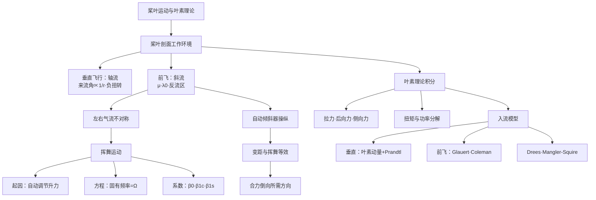
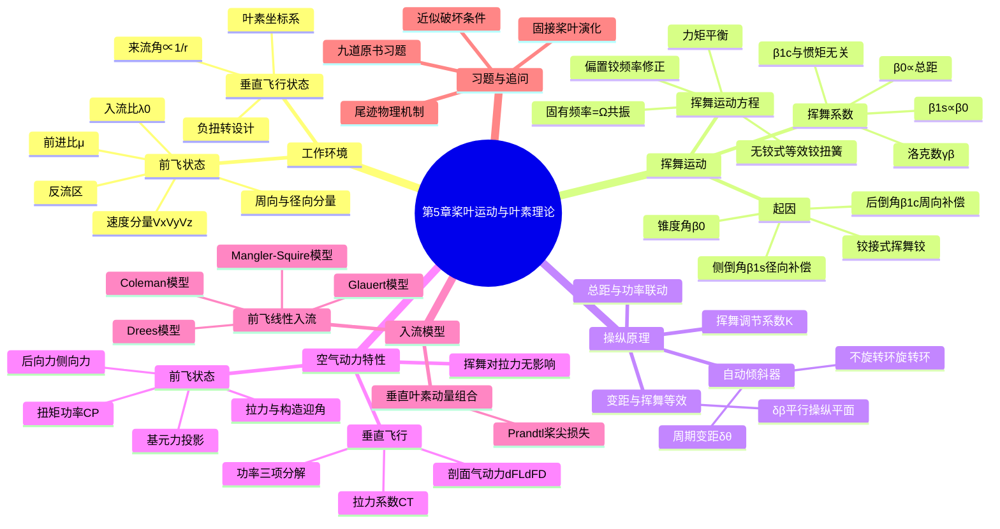

# 第 5 章 桨叶运动与叶素理论 · 思维导图

## 章节逻辑脉络

## 核心判断

1. 前飞左右气流不对称是旋翼一切特殊气动问题的根源；挥舞是铰接式旋翼化解这种不平衡、消除侧倾力矩的物理机制，而非缺陷。
2. 挥舞运动方程是共振系统（固有频率恰等于旋转角频率 $\Omega$），故气动力矩对挥舞的相位滞后恒为 $90^\circ$，这直接解释了后倒角与侧倒角的产生。
3. 升力自动调节使"拉力力矩不随方位角变化"成为铰接式旋翼的基本特征，叶素理论因而可把整副旋翼气动力写成干净的一、二重积分。
4. 变距与挥舞等效是操纵的精髓：自动倾斜器倾斜→桨尖平面平行倾斜→气动合力随之倒向，总距与功率必须联动。
5. 入流模型补上叶素理论唯一缺的环节（诱导速度分布）；速度越高，线性入流（Drees 等）相对于均匀入流的修正越不可省略。

## 完整思维导图

[← 返回第 5 章正文](chapter5/README.md)
