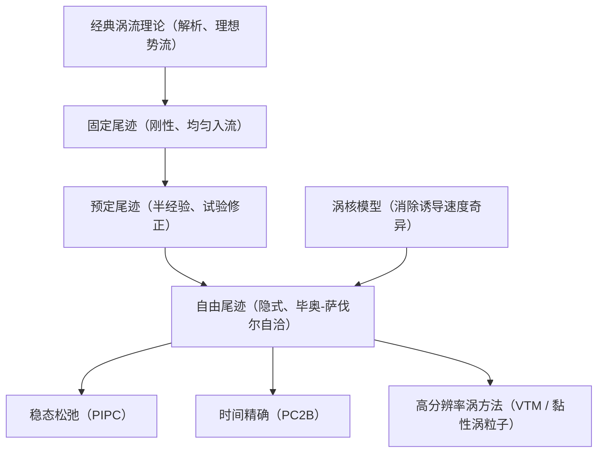

# 第 6 章 旋翼涡流理论

> 对应原书书内 p136–p157。
> 本章先讲经典涡流理论对悬停与前飞的解析处理，再展开尾迹分析方法的建模思路与控制方程，依次介绍固定尾迹、预定尾迹、自由尾迹三代模型，并补充涡核模型、气动力求解与高分辨率涡方法。主线是：用"涡系"这一统一语言，把桨叶载荷与尾迹诱导作用完整地耦合起来。

## 本章导览

**一句话主线**：滑流理论只给整体动量、叶素理论缺局部入流分布 → 涡流理论用"附着涡系 + 尾迹涡系"完整描述诱导作用 → 经典理论能给出解析解但有理想化局限 → 尾迹方法把涡系离散并迭代求解：固定（刚性、均匀入流）→ 预定（半经验、试验修正）→ 自由（隐式、毕奥–萨伐尔自洽）→ 涡核模型消除奇异性 → 最终由环量/诱导速度求气动力。

**学习目标**

| # | 目标 | 对应小节 |
|---|---|---|
| 1 | 了解经典涡流理论对旋翼流场的简化假设与典型涡系建模 | 6.1 / 6.2 |
| 2 | 掌握尾迹方法的控制方程（涡量输运）及其物理内涵 | 6.3.4 |
| 3 | 了解代表性的固定尾迹与预定尾迹模型，并掌握其生成方法 | 6.3.5 / 6.4 |
| 4 | 了解代表性的自由尾迹数值格式及适用工况，了解典型涡核模型 | 6.5 / 6.6 |
| 5 | 掌握从环量/诱导速度求解气动力的多种途径 | 6.7 |
| 6 | 了解代表性的高分辨率涡方法（VTM、黏性涡粒子） | 6.8 |

---

## 6.1 引言

前两章的滑流理论（动量理论）与叶素理论各有短板：滑流理论只从整体动量平衡描述桨盘的作用，完全不涉及旋翼的几何形状与局部入流；叶素理论虽然从桨叶剖面受力出发，但沿半径的诱导速度分布仍需借助别的模型给定。要更精确地求旋翼复杂的诱导速度分布，需要一种能把"桨叶几何—气动载荷—诱导流场"三者串起来的方法。

茹科夫斯基（Joukowsky）通过实际观察并基于机翼涡流理论推理，创立了旋翼在轴向气流中的涡流理论。其理论基石是：从理论空气动力学的角度看，旋翼对空气的作用，可以等效为某一"涡系"对空气的作用。这个涡系分两部分：

- **桨叶（附着）涡系**：与桨叶气动载荷的产生直接关联，分布在桨叶上；
- **尾迹涡系**：为满足涡量守恒，由桨叶后缘（随方位角）逸出、一直延伸到无限远处的自由涡。

涡流理论的关键，就在于**如何选取这套涡系的物理模型**——选用不同的模型，就得到经典理论、固定尾迹、预定尾迹、自由尾迹等不同程度的近似。

---

## 6.2 经典涡流理论

经典涡流理论除假定空气为理想、不可压流体之外，还把有限片数桨叶"分化"为无限多、无限窄的桨叶：即桨盘处分布着无限多、强度无限小的附着涡，每片桨叶后缘又拖出由大量自由涡构成的螺旋涡面。这样研究流场时无需直接考虑桨叶本身，只要给出对应的涡系，就能确定周围任意点的诱导速度。

#### 6.2.1 毕奥–萨伐尔定律

无论采用哪一种涡流理论，只要流场中存在一根或多根涡线，它在理想情况下激起的诱导速度都按**毕奥–萨伐尔定律（Biot–Savart law）**确定。设有一根环量为 $\Gamma$ 的涡线，其微段 $d\mathbf{s}$ 在空间某点 $M$ 处激起的微元诱导速度为：

$$d\mathbf{v} = \frac{\Gamma\, d\mathbf{s}\times \mathbf{l}}{4\pi\, l^3} \tag{6.1}$$

式中 $\mathbf{l}$ 是从涡线微段 $d\mathbf{s}$ 指向点 $M$ 的距离矢量，$l=|\mathbf{l}|$。诱导速度方向由矢量叉乘 $\times$ 的右手定则规定。对式 (6.1) 取叉乘并投影，即可得到诱导速度在直角坐标系各轴上的分量。在离散尾迹里，常把相邻配置点之间的涡元近似为直线段，再对式 (6.1) 做数值积分。

#### 6.2.2 轴流状态

对轴流（悬停近似）状态，经典理论在理想、不可压之外还作了五条简化假设：

1. 气流定常、无周期性，时间平均诱导速度近似等于瞬时诱导速度；
2. 径向诱导速度对自由涡延伸方向的影响略去不计；
3. 周向诱导速度对自由涡延伸方向的影响略去不计；
4. 轴向诱导速度对自由涡延伸方向的影响，按某一等效常值处理，即自由涡轴向延伸速度取 $\bar{v}_a = v_a + v_{ia}$，且沿半径视为常数；
5. 旋翼挥舞锥度角略去不计。

由假设 (1) 推出：桨盘平面被连续分布的无限多、强度无限小的附着涡取代，整个桨盘面可简化为一个**圆形涡盘**；由 (2)(3)(4)(5) 推出：自由涡既不向内收缩（径向延伸仅由相对旋转速度决定）、周向延伸只由相对旋转速度决定、轴向延伸由相对气流速度加等效诱导速度决定，且涡系从桨盘平面逸出，挥舞效应统一归入环量分布处理。

若旋翼有 $N$ 片桨叶且满足"茹氏旋翼"条件（每片桨叶环量 $\Gamma$ 沿半径为常数），则轴流状态下经典涡流理论的涡系具有三个特征：

- 总环量为 $N\Gamma$，任一中心角 $d\psi$ 的微元附着涡环量为 $\Gamma\,d\psi$；
- 桨尖处每个微元附着涡转成一条自由涡（桨尖涡），与桨盘圆周成角 $\theta=\arctan(\bar{v}_a/v_\psi)$，所有尾随涡最终构成**圆柱涡面**；
- 桨根处由涡量守恒，有一根环量为 $N\Gamma$ 的**中央涡束**进入。

于是茹氏旋翼的轴流涡系 = 圆形涡盘 + 圆柱涡面 + 中央涡束。书上略去推导，直接给出各部分在桨盘平面上任一点 $M_0$ 处的诱导速度积分结果。圆柱涡面对桨盘平面上任意点的**轴向**诱导速度分量为：

$$v_{ia} = \begin{cases} 0, & r_{M0}>r_{A0} \\[4pt] \dfrac{N\Gamma}{4\pi r_{A0}}\,\Phi(\cdots), & r_{M0}<r_{A0} \end{cases} \tag{6.3}$$

圆柱涡面对任意点的**周向**分量（6.4）与**径向**分量（6.5）形式类似；其中径向分量含第一、第二类完全椭圆积分 $K$、$E$，一般需查表或数值求取。中央涡束对桨盘平面上任意点的**周向**分量为：

$$v_{i\psi} = \frac{N\Gamma}{4\pi r_{M0}} \tag{6.6}$$

而圆形涡盘在桨盘平面上三向诱导速度均为 0；中央涡束在桨盘平面上的轴向、径向分量也均为 0。

把涡系整体串起来看，结论是：

- 桨盘上方无限远处，轴向、周向、径向诱导速度全为 0；
- 桨盘下方无限远处、且在桨盘圆周范围之外，三向诱导速度也全为 0；
- 在桨盘圆周**之内**，桨盘下方远场的轴向诱导速度是桨盘处的 2 倍，$v_{ia}=\dfrac{N\Gamma}{2\pi}$，周向诱导速度也是桨盘处的 2 倍，$v_{i\psi}=\dfrac{N\Gamma}{2\pi r_{M0}}$，但**径向诱导速度为 0**。

实际桨叶环量沿半径 $r$ 是变化的，记作 $\Gamma=\Gamma^*(r)$。从半径 $r$ 到 $r+dr$ 处附着涡增量为 $d\Gamma^*$，据涡量守恒，后缘每点逸出环量 $-d\Gamma^*$ 的微元涡，得到无限多同心圆柱涡面。变环量下，整个涡系在 $M_0$ 点激起的轴向、周向诱导速度只与该点所在半径处的桨叶环量 $\Gamma^*(r)$ 有关：

$$v_{ia} \propto \frac{N}{4\pi}\int \frac{\Gamma^*(r)}{\cdots}\,d(\cdots), \qquad v_{i\psi} \propto \frac{N}{4\pi}\int \frac{\Gamma^*(r)}{\cdots}\,d(\cdots) \tag{6.7, 6.8}$$

而径向分量一般难以给出解析积分解。

#### 6.2.3 前飞状态

前飞涡流理论是悬停经典理论的推广：小速度平飞时尾迹近似为一斜向涡柱，大速度平飞时近似为一平面涡系。最早的假定仍取环量沿半径为常值，于是桨尖拖出螺线尾随涡（**纵向自由涡**，亦称螺旋自由涡）；进一步考虑环量沿半径不均匀 $\Gamma=\Gamma(r)$，则不同半径拖出不同的螺线尾随涡；再推广到环量还随方位角不均匀 $\Gamma=\Gamma(r,\psi)$，桨叶运动时还在不同方位逸出射线状脱体涡（**横向自由涡**，亦称径向自由涡）。横向与纵向自由涡共同构成网格状的斜向螺旋涡面。

广义经典涡流理论在前飞时再作四条假设：气流定常、把桨叶化为无限多片布满桨盘的附着涡；涡系不收缩；附加旋转影响略去；涡系延伸方向按桨盘平面处的某合速度 $\bar{v}$ 考虑，即相对气流速度 $\mathbf{v}_0$ 加等效诱导速度 $\mathbf{v}_{ind}$，写为 $\mathbf{V}_s = \mathbf{v}_0+\mathbf{v}_{ind}$。在此假设下，前飞涡系就是一个以桨盘平面为底、沿 $\mathbf{V}_s$ 方向延伸到无限远的斜向圆柱；前进比很大时，螺线退化为摆线，可近似为平面涡系。苏联学者韦尔德克鲁别（Вильдгрубе）就环量沿方位角常值的平面涡系，给出了工程实用的诱导速度算法。

一般地，尾迹既不在同一平面、环量分布也随方位角变化。1961 年我国学者**王适存**考虑纵横向涡线的一般情况，推导创立了**广义涡流理论**，能确定旋翼在任意定常飞行状态空间任一点的诱导速度，是经典涡流理论的重要发展。

---

## 6.3 尾迹分析方法概述

经典涡流理论的优点是有解析表达式、物理图像清晰、便于参数分析，用于性能计算也能得到较好结果。但它有两点根本不足：

1. 假定附着涡沿桨盘连续、桨叶片数无限，因此**不能分析诱导速度随时间的变化**，更关键的是**不能计入桨叶之间的相互干扰**；
2. 假定所有尾涡按同一等效速度向后延伸（涡系形状规则），**未计入尾流速度不均匀造成的涡系形状畸变**。

因此经典理论给出的诱导速度分布不够精确，据此算得的诱导功率、桨叶失速边界与动载荷都偏乐观。

要精确分析桨叶气动载荷，就必须发展更贴近物理实际的涡系模型。实际转动中，有限片桨叶的旋翼涡系应由 $N$ 片桨叶附着涡系与对应的 $N$ 个尾迹涡系组成，这类方法统称**尾迹分析方法（wake method）**，通常以**涡量输运方程**作控制方程来给出尾迹的空间分布。求解时先选定附着涡系与尾迹涡系的建模方式，再据边界条件解控制方程，边界条件通常包括：由附着涡模型给出的"内部问题"边界（如控制点处壁面法向无穿透）、桨叶后缘满足**库塔（Kutta）条件**、桨叶后缘与尾迹起始点重合给出的"外部问题"几何边界等。数值计算后得到附着涡环量分布、尾迹几何形状与尾迹环量分布，进而求气动载荷。

#### 6.3.1 桨叶附着涡系模型

附着涡系建模常借鉴固定翼做法。例如 Prandtl 的经典**升力线模型**（针对稳态来流中大展弦比平直翼，一阶精度）；以及常用的 **Weissinger-L 升力面模型**——由二维升力线推广到三维：附着涡集中在 1/4 弦点，控制点在微段 3/4 弦线中点，二阶精度，对变弦长、前后掠、翼尖三维效应都有好精度，后被广泛用于旋翼。

上述两模型都只把桨叶简化为沿展向分段、弦向不分段。为提高精度，可在升力面基础上沿弦向也分段，把桨叶分成多个涡格，即**面元法**；更精细地，对桨叶上、下表面分别用面元法（如图 6.8），以更精确刻画外形。

#### 6.3.2 尾迹涡系模型

以卷起的高强度桨尖涡为主导的尾迹流场极度复杂、强非定常，是旋翼流场的标志性特征，也显著影响桨叶气动特性。数值上需把连续尾迹离散，按离散形式不同有**涡格、涡线、涡团**等模型，常组合使用。常见的有涡格模型、单根集中涡模型、近尾迹涡格/远尾迹集中涡模型，以及等环量线模型、涡团模型等。

从桨叶后缘新逸出的尾迹初期较复杂，而经一定涡龄角发育成熟后，高度卷起的桨尖涡强度远大于其他涡，是桨/涡干扰的主要来源。研究表明，对常见工况，单根集中涡（桨尖涡）就能良好建模旋翼尾迹，因此书后多以单根集中涡、近尾迹涡格/远尾迹集中涡作示例。

#### 6.3.3 尾迹方法的环量求解

无论附着涡系与尾迹涡系如何建模，作为涡强度的定量表征，**环量的求解都是关键**。对附着涡系，通常借边界条件求解其环量。以旋翼流场尾迹方法的离散模型为例，附着涡用 Weissinger-L 模型，控制点满足壁面法向无穿透条件，对各控制点依次施加该条件，得到线性方程组 $A\boldsymbol{\Gamma}=\mathbf{B}$：

$$A_{ij}\ \text{为影响系数},\quad \Gamma_i\ \text{为第 }i\text{ 段附着涡环量},\quad B_i\ \text{为第 }i\text{ 段处来流、桨叶运动、远尾迹诱导速度等叠加所得速度},\quad \mathbf{n}\ \text{为控制点外法矢} \tag{6.9}$$

解此方程组即得各分段附着涡环量，桨叶后缘自动满足库塔条件。涡格模型中，一条脱体涡或尾随涡可看作相邻两涡格的重合边，在两侧分别计入，等效于环量 $\partial\Gamma/\partial r$、$\partial\Gamma/\partial\psi$ 的尾随涡/脱体涡单独参与计算。

对卷起的桨尖涡，其环量与附着涡环量分布相关联。基于贝茨（Betz）卷起理论，涡环量 $\Gamma$ 与卷起中心位置 $r_{center}$ 可写为：

$$r_{center}=\frac{\displaystyle\int r\,\Gamma(r)\,dr}{\displaystyle\int \Gamma(r)\,dr}, \qquad \Gamma_{roll}=\int_a^b \frac{d\Gamma}{dr}\,dr \tag{6.10, 6.11}$$

对单一正环量桨尖涡卷起：

$$\Gamma_{tip}=\int_{r_{b\max}}^{R}\frac{d\Gamma}{dr}\,dr=\Gamma_{b\max}-\Gamma(R),\qquad \Gamma(R)=0 \tag{6.12}$$

$$r_{tip}=\frac{\displaystyle\int_{r_{b\max}}^{R} r\,\dfrac{d\Gamma}{dr}\,dr}{\displaystyle\int_{r_{b\max}}^{R}\dfrac{d\Gamma}{dr}\,dr} \tag{6.13}$$

式中 $r_{b\max}$ 为最大附着涡环量展向位置，$\Gamma_{b\max}$ 为最大附着涡环量，桨尖处附着涡环量为 0。对"内侧卷起较强正环量次级涡、外侧较弱负环量桨尖涡"的情况（常见于单旋翼中、高前进比），次级涡参数可类似给出：

$$\Gamma_{sec}=\int_{r_{b\min}}^{r_{b\max}}\frac{d\Gamma}{dr}\,dr=\Gamma_{b\max}-\Gamma_{b\min} \tag{6.14}$$

$$r_{sec}=\frac{\displaystyle\int_{r_{b\min}}^{r_{b\max}} r\,\dfrac{d\Gamma}{dr}\,dr}{\displaystyle\int_{r_{b\min}}^{r_{b\max}}\dfrac{d\Gamma}{dr}\,dr} \tag{6.15}$$

式中 $r_{b\min}$ 为靠近桨尖处最小附着涡环量展向位置，$\Gamma_{b\min}$ 为对应最小环量。试验还表明，充分发展的桨尖涡环量约为附着涡环量峰值的 **70%~85%**。

#### 6.3.4 尾迹方法的控制方程

离散尾迹时，以涡线为例，据**亥姆霍兹定理（Helmholtz theorem）**，涡线作物质线运动时保持环量守恒，并依涡量输运方程在流场中移动。对涡线上任一节点，基本控制方程为：

$$\frac{d\mathbf{r}}{dt}=\mathbf{V} \tag{6.16}$$

其中 $\mathbf{r}$ 为节点坐标，$\mathbf{V}$ 为节点当地流场速度（含自由来流与各种涡诱导速度）。以方位角 $\psi$ 与涡龄角 $\zeta$ 为自变量展开：

$$\frac{\partial \mathbf{r}}{\partial \psi}\frac{d\psi}{dt}+\frac{\partial \mathbf{r}}{\partial \zeta}\frac{d\zeta}{dt}=\mathbf{V}_\infty+\mathbf{V}_{ind}(\psi,\zeta) \tag{6.19}$$

该方程是一阶、拟线性、双曲型偏微分方程：左端是线性波动项，右端通常来自整个尾迹的诱导速度，是非线性函数。由于诱导速度 $\mathbf{V}_{ind}(\psi,\zeta)$ 的空间分布既非线性、又是位置 $\mathbf{r}$ 的隐函数，为能求解，需对右端做不同假设，从而分出**固定（刚性）尾迹、预定尾迹、自由尾迹**三类。固定与预定尾迹把诱导速度显式处理（经验/半经验解析表达式），自由尾迹则保持诱导速度与位置的隐式关系，用数值迭代求解。

#### 6.3.5 固定尾迹

固定尾迹模型除令附着涡系与尾迹涡系数目等于实际桨叶片数外，与经典涡系类似：假定涡系不收缩、不计附加旋转，延伸方向按桨盘平面处某合速度方向。建模时各诱导速度中仅考虑轴向诱导速度对尾迹运动的影响，且为解耦诱导速度与尾迹形状，假设尾迹诱导速度场均匀（即**均匀入流**）。在本章坐标系下，无量纲速度为：

$$\dot{y}=\mu_\psi-\lambda_{ind},\qquad \dot{z}=0 \tag{6.20}$$

式中 $\mu_\psi$、$\mu_x$ 为相应坐标上无量纲来流分量；由动量理论，平均无量纲诱导速度 $\lambda_{ind}$ 满足：

$$\lambda_{ind}=\frac{C_T}{2\sqrt{\mu^2+(\mu_x+\lambda_{ind})^2}} \tag{6.21}$$

该式需用牛顿–拉弗森法（Newton–Raphson）迭代求解，残差可取：

$$f(\lambda)=\lambda\sqrt{\mu^2+(\mu_x+\lambda)^2}-\frac{C_T}{2}=0 \tag{6.22, 6.23}$$

更新格式为 $\lambda^{(n+1)}=\lambda^{(n)}-f(\lambda^{(n)})/f'(\lambda^{(n)})$。以桨尖涡为例，令 $r_{tipvor}$ 为其径向位置，则无量纲桨尖涡坐标为：

$$x_{tip}(\psi,\zeta)=\mu\psi,\quad y_{tip}(\psi,\zeta)=\mu_x\psi-\lambda_{ind}\zeta,\quad z_{tip}(\psi,\zeta)=r_{tipvor}\sin(\psi-\zeta) \tag{6.24}$$

固定尾迹又常被称为"固定涡系方法"，它把诱导速度显式给定，是最简单的一代尾迹模型。

---

## 6.4 半经验方法——预定尾迹模型

预定尾迹模型基于流动显示试验，总结桨尖涡与内段涡面结构随旋翼参数的变化来确定尾迹几何形状，从而计入涡线实际的收缩、并改进轴向位移。它始于 20 世纪 70 年代，八九十年代趋于成熟。其本质是一种"后预测"模型：桨尖涡轨迹由假设和修正得到，而非由当地流场速度算出，因此对不同构型的有效性仍需验证，也不能用于桨叶气动外形设计计算。

#### 6.4.1 悬停预定尾迹模型

七八十年代大量流场测量试验修正后，建立了多种悬停预定尾迹模型。例如 Landgrebe 等在其流动显示试验基础上，给出了著名的悬停旋翼尾迹模型（如图 6.14），分别描述桨尖涡与内部涡系几何。书上仅给桨尖涡形状作参考。

1) **桨尖涡轴向坐标**

$$z_{tip}(\zeta)=\begin{cases} k_1\,\dfrac{\zeta^2}{2\pi/N}, & 0\le \zeta\le \dfrac{2\pi}{N} \\[6pt] k_1\,\dfrac{2\pi}{N}\left[\zeta-\dfrac{2\pi}{N}(1-k_2)\right], & \zeta>\dfrac{2\pi}{N} \end{cases} \tag{6.25}$$

系数 $k_1,k_2$ 与拉力系数 $C_T$、负扭转角 $\alpha$ 有关：

$$k_1=-0.065\left(\frac{C_T}{\sigma}+0.0010\alpha\right) \tag{6.26}$$

$$k_2=-(1.41+0.0141\alpha)\sqrt{\frac{C_T}{\sigma}(1+0.010\alpha)}$$

2) **桨尖涡径向坐标**

$$r_{tipvor}(\psi,\zeta)=A+(1-A)e^{-\Lambda\zeta} \tag{6.27}$$

尾迹径向收缩是平滑、渐近的。经验系数取 $A=0.78$、$\Lambda=0.145+27C_T$。如第 3 章所述，悬停尾迹理论收缩比为 0.707，但试验测得接近 0.78。Gilmore 与 Gartshore、Kocureck 与 Miller、Kocureck 与 Berkowitz 等也据试验各自建立了悬停预定尾迹模型。

#### 6.4.2 前飞预定尾迹模型

前飞预定尾迹模型同样基于试验数据修正固定尾迹。试验观察到尾迹纵、横向畸变比轴向畸变小，即桨盘面内自诱导速度较小，因此面内运动仍用与固定尾迹相同的方程，即 $x,y$ 坐标同式 (6.24)。

以应用最广的 **Beddoes 预定尾迹模型**为例：它具解析表达式，并基于试验参数修正计入涡线畸变与收缩。其诱导速度 $\lambda$ 由下式确定：

$$\lambda=\lambda_{ind}\left[1+\varepsilon\,F_1(\psi-\zeta)\right] \tag{6.28}$$

式中 $\lambda_{ind}$ 为由动量理论给出的平均诱导速度（见 6.3.5），$\varepsilon$ 为尾迹倾斜角，Beddoes 取 $\varepsilon=\chi$，$\chi=\arctan\!\big(\mu_x/(\mu_\psi+\lambda_{ind})\big)$，应用中也有取 $\varepsilon=\chi/2$ 的。由此可积分得到尾迹 $u$ 坐标：

$$u(\psi,\zeta)=\int \lambda\,d\psi \tag{6.29}$$

按涡元形成至积分时刻的运动分三种情况（始终在桨盘平面下方、直接顺流移出投影外、部分在内部分在外），最终给出 Beddoes 尾迹的 $u$ 坐标分段式：

$$u(\psi,\zeta)=\begin{cases} \mu\psi-\lambda_{ind}\left(\dfrac{\zeta}{2\pi}+\varepsilon\,\dfrac{\psi-\zeta}{2\pi}\right), & \cos(\psi-\zeta)>0 \\[6pt] \mu\psi-2\lambda_{ind}\big(1-\varepsilon\,F_2(\cdots)\big), & \cos(\psi-\zeta)<0 \\[6pt] \text{（其余情形取上两式的混合）} & \text{其他} \end{cases} \tag{6.30}$$

类似地，van der Wall 比较桨/涡干扰下的尾迹形状、干扰位置与气动载荷，对 Beddoes 模型评估并提出改进模型。预定尾迹虽与试验吻合较好，但因轨迹源于假设修正而非当地流场速度，不能区分不同外形设计参数。

---

## 6.5 现代尾迹分析方法——自由尾迹模型

与固定/预定尾迹不同，自由尾迹允许涡线依据涡量输运方程，在当地流场受力平衡状态下自由移动——即控制方程式 (6.19) 右端的诱导速度由尾迹几何与环量经毕奥–萨伐尔定律算出。由于流场复杂、诱导速度强非线性，自由尾迹几乎不可能给出解析解，必须构造数值格式迭代求解。

#### 6.5.1 稳态松弛求解方法

早期用时间推进格式的自由尾迹普遍存在稳定性差、难收敛的问题。后续研究利用直升机稳态飞行流场呈周期变化的特点，把松弛法与尾迹迭代结合，形成多种适用于稳态飞行的算法。以 Bagai 等提出的**伪隐式预测–校正（PIPC）算法**为例：它采用五点中心差分，在时间推进中构造预测步与校正步，并在校正步用基于预测步的松弛格式，显著改善了悬停与小速度前飞的 Numerical 稳定性。

对拓扑点 $(i-1/2,\ j-1/2)$ 构造格式，对方位角、涡龄角的偏微分用中心差分：

$$\frac{\partial \mathbf{r}}{\partial \psi}\approx\frac{\mathbf{r}_{i,j}+\mathbf{r}_{i,j-1}-\mathbf{r}_{i-1,j}-\mathbf{r}_{i-1,j-1}}{2\Delta\psi} \tag{6.31}$$

$$\frac{\partial \mathbf{r}}{\partial \zeta}\approx\frac{\mathbf{r}_{i,j}+\mathbf{r}_{i-1,j}-\mathbf{r}_{i,j-1}-\mathbf{r}_{i-1,j-1}}{2\Delta\zeta} \tag{6.32}$$

右端诱导速度用四点平均：

$$\mathbf{V}_{ind}=\frac{1}{4}\Big(\mathbf{V}_{ind}(\mathbf{r}_{i,j})+\mathbf{V}_{ind}(\mathbf{r}_{i,j-1})+\mathbf{V}_{ind}(\mathbf{r}_{i-1,j})+\mathbf{V}_{ind}(\mathbf{r}_{i-1,j-1})\Big) \tag{6.33}$$

代入控制方程整理成推进格式。取 $\Delta\psi=\Delta\zeta$ 时沿特征线求解且数值稳定：

$$\mathbf{r}_{i,j}=\mathbf{r}_{i-1,j-1}+\frac{\Delta\zeta}{4\Delta\psi}(\mathbf{r}_{i,j-1}-\mathbf{r}_{i-1,j})+\frac{\Delta\zeta}{4}\Big[\mathbf{V}_\infty+\tfrac12\big(\mathbf{V}_{ind}(\mathbf{r}_{i,j})+\mathbf{V}_{ind}(\mathbf{r}_{i,j-1})+\mathbf{V}_{ind}(\mathbf{r}_{i-1,j})+\mathbf{V}_{ind}(\mathbf{r}_{i-1,j-1})\big)\Big] \tag{6.35}$$

预测步用预测值参与诱导速度，校正步把诱导速度由前次迭代值与预测值松弛得到：

$$\mathbf{V}_{ind}(\mathbf{r}_{i,j})=\omega_V\,\mathbf{V}_{ind}^{pred}+(1-\omega_V)\,\mathbf{V}_{ind}^{old} \tag{6.38}$$

并在校正步后对节点坐标引入松弛因子：

$$\mathbf{r}_{i,j}=\omega_r\,\mathbf{r}_{i,j}^{pred}+(1-\omega_r)\,\mathbf{r}_{i,j}^{old} \tag{6.39}$$

控制方程需初值与边界条件：初始条件可由固定/预定尾迹给出；PIPC 给定三个边界条件——(1) 几何边界：近尾迹与桨叶后缘重合、远尾迹与近尾迹经 Betz 卷起公式几何重合；(2) 方位角周期性边界：

$$\mathbf{r}(\psi,\zeta)=\mathbf{r}(\psi+2\pi,\zeta) \tag{6.40}$$

(3) 为抑制截断误差引入的涡龄角方向远场相似性外推边界，在桨尖（根）涡后引入虚尾迹，其节点诱导速度由最后一固节点的诱导速度插值、沿特征线 $d\psi/d\zeta=1$ 外推：

$$\mathbf{V}(\psi,\zeta)-\mathbf{V}(\psi,\zeta-2\pi)=\mathbf{V}(\psi+\Delta\psi,\zeta-2\pi)-\mathbf{V}(\psi,\zeta-4\pi) \tag{6.41}$$

#### 6.5.2 时间精确方法

稳态松弛格式对准定常工况已有良好精度。但在瞬态操纵、近地操纵、机动飞行、自转、近涡环状态下降或某些尾迹–机身干扰问题中，准定常/周期假设不再适用，需采用时间步进求解尾迹瞬态响应。早期时间步进算法因离散引入数值误差，会出现与试验不符的数值不稳定；可通过引入数值耗散项抑制扰动发展。

例如 Bhagwat 等提出的**二阶向后差分预测–校正（PC2B）算法**，采用空间五点中心差分与时间三步向后差分，并在时间步进上隐式引入阻尼项，能可靠预测瞬态操纵时的自由尾迹几何变化。部分时间步进方法显式引入阻尼项提高效率：它在 PIPC 基础上发展，预测步同 PIPC，校正步保持空间五点中心差分，但把时间离散改为：

$$\frac{3\mathbf{r}^{(n)}-4\mathbf{r}^{(n-1)}+\mathbf{r}^{(n-2)}}{2\Delta t}=\mathbf{V}_\infty+\mathbf{V}_{ind} \tag{6.42}$$

该算法对任意飞行工况均有良好稳定性与精度，被视为一种时间精确自由尾迹格式。由于本质是时间步进，它移除了 PIPC 中方位角方向的周期性边界条件。

---

## 6.6 尾迹分析方法中的涡核模型

直接套用基于不可压势流的毕奥–萨伐尔定律（式 6.1）求解诱导速度，当空间中点无限靠近涡线时，诱导速度会出现**奇异值**——这与实际流体中旋涡的速度分布不符。因此尾迹方法中必须对涡核附近的速度分布建模。实际桨尖涡横向截面内部呈明显层流特征，随离涡核轴心距离增大，湍流作用增强并占主导；试验还发现，充分卷起的桨尖涡速度分布在小、大涡龄角处呈"自相似"特征，即各截面速度型经速度与长度无量纲化后可用同一函数表示。典型桨尖涡流场可分为：1. 内部层流区；2. 过渡区；3. 外部湍流区。

研究中常把卷起的集中涡流场简化为二维对称涡流场。Vatistas 提出一类系列模型：

$$v_\theta(\eta)=\frac{\Gamma}{2\pi r_c}\frac{\eta}{(1+\eta^{2n})^{1/n}},\qquad \eta=\frac{r}{r_c} \tag{6.43}$$

其中 $r_c$ 为涡核半径。当 $n\to\infty$ 得 **Rankine 涡**（涡核内为刚体转动，涡核环量等于桨尖涡环量）：

$$v_\theta(r)=\begin{cases} \dfrac{\Gamma r}{2\pi r_c^2}, & 0\le r\le r_c \\[6pt] \dfrac{\Gamma}{2\pi r}, & r>r_c \end{cases} \tag{6.44}$$

当 $n=1$ 得 **Scully 涡**（涡核环量为桨尖涡环量的 50%）：

$$v_\theta(r)=\frac{\Gamma}{2\pi}\frac{r}{r_c^2+r^2} \tag{6.45}$$

当 $n=2$ 近似于 **Lamb–Oseen 涡**（一维 N–S 方程在轴向、径向速度为 0 时的解析解，涡核环量约为桨尖涡环量的 71%，Oseen 数 $\alpha=1.25643$）：

$$v_\theta(r)=\frac{\Gamma}{2\pi r}\left(1-e^{-\alpha r^2/r_c^2}\right) \tag{6.46}$$

不同涡模型周向诱导速度随无量纲涡核半径的分布如图 6.21 所示。实际计算中还常考虑湍流扩散与涡的伸缩效应。例如把桨尖涡内湍流扩散纳入，将只考虑分子动量扩散的 Lamb–Oseen 扩散模型扩展为：

$$\Gamma(\zeta)=\Gamma_0+\omega_e\,\zeta,\qquad \omega_e=\frac{1}{4\alpha_s\nu}\frac{d\Gamma}{d\zeta} \tag{6.47}$$

其中 $\nu$ 为气体运动黏性系数（$\nu\approx1.46\times10^{-5}$），$\zeta_0$ 为消除奇异性引入的虚拟涡龄角（小量）。引入 Squire 假设（涡黏性正比于涡环量强度），涡黏性系数 $\delta$ 可写为：

$$\delta=1+\alpha_1 Re_\Gamma,\qquad Re_\Gamma=\frac{\Gamma}{\nu} \tag{6.48}$$

经验参数 $\alpha_1$ 需由试验测定，通常在 $10^{-3}\sim10^{-5}$ 量级。

---

## 6.7 气动力求解

尾迹分析方法可经多种途径求桨叶气动力：

**1) 叶素理论 + 二维翼型气动数据表**

算得当地诱导速度、得到截面速度与迎角后，据二维翼型气动数据表插值获得叶素气动力，再积分得到桨叶与旋翼气动力。

**2) 叶素理论 + 二维翼型气动力模型**

为提高精度，研究者基于试验修正提出可考虑不同速度下迎角动态变化的模型。以 **Leishman–Beddoes 非定常二维气动力模型**为例：它在 Kirchhoff–Helmholtz 模型基础上引入 Prandtl–Glauert 压缩修正，法向力系数 $C_N$ 为：

$$C_N=\frac{C_{N_\alpha}}{2}\sqrt{1-M_a^2}\;\alpha \tag{6.49}$$

式中 $M_a$ 为当地马赫数，$f$ 为后缘分离点无量纲位置，$\alpha$ 为气动迎角。相应升力系数 $C_L$ 由 Kirchhoff 修正给出，阻力系数：

$$C_D=C_{D0}+0.035\,C_N\sin\alpha+K_D\,C_N^2\sin(\alpha-\alpha_{DD}) \tag{6.51}$$

式中 $C_{D0}$ 为零升阻力系数，$\alpha_{DD}$ 为阻力发散迎角，$K_D$、$\alpha_1$ 由经验式给出。算出当地诱导速度后，即可经叶素理论求桨叶与旋翼气动力。

**3) 库塔–茹科夫斯基（Kutta–Joukowski）定理**

基于等效附着涡环量，桨叶分段气动力：

$$dL=\rho V_\infty\,\Gamma_K\,dr \tag{6.52}$$

$$\Gamma_K=\oint \mathbf{V}\cdot d\mathbf{l} \tag{6.53}$$

由法向无穿透边界条件，控制点处法向速度满足：

$$\sum_{j=1}^{N} B_{ij}\,\Gamma_j=V_\infty\,\alpha_{eff} \tag{6.54}$$

式中 $B_{ij}$ 为影响系数，$\Gamma_j$ 为附着涡环量，$\alpha_{eff}$ 为有效迎角。令积分路径以 1/4 弦线为轴、以当地弦长一半 $c_i/2$ 为半径过控制点，可得桨叶周围速度场积分环量 $\Gamma_{K,i}$ 的离散式。

**4) 非定常伯努利（Bernoulli）方程**

通过求解非定常伯努利方程得到当地压强：

$$\frac{\partial\phi}{\partial t}+\frac{1}{2}|\mathbf{V}|^2+\frac{p-p_\infty}{\rho_\infty}=0 \tag{6.56}$$

式中 $\phi$ 为速度势，$p$ 为待求压强，$p_\infty$、$\rho_\infty$ 为远场压强与密度。该方法常用于以非定常面元法作附着涡涡系的场合。

---

## 6.8 高分辨率涡方法

固定、预定与自由尾迹大多用线涡元离散尾迹。为提高建模精度，近年研究者发展了高分辨率涡方法。

Brown 等基于有限体积法建立了适用于高精度尾迹特性研究的**涡输运模型（vorticity transport model, VTM）**，用有限体积法求解无黏涡量动力学方程以模拟尾迹输运，通量守恒保证了计算中的涡量守恒性：

$$\frac{\partial\boldsymbol{\omega}}{\partial t}+\mathbf{u}\cdot\nabla\boldsymbol{\omega}=\boldsymbol{\omega}\cdot\nabla\mathbf{u}+\mathbf{S} \tag{6.57}$$

式中 $\mathbf{u}$ 为速度场，$\boldsymbol{\omega}=\nabla\times\mathbf{u}$ 为涡量场，源项 $\mathbf{S}$ 来源于与桨叶气动载荷关联的附着涡。该方法在多种旋翼气动特性分析中适用性良好，但未考虑流体黏性影响。

赵景根等把计入黏性的**涡粒子方法**首次引入旋翼尾迹分析：把尾迹涡量场离散为一系列涡粒子（如图 6.22），在拉格朗日描述下求解涡量动力学方程，预测尾迹输运与黏性扩散，并引入 TreeCode 与快速多极子算法（FMM）加速。其动力学与运动学控制方程为：

$$\frac{d\boldsymbol{\alpha}_i}{dt}=\nu\nabla^2\boldsymbol{\alpha}_i,\qquad \frac{d\mathbf{x}_i}{dt}=\mathbf{u}_i \tag{6.58}$$

式中 $\boldsymbol{\alpha}_i$ 为编号 $i$ 的涡粒子矢量化涡量，$\nu$ 为气体运动黏性系数，$\mathbf{x}_i$ 为其坐标。魏鹏等在黏性涡粒子研究后，又建立了 CFD/黏性涡粒子混合方法。研究表明，黏性涡粒子方法能精确、高效地预测尾迹涡的空间位置与涡畸变运动，很好地避免数值耗散与扩散，且精度对参数依赖很小，通用性高。

---

## 6.9 习题

1. 假设一直线涡元 $AB$，端点坐标分别为 $(X_A,Y_A,Z_A)$ 与 $(X_B,Y_B,Z_B)$，涡元环量 $\Gamma$ 为常数、由 $A$ 指向 $B$，试给出该直线涡元在坐标为 $(X_P,Y_P,Z_P)$ 的任一点 $P$ 处的诱导速度计算公式。
2. 尝试用计算机编程，实现直线涡元的毕奥–萨伐尔定律计算。
3. 已知桨叶附着涡环量为 $\Gamma(r,\psi)=\Gamma_0(1-\mu_x\sin\psi)$，试求桨叶转过微小角度 $\Delta\psi$ 过程中所逸出的脱体涡环量 $\Delta\Gamma_\psi$，以及沿桨叶展向 $\Delta r$ 段所逸出尾随涡的环量 $\Delta\Gamma_r$。
4. 尝试用计算机编程，通过 Newton–Raphson 法构造迭代格式，实现前飞工况平均诱导速度的计算。
5. 尝试用计算机编程，实现固定尾迹的生成。
6. 根据 6.5.1 节 PIPC 格式的构造过程，给出 6.5.2 节所提 PC2B 格式的校正步计算公式（诱导速度仍可采用 PIPC 格式处理方法）。

---

## 本章小结

1. **为什么需要涡流理论**：滑流理论只看整体动量、叶素理论缺局部入流——涡流理论用"附着涡系 + 尾迹涡系"把桨叶载荷与诱导流场耦合，可求空间任一点诱导速度，再算叶素受力、拉力与功率。
2. **经典涡流理论的得与失**：以理想、不可压、无限多窄桨叶为前提，给出圆形涡盘 + 圆柱涡面 + 中央涡束的解析涡系，轴向/周向诱导速度可积、径向需椭圆积分，悬停/前飞（含王适存广义理论）均有清晰图像；但假定涡系规则、不计桨叶干扰与形状畸变，结果偏乐观。
3. **尾迹方法的控制方程**：核心是涡量输运方程 $d\mathbf{r}/dt=\mathbf{V}_\infty+\mathbf{V}_{ind}(\psi,\zeta)$，一阶拟线性双曲型；对右端诱导速度做不同假设，分出三代模型。
4. **三代尾迹模型的演进逻辑**：固定尾迹把诱导速度显式取均匀入流（刚性）→ 预定尾迹用试验数据半经验修正计入收缩与畸变（"后预测"）→ 自由尾迹保持诱导速度与尾迹几何的隐式关系、用毕奥–萨伐尔自洽迭代（PIPC 稳态松弛 / PC2B 时间精确），每一代都放松了对尾迹形状的预设。
5. **涡核模型解决数值奇异性**：势流毕奥–萨伐尔在涡线附近奇异，Vatistas 系列（Rankine/Scully/Lamb–Oseen）等二维轴对称模型给出有限的核心速度分布，并可在其中加入湍流扩散。
6. **气动力从环量求出**：经叶素理论 + 翼型数据/非定常模型、库塔–茹科夫斯基定理、非定常伯努利方程等途径，由环量与当地诱导速度得到桨叶截面力，再积分得旋翼气动力；更高精度则靠 VTM、黏性涡粒子等高分辨率涡方法。

---

## 自测题

**原书习题回顾**

- 第 1、2 题：直线涡元毕奥–萨伐尔公式的推导与编程实现——这是所有尾迹方法的基础积木。
- 第 3 题：由给定环量分布 $\Gamma(r,\psi)$ 求脱体涡 $\Delta\Gamma_\psi$ 与尾随涡 $\Delta\Gamma_r$，体会"环量沿方位角变化→横向自由涡、沿半径变化→纵向自由涡"。
- 第 4、5 题：Newton–Raphson 求平均诱导速度、生成固定尾迹——理解最简一代模型。
- 第 6 题：由 PIPC 推导 PC2B 校正步——理解从稳态松弛到时间精确的格式改动（时间离散由中心差分改为三步向后差分）。

**整理者补充的追问**

- 固定尾迹、预定尾迹都把诱导速度"显式"给定，为什么这会导致它们无法反映桨/涡干扰中的真实涡系畸变？自由尾迹相对它们放松了哪一条关键假设？
- 涡核模型消除的是毕奥–萨伐尔定律在哪里的奇异性？若完全不用涡核模型、直接对线涡积分，自由尾迹计算会在什么位置出现数值问题？
- 三代尾迹模型中，哪一代能"计入桨叶之间的相互干扰"？这与经典涡流理论"桨叶片数无限"的假设有何根本区别？

[查看本章思维导图 →](chapter6/mindmap.md)
