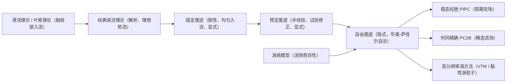
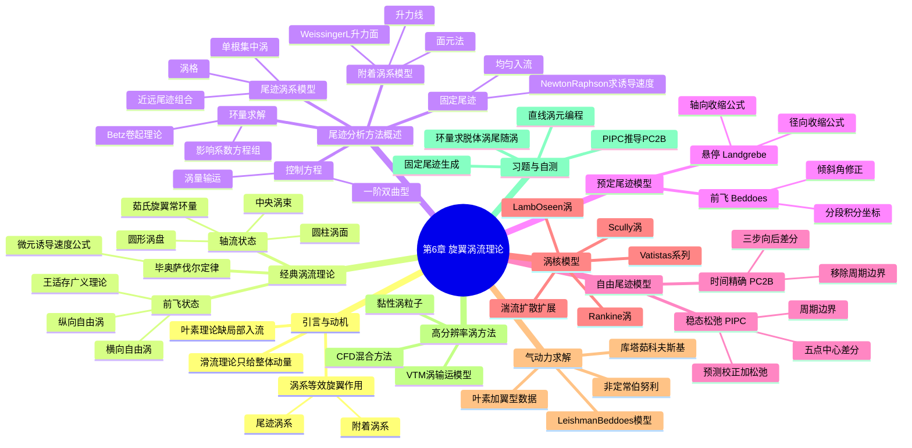

# 第 6 章 旋翼涡流理论 · 思维导图

## 章节逻辑脉络

尾迹模型的三代演进，本质是一代比一代更少地预设尾迹形状、把诱导速度从"显式给定"逐步推向"由流场自洽解出"。

---

## 核心判断

1. **涡流理论统一了"载荷—流场—受力"**：旋翼对空气的作用等效为一支涡系，分附着涡系与尾迹涡系两部分；只要给出涡系，就能用毕奥–萨伐尔定律算任意点诱导速度，进而求叶素受力。
2. **经典理论解析清晰但假设过强**：理想、不可压、无限多窄桨叶 + 规则涡系，使它不能分析时变诱导速度、不能计入桨叶间干扰、不能反映涡系畸变，结果偏乐观。
3. **三代尾迹模型递进放松假设**：固定（诱导速度取均匀入流）→ 预定（试验半经验修正形状）→ 自由（诱导速度由当地流场自洽迭代），每一代都更贴近真实涡系。
4. **涡核模型是数值可解性的前提**：势流毕奥–萨伐尔在涡线附近奇异，二维轴对称涡核模型（Rankine / Scully / Lamb–Oseen）给出有限的核心速度，使自由尾迹迭代能够稳定进行。
5. **气动力最终都回到环量**：叶素理论配翼型数据、库塔–茹科夫斯基定理、非定常伯努利方程，都由环量与当地诱导速度求出截面力，再积分得旋翼气动力。

---

## 完整思维导图

---

[← 返回第 6 章正文](chapter6/README.md)
