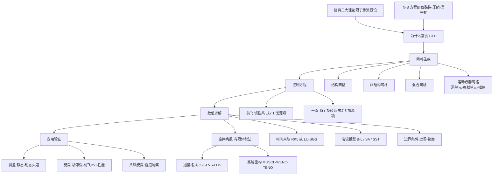
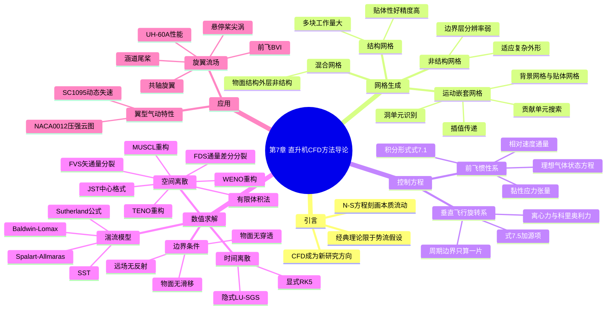

# 第 7 章 直升机 CFD 方法导论 · 思维导图

> 本章是全书从经典解析理论转向数值模拟的转折点。这张思维导图把"为什么需要 CFD、难点在哪、怎么算、能算什么"四条线索整理成可回看的骨架。

## 章节逻辑脉络

## 核心判断

1. **直升机 CFD 比固定翼难，根子在"动"**：桨叶周期挥舞/变距使网格必须随体运动，尾迹（桨尖涡、BVI）是非定常强干扰，复杂外形又叠加部件干扰——这三点共同决定了网格与求解方案的特殊性。
2. **运动嵌套网格是刚需而非选项**：单块网格会畸变，对接网格难扛非定常运动，嵌套网格用"背景网格+贴体网格+插值"化解了贴体生成与运动兼容的矛盾。
3. **坐标系是工程权衡**：前飞用惯性系写无源项方程最直观；垂直飞行用旋转系可借周向对称只算一片桨叶，代价是加入离心力与科里奥利力源项。
4. **精度与代价永远在拉扯**：有限体积法适配复杂外形，RANS 在百万雷诺数下是唯一实用的湍流处理方式；中心格式靠人工耗散、迎风格式靠格式本身耗散，高阶重构（WENO/TENO）则是为保住桨尖涡这类精细结构。
5. **CFD 已经"算得准"到工程可用**：从二维翼型动态失速到三维悬停桨尖涡、前飞 BVI、UH-60A 性能曲线、共轴旋翼、涵道尾桨，计算值与试验均吻合良好。

## 完整思维导图

[← 返回第 7 章正文](chapter7/README.md)
