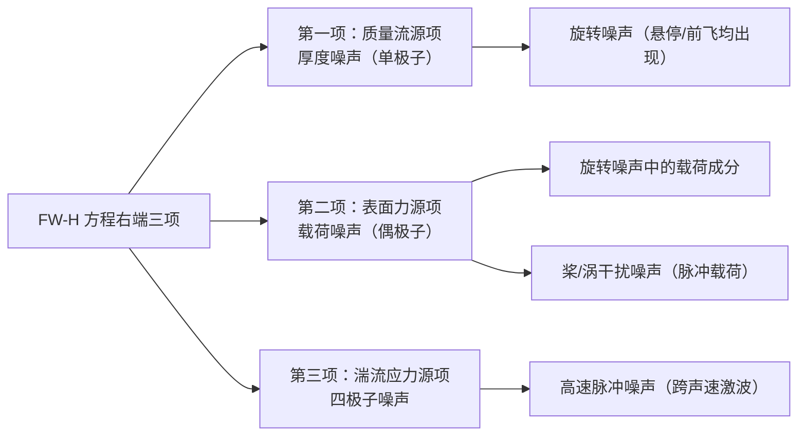

# 第 8 章 直升机气动噪声基础

> 对应原书书内 p177–p204。
> 本章主线：声学类比方法把"流动中的声源"等效成声学方程右端的源项；福克斯·威廉姆斯-霍金斯（FW-H）方程进一步把旋翼噪声拆成厚度、载荷、四极子三类声源；在此基础上逐一剖析旋转噪声、宽频噪声、桨涡干扰噪声、高速脉冲噪声四类成分的发声机理，并给出常用声学量的定义与量级。

## 本章导览

**一句话主线**：声学类比（流动 → 等效声源）→ FW-H 方程三大声源项（厚度 / 载荷 / 四极子）→ 四类旋翼噪声（旋转 / 宽频 / 桨涡干扰 / 高速脉冲）的发声机理 → 常用声学量与降噪思路。

**学习目标**

| # | 目标 | 对应小节 |
|---|---|---|
| 1 | 了解声学类比理论的基本思想与推导脉络 | 8.2.1 |
| 2 | 掌握 FW-H 方程三大声源项的物理意义及其对应的噪声 | 8.2.2 |
| 3 | 了解 Farassat 1A、FW-Hpds、Kirchhoff 等公式的适用条件 | 8.2.3 |
| 4 | 掌握声压级、声强级等基本声学量的定义与量级 | 8.2.4 |
| 5 | 了解直升机噪声水平与外部噪声构成 | 8.3.1 / 8.3.2 |
| 6 | 掌握旋翼噪声的四类划分及其基本特征 | 8.3.3 |
| 7 | 理解旋转、宽频、桨涡干扰、高速脉冲四类噪声的发声机理 | 8.4 |

---

## 8.1 引言

早期直升机设计主要关注性能、效率、振动与安全性，噪声往往被忽略或置于次要地位。但随着直升机广泛应用，噪声问题日益突出。20 世纪末，严重的噪声问题使多国关闭了大量城市直升机机场，并限制直升机在城区的飞行空域与飞行时间；国际民用航空组织（ICAO）也在《国际民用航空公约》附件第 16 章中提高了适航取证时的噪声限制要求。军事上同样暴露出严重问题：据统计，伊拉克战争期间美军被击毁的直升机中约 30% 是因噪声暴露而被击落。因此，当前各国直升机设计部门已将噪声问题提升到与安全性、可靠性相当的位置。

直升机噪声具有频率低、强度大、传播距离远的特点。对商用直升机，降低噪声与振动能提高乘客舒适性、减缓驾驶员操纵疲劳；对军用直升机，降低噪声可避免被敌方侦测，提高战场生存能力。本章即围绕直升机主要噪声源、旋翼噪声计算方法与产生机制展开。

---

## 8.2 旋翼气动噪声计算理论

#### 8.2.1 莱特希尔声学类比理论

**1) 波动方程推导**

1952 年，莱特希尔（Lighthill）在研究声速、密度均为常数的无限均匀流体中小湍流区产生的声辐射问题时，提出了声学类比理论。其核心认识是：远离湍流区的当地密度脉动 $\rho'=\rho-\rho_0$ 实质就是声波扰动引起的；对连续方程与动量方程进行推导，可得到远离湍流区的非齐次波动方程。

令 $\rho=\rho_0+\rho'$、$p=p_0+p'$，且 $\rho_0\gg\rho'$、$p_0\gg p'$，整理可得关于扰动密度的表达式。其右端项分别对应于单极子、偶极子与四极子项，四极子项中的 $T_{ij}$ 即莱特希尔湍流应力张量：

$$T_{ij}=\rho u_i u_j+(p-c_0^2\rho)\delta_{ij}-\tau_{ij}$$

式中 $\delta_{ij}$ 为克罗内克符号。其中 $\rho u_i u_j$ 为湍流（雷诺）应力，$(p-c_0^2\rho)\delta_{ij}$ 表示热传导影响（绝热条件下为零），$\tau_{ij}$ 为黏性切向应力（相比雷诺应力是小量，可忽略）。因此一般取 $T_{ij}\approx\rho u_i u_j$。

再根据 $p'=c_0^2\rho'$，可把方程转化为关于声压的非齐次波动方程（即莱特希尔方程）：

$$\frac{\partial^2 p'}{\partial t^2}-c_0^2\nabla^2 p'=\frac{\partial^2 T_{ij}}{\partial x_i\partial x_j} \tag{8.12}$$

该方程右端的单极子、偶极子声源仅出现在运动物体表面（面声源），远离表面时为零；四极子声源仅出现在湍流空间区域（体声源）。当右端全为零时，方程退化为齐次波动方程，描述的是静止均匀介质中声波的传播。若仅保留四极子项，则得到纯湍流噪声方程：

$$\frac{\partial^2 p'}{\partial t^2}-c_0^2\nabla^2 p'=\frac{\partial^2 T_{ij}}{\partial x_i\partial x_j} \tag{8.13}$$

**2) 气动声源分类**

经典声学把声波产生归于物体表面振动；而流体动力声还包括运动物体对流体的作用，以及流体自身湍流运动引起的相互作用。由于声源位置随物体运动，流体动力声源比经典声源复杂得多。莱特希尔用点源（单极子、偶极子、四极子）方法描述流体动力声源，按其发声机制与物理模型分为三类：

- **脉动质量源（单极子源）**：物体在流体中运动，周期性占据当地空间，使流体密度周期性增大，等效于向当地注入质量。其发声类似经典声学中的脉动球源，在数学上是一个点声源（单极子）。桨叶旋转排开流体引起的厚度噪声，即可在桨叶表面布置单极子源来模拟，强度与桨叶厚度及运动速度直接相关。单极子声场在空间各向同性。
- **脉动力源（偶极子源）**：物体表面受气动力，并以等大反向的力反作用于流体，使当地流体压力变化而产生声波，类似振动球源，数学上是力点声源（偶极子）。两个等值反向、无限接近的单极子构成偶极子；其声场在轴线上出现声压峰值，在垂直轴线上两源反相抵消，因此偶极子噪声具有很强的方向性。旋翼桨叶表面气动力对空气的反作用即典型偶极子源，对应载荷噪声。
- **流体湍流应力源（四极子源）**：流体与流体间的相互作用可看成一对等大反向、作用于同一位置的偶极子，即四极子源。两个无限接近的偶极子构成四极子；三维下依轴布置方向不同有 9 种，每种传播特性各异。四极子对应纯湍流应力脉动，强度通常较弱，但在高马赫数下显著。

#### 8.2.2 福克斯·威廉姆斯-霍金斯方程

1969 年，福克斯·威廉姆斯（Ffowcs Williams）与霍金斯（Hawkings）将莱特希尔声学类比推广到任意外形与任意运动的物体，使用广义函数把 Navier-Stokes 方程推导为非齐次波动方程，即福克斯·威廉姆斯-霍金斯（FW-H）方程。该方程能精确描述流体与固体相对运动中的发声现象，是目前直升机气动噪声计算的主要理论基础。

FW-H 方程在无限空间内推导，假设发声物体是一个封闭运动面 $f(\mathbf x,t)=0$，面内流动无扰动、不产生声，扰动只存在于面上并向空间传播；令 $f>0$ 为外部流场，$f<0$ 为运动面内部。通过引入广义微分代替普通微分，可得到广义连续方程与广义动量方程，其右端分别出现与质量注入变化率、表面力及动量注入变化率成正比的源项。仿照莱特希尔的推导步骤，得到微分形式的 FW-H 方程（物体为固体物面且 $U_n=V_n$ 时）：

$$\frac{\partial^2 p'}{\partial t^2}-c_0^2\nabla^2 p'=\frac{\partial}{\partial t}\big[\rho_0 V_n\delta(f)\big]-\frac{\partial}{\partial x_i}\big[\ell_{ij}n_j\delta(f)\big]+\frac{\partial^2}{\partial x_i\partial x_j}\big[T_{ij}H(f)\big] \tag{8.17}$$

其中 $\delta(f)$ 为狄拉克函数，$H(f)$ 为 Heaviside 函数，$V_n$ 为运动面法向速度，$\ell_{ij}n_j$ 为表面载荷，$T_{ij}$ 为莱特希尔应力项（黏性影响很小，一般取 $T_{ij}\approx(p-p_0)\delta_{ij}$）。三项物理意义清晰：

- **第一项（单极子）**：物体经过时排开介质形成，对应厚度噪声；
- **第二项（偶极子）**：物体表面载荷变化引起，对应载荷噪声；
- **第三项（四极子）**：含当地声速变化与近场非线性流动现象，在高马赫数下显著。

积分形式的 FW-H 方程（延迟时间形式）最为广泛使用：

$$4\pi p'(\mathbf x,t)=\frac{\partial}{\partial t}\int_S\left[\frac{\rho_0 V_n+\rho(U_n-V_n)}{r(1-M_r)}\right]_{\mathrm{ret}}dS-\frac{\partial}{\partial x_i}\int_S\left[\frac{\ell_{ij}n_j}{r(1-M_r)}\right]_{\mathrm{ret}}dS+\frac{\partial^2}{\partial x_i\partial x_j}\int_V\left[\frac{T_{ij}}{r}\right]_{\mathrm{ret}}H(f)\,dV \tag{8.31}$$

该式是描述物体任意运动下噪声辐射的控制方程，右端三项即分别理解为厚度噪声、载荷噪声与四极子噪声（高马赫数下很大程度上体现为高速脉冲噪声）。

#### 8.2.3 旋翼噪声计算公式

**1) Farassat 1A 公式**

法拉塞特（Farassat）1A 公式以物体表面为积分面（FW-H 控制面满足不可穿透条件），略去四极子源，引入自由空间格林函数并对方程积分，得到时域解。利用关系式 $\displaystyle \frac{\partial}{\partial t}=\frac{1}{1-M_r}\frac{\partial}{\partial \tau}$ 把对观察时间的偏导转化为对延迟时间的偏导，得到：

$$p'(\mathbf x,t)=p'_T(\mathbf x,t)+p'_L(\mathbf x,t) \tag{8.20a}$$

其中厚度噪声 $p'_T$ 与载荷噪声 $p'_L$ 分别为：

$$p'_T=\frac{1}{4\pi}\int_S\left[\frac{\rho_0\dot V_n}{r(1-M_r)^2}+\frac{\rho_0 V_n\dot M_r}{r^2(1-M_r)^3}\right]_{\mathrm{ret}}dS \tag{8.20b}$$

$$p'_L=\frac{1}{4\pi}\int_S\left[\frac{\dot\ell_r}{r(1-M_r)^2}+\frac{\ell_r-\ell_i M_i}{r^2(1-M_r)^3}\right]_{\mathrm{ret}}dS \tag{8.20c}$$

式中 $\ell_i=p\,n_i$ 为表面载荷矢量，$M_r=\hat{\mathbf r}\cdot\mathbf M$ 为表面运动马赫数在声传播方向上的分量，上标"·"表示对延迟时间 $\tau$ 的导数，$\mathbf r$ 为声源面指向观察点的矢量，$r$ 为其距离。该公式能明确区分厚度噪声与载荷噪声，物理含义清晰，广泛用于螺旋桨与旋翼气动噪声计算。

**2) FW-Hpds 公式**

Farassat 1A 忽略了分布于空间的四极子源及近场非均匀流场对传播的影响，不适用于旋翼跨声速状态。FW-Hpds 公式改用可穿透积分面代替物面积分面，运动流体可穿过声源面，从而计入面内四极子源与非均匀流场的影响：

$$p'_F=p'_T+p'_L+p'_{FQ}$$

其第三项 $p'_{FQ}$ 为体积分贡献。当积分面取为物体表面时，FW-Hpds 公式即退化为传统 Farassat 1A 公式——后者可视为前者的特殊形式。

**3) Kirchhoff 公式**

基尔霍夫（Kirchhoff）公式在可穿透积分面上给出声压：

$$p'(\mathbf x,t)=\frac{1}{4\pi}\int_S\frac{1}{r(1-M_r)}\left[\frac{1}{c_0}\frac{\partial p}{\partial t}+\frac{\partial p}{\partial n}+\frac{p}{1-M_r}\frac{\partial M_r}{\partial n}\right]_{\mathrm{ret}}dS \tag{8.21}$$

式中 $\mathbf x$ 为观测点，$t$ 为观测时间，$M_r$ 为 Kirchhoff 声源面运动马赫数，$n$ 为局部表面法向，$\partial/\partial n$ 为法向导数，下标 $r$、$t$ 分别表示径向与时间导数。该公式便于处理包含非线性效应的近场。

**4) 延迟时间公式**

上述三式中的变量均定义在延迟时间上。对 $t$ 时刻的噪声信号，需先求出各声源微面对应的延迟时间 $\tau$，满足：

$$t=\tau+\frac{r(\tau)}{c_0} \tag{8.25}$$

式中 $r$ 为声源微面到观察点的距离，它随声源或观测点位置变化，故 $r$ 也是时间的函数，$c_0$ 为声速。该方程不能直接求解，需迭代进行。

#### 8.2.4 基本声学量

人耳对声音的感觉源于非定常声压：

$$p'(t)=p(t)-p_0$$

式中定常部分 $p_0$ 为 $p(t)$ 的时间平均，人耳感觉不到；严格讲 $p'(t)$ 应称扰动压强。一段时间内瞬时声压的均方根为有效声压：

$$p_e=\sqrt{\frac{1}{T}\int_{t-T/2}^{t+T/2}p'^2(t)\,dt} \tag{8.28}$$

例如正弦信号 $p'(t)=p_m\cos(\omega t)$ 的有效声压为 $p_e=p_m/\sqrt{2}$。

人耳可感知的声压范围极大：最小可听声压（听阈）$p_{\min}\approx 10^{-5}\,\mathrm{Pa}$（与频率有关），最大痛阈 $p_{\max}\sim 10^2\,\mathrm{Pa}$。由于听觉对声压大小的敏感程度与声压的对数成正比，常用声压级（Sound Pressure Level, SPL）衡量：

$$L_p=20\log_{10}\left(\frac{p_e}{p_{\mathrm{ref}}}\right)=10\log_{10}\left(\frac{p_e^2}{p_{\mathrm{ref}}^2}\right) \tag{8.30}$$

单位为 dB，$p_{\mathrm{ref}}=2\times10^{-5}\,\mathrm{Pa}$，对应 2 kHz 纯音的听阈。声压增大（减小）1 倍，声压级变化 $\pm 6\,\mathrm{dB}$。常见量级：安静房间约 40 dB，正常谈话约 50 dB，繁华街道约 80 dB，飞机发动机附近约 140 dB，火箭发射场约 150 dB，烈性炸药爆炸约 170 dB。

常一并给出的还有声强级（Sound Intensity Level）：

$$L_I=10\log_{10}\left(\frac{I}{I_{\mathrm{ref}}}\right)$$

其中 $I_{\mathrm{ref}}=10^{-12}\,\mathrm{W/m^2}$。在适航取证中，还采用有效感觉噪声级（EPNL）作为评价指标（见 8.3.1）。

---

## 8.3 直升机气动噪声分类

#### 8.3.1 直升机噪声水平

在认识噪声特性前，先了解当前直升机噪声水平。噪声水平是民用直升机适航取证的要求之一，ICAO 及我国民航局条例均有严格限定；军用直升机（除特战型外）一般无明确限制，故这里仅对民用机统计。按最先进、在产、已停产三类比较，并以起飞、平飞（飞越）、降落三种状态的有效感觉噪声级（EPNL）为指标：

从图中可归纳出三点趋势：一是随技术发展与设计水平的提高，噪声水平逐步降低，而限制要求也在提高——ICAO 8.4.2 标准较 8.4.1 在起飞与飞越阶段提高了约 4 dB；二是降落阶段限制提高不到 1 dB，因其主要成分为桨涡干扰噪声（与飞行状态相关，难靠设计降低），而起飞、平飞噪声与设计及发动机有关；三是中小型直升机较易满足限定且有余量，中大型直升机余量较小、部分机型甚至超限，未来低噪声设计挑战大。

#### 8.3.2 外部噪声构成

直升机工作时，高速旋转的旋翼与尾桨、大尺寸机身、裸露挂架与起落架等都会扰动空气形成气动噪声。按部件区分，主要声源有旋翼、尾桨、部件干扰、机体及机械传动噪声；其中旋翼气动噪声占主导地位，常以之衡量全机噪声水平。

图中噪声类型包括旋翼与尾桨谐波噪声、宽带噪声、减速器噪声等。虽成分较多，但多数直升机上仅少数声源占主导。出于安全、振动、效率考虑，悬停桨尖马赫数一般在 0.6–0.7；当桨尖马赫数较高时，以谐波为主的脉冲噪声与旋转噪声成为整体气动噪声的主要成分。

#### 8.3.3 旋翼噪声分类

已知旋翼噪声可分为四类：

- **旋转噪声**：纯周期性声压扰动，由作用在桨叶上的周期性升力、阻力及桨叶厚度产生；频谱由桨叶通过频率的各阶谐波组成，悬停、前飞等各状态均出现。包括厚度噪声与载荷噪声。
- **宽带噪声（宽频噪声）**：由湍流尾迹在桨叶上引起的随机载荷变化产生，频谱表现为很宽频率范围内的连续噪声。低桨尖马赫数下较明显，旋翼启动时的"嗖嗖"声即典型宽频噪声。
- **脉冲噪声**：出现在桨叶通过频率上的猛烈、阵发性拍击声，出现时噪声水平大幅上升。高速脉冲噪声与桨涡干扰噪声均属此类——前者仅在跨声速状态出现，后者主要出现在桨盘相对来流有后倒角的下降、减速等状态。

---

## 8.4 直升机气动噪声发声原理

8.3 节已给出 FW-H 方程，其右端三项可理解为不同声源项：第一项对应桨叶旋转排开流体产生的厚度噪声；第二项为桨叶表面作用于流体产生的载荷噪声；第三项对应流体应力产生的四极子噪声，高马赫数下尤为显著，很大程度上体现为高速脉冲噪声。三项的对应关系如下：

#### 8.4.1 旋转噪声

以悬停为例，忽略大气随机扰动，在旋转坐标系下桨叶处于类似固定翼的定常气动环境，声源（桨叶气动力与厚度）可视为定常。旋转噪声是厚度与载荷噪声的叠加，是与桨叶旋转频率相关的谐波噪声；区别于桨涡干扰、高速脉冲等非线性噪声，又称旋翼线性谐波噪声。

**1) 厚度噪声**

厚度噪声由桨叶旋转排开空气产生。悬停时，桨叶外端微段的法向速度分量 $V_n$ 沿弦向随翼型厚度先增后减：前缘附近达正向最大，后缘附近达负向最大。可把前段等效为"源"（排开流体）、后段等效为"汇"（空气汇聚），两者强度均为质量流量 $\rho_0 V_n$，但空间位置差异使到达观测点的时间不同。

影响厚度噪声辐射强度的因素包括质量流量 $\rho_0 V_n$、多普勒因子 $(1-M_r)$ 及时间变化率 $\partial/\partial t$。多普勒因子中 $M_r$ 为声源运动速度在辐射方向的分量：当 $M_r\to 1$ 时积分项迅速增大，$M_r=1$ 时方程奇异（需特殊处理）。多数直升机桨尖速度达不到马赫数 1，大速度巡航时 $M_r$ 一般不大于约 0.85。源、汇两项波形时域叠加后再对时间求导，即得观测声压——厚度噪声波形近乎对称。

**2) 载荷噪声**

载荷噪声来自桨叶表面气动力对周围空气的反作用，对应 FW-H 第二项：

$$p'_L(\mathbf x,t)=-\frac{1}{4\pi}\int_S\left[\frac{1}{r(1-M_r)}\frac{\partial}{\partial t}\left(\frac{\ell_i}{1-M_r}\right)\right]_{\mathrm{ret}}dS \tag{8.34}$$

载荷 $\ell_i$ 可简化为垂直于桨盘面的拉力与平行桨盘面的阻力。对桨叶端部微段，旋转一周内被积函数 $\ell_i/[r(1-M_r)]$ 近似为周期性波形，对其（空间）求导即得观测噪声信号，呈现类似正弦的波峰、波谷变化——与近乎对称的厚度噪声波形明显不同。

厚度噪声与载荷噪声叠加即旋转噪声，是定常飞行时旋翼辐射的主要噪声。在桨盘面及附近方向，噪声主要来自厚度噪声与阻力载荷噪声；向下移动时两者影响减小，升力引起的载荷噪声逐渐增强并在前下方某处达到最大，随后再减小。轴向观测点处因距离恒定、积分项为常数、时间导数为零而无噪声辐射。旋转噪声由离散频率谱组成，基频为旋翼通过频率（桨叶片数 × 旋转频率），故为谐波噪声。

#### 8.4.2 宽频噪声

宽频噪声（宽带噪声）频率覆盖范围广、频谱连续，且频率段恰处于人耳听觉敏感域，对总噪声贡献重要。它由桨叶表面随机脉动力引起，凡桨叶附近湍流流动均会产生。已认识的形成机理有三种：旋翼自噪声、桨叶-尾迹干扰噪声、湍流摄入噪声。

**1) 旋翼自噪声**

旋翼自噪声（self noise）由流经桨叶后缘的非定常湍流与近尾迹掺混形成的湍流压力场散射引起，属高频宽带噪声（全尺寸机约 4–10 kHz），在缓爬升至急爬升阶段较明显。按湍流成因可分为四类：

- 湍流附面层-后缘干扰噪声（TBL-TE）：湍流附面层进入后缘尾迹引起压力脉动；
- 层流附面层-涡脱落诱导噪声（LBL-VS）：不稳定层流附面层形成脱落涡引起；
- 钝后缘-涡脱落噪声（BTE）：流场经过非尖后缘引起涡脱落；
- 桨尖噪声（tip）：桨尖涡形成与脱落引起。

**2) 桨叶-尾迹干扰噪声**

20 世纪 80 年代发现，桨叶与尾迹涡的干扰也是宽频噪声来源之一，称桨叶-尾迹干扰（BWI）噪声。需注意 BWI 与桨涡干扰（BVI）不同：BVI 是桨叶与强桨尖涡的近距离干扰（脉冲噪声），而 BWI 是桨叶前缘与尾迹涡系周围湍流（桨尖涡湍流、内部涡系湍流、卷起涡湍流等）的相互干扰。

BWI 属中频噪声（全尺寸机约 0.5–4 kHz），在平飞、起飞等过程较明显，强度随飞行姿态变化较小。

**3) 湍流摄入噪声**

旋翼工作时，上方大尺寸湍流涡受入流拉伸，被吸入桨盘后被旋转桨叶多次切割，每次切割产生短暂脉冲扰动，形成湍流摄入噪声（turbulence-ingestion noise）：

涡被切割的位置随机，但若在相近位置多次被切，信号会呈现峰-谷状类谐波特征；涡团越大、拉伸越长，同一位置被切次数越多，噪声波峰越窄。除悬停与很小速度前飞外，涡的摄入、拉伸较弱，仅在低频段形成峰谷谱线；高频段因小尺度涡被切次数少而相对光滑。旋翼启动或停止时的"嗖嗖"声即湍流摄入噪声及自噪声高频成分，这类高频宽带噪声只在很低马赫数、其他噪声源影响很小时才重要，故对小尺寸旋翼飞行器较明显。

#### 8.4.3 桨/涡干扰噪声

**1) 桨/涡干扰形成条件**

有限长桨叶产生升力的同时，在桨尖形成强集中涡（桨尖涡）。当桨叶与呈螺旋形运动的桨尖涡相互靠近时发生干扰，形成直升机特有的桨涡干扰（BVI）现象，引起桨叶表面脉冲气动力并辐射极强脉冲噪声。BVI 属中高频非定常周期载荷噪声，声压级高、方向性强，主要音频范围约 500–2000 Hz，恰位于人耳听觉敏感域，很大程度上限制了直升机在人口密集区的起降使用，ICAO 及我国适航条例均对其提出明确限制。

并非任何状态都出现强 BVI。一般认为当桨叶外端（大于 70%R）距桨尖涡较近时诱发强干扰。平飞时桨盘前倾，前飞来流轴向分量向下，增大尾迹下洗速度，使桨叶与涡垂直距离较大，一般不出现强 BVI；下降飞行时气流从下方流入，向上轴向气流把尾迹重新吹入桨盘，形成 BVI：

当由平飞转入斜下降，BVI 开始出现，声压级迅速增加约 15 dB；但下降速率过大时尾迹再次远离桨盘，BVI 减弱、噪声水平恢复。

**2) 桨/涡干扰形成原理**

桨尖涡靠近桨叶时引起局部流场变化，形成气动力扰动。宏观三维 BVI 可化为二维翼型与涡的干扰（翼-涡干扰，AVI）来分析：

涡逐渐靠近翼型过程中，在前缘诱导的非定常气动力变化显著：涡在翼型前方时诱导速度向下，形成负向力；位于前缘附近达峰值；随后位于翼型下方，诱导反向速度，负向力减小并最终变为向上气动力。气动力时间导数在涡过前缘时变化最剧烈且历时极短——非定常脉冲载荷即干扰噪声的主因。典型噪声波形由干扰气动力及其时间导数两部分贡献，且载荷导数的贡献在幅值上远大于载荷自身：

用"旋翼与自由涡干扰"理想模型（调整操纵使旋翼不产生升力，由前方涡发生器产生外部线涡）可量化研究敏感因素。桨叶转至 $\psi=180^\circ$ 时变距轴线与涡线平行，各剖面几乎同时产生干扰，称平行干扰，是最强形式；不平行的统称斜干扰：

干扰过程中桨尖某剖面弦向压强变化显示，桨叶 10% 弦长内表面的扰动压强是 BVI 气动载荷的主要来源：

**3) 桨/涡干扰噪声特性**

桨尖涡进入桨盘时与桨叶在多处产生干扰。以两片桨叶旋翼下降飞行为例，桨盘内共 6 处 BVI（前行侧 A1–A4、后行侧 R1–R2），其中 A3、R1 前缘与涡线近乎平行，为平行干扰，其余为斜干扰：

桨盘平面气动载荷分布清晰显示前行、后行侧存在明显载荷扰动，与图 8.22 位置吻合，说明这些扰动均由 BVI 引起：

以旋转中心为球心、半径 3.5R 半球面上的声压级分布显示：桨盘平面附近以厚度噪声为主，而旋翼前下方 BVI 噪声迅速增强，明显大于一般载荷与厚度噪声；BVI 指向性强，峰值位于前行侧下方（方位角约 120°、下方 45°附近），180° 方位角处也存在另一能量集中区：

**4) 桨/涡干扰敏感因素**

影响 BVI 的因素分两类：一是干扰涡自身属性（涡强、涡核半径等），二是涡与桨叶的相位位置（干扰距离、干扰角度等）。以旋翼/自由涡模型（$\mathrm{Ma}_{\mathrm{tip}}=0.65$，$Y_V=-0.2$，涡核半径 $0.17c$）分析：

- **涡强**：桨尖涡强度与桨叶升力对应；涡强从 0.1 增至 1.0 时，BVI 载荷与辐射噪声强度与涡强成正比。
- **干扰距离**：即涡与桨叶垂直距离；距离从 0 增至 1c 时，噪声降低约 16 dB。
- **涡核半径**：诱导速度分布与涡核半径相关；干扰距离越近，涡核半径对噪声影响越剧烈。
- **斜干扰**：平行干扰最强烈；实际干扰角任意，呈斜干扰。随干扰角增大，干扰位置前移、强度减弱、脉冲特性减弱，最大声压级降低约 10 dB——增大涡线与桨叶展向干扰角是有效降噪措施，如"蓝色前缘"桨叶利用大前/后掠角分布避免平行 BVI。

#### 8.4.4 高速脉冲噪声

高速脉冲噪声（HSI）是另一种脉冲噪声，被认为是厚度噪声的极限情况，但声压波形与厚度噪声不同。以三个前行马赫数为例：状态 1（$\mathrm{Ma}_{\mathrm{tip}}=0.867$）噪声波形近似对称、听觉上略显沉闷的"砰砰"声（厚度噪声特征）；状态 2（$\mathrm{Ma}_{\mathrm{tip}}=0.9$）波形渐成锯齿状、声压快速下降后陡增，听觉变清脆；状态 3 负声压进一步快速增大、变化更剧烈，锯齿波形是 HSI 主要特征，人耳感觉为尖锐刺耳声：

状态 3 声压峰值快速增加由激波辐射引起——三个状态前行侧均处跨声速流场、桨叶表面产生局部激波，但从波形看，状态 1 局部激波未向远场传播，状态 2 起才逐渐向远场传播并致声压增大。这种局部激波由局限于桨叶表面到向远场传播、辐射强烈噪声的过程称"离域化"现象，对应桨叶前行马赫数称离域马赫数。需注意离域马赫数与临界马赫数不同：后者表征翼型表面是否出现激波，前者表征局部激波是否向远场传播，故离域马赫数大于临界马赫数；不同翼型离域马赫数不同，图中 NACA0012 约为 0.9。

为分析离域化与噪声辐射，引入空间固定坐标系下的经典位势方程（弱激波、定比热）：

$$\nabla^2\phi-\frac{2}{c_0^2}\frac{\partial\phi}{\partial t}\cdots=0 \tag{8.35}$$

在桨叶固定圆柱坐标系（悬停定常）中保留至二阶项，得非线性定常二阶偏微分方程（8.36）。其系数 $B$ 决定方程整体特性：

$$B\propto(1-M_{at}^2)$$

其中当地马赫数 $M_{at}=(U_\infty+u)/c_0$，$U_\infty=\Omega r$。于是：

- 若 $M_{at}<1.0$，则 $B<0$，方程呈椭圆型，扰动向四周任意方向传播、无特定方向性；
- 若 $M_{at}>1.0$，则 $B>0$，方程呈双曲型，扰动沿特征线（特定方向）传播。

把流场中 $M_{at}=\Omega r/c_0=1$ 对应的圆柱面称声速面：其内扰动按椭圆方程传播，其外按双曲方程沿特定方向传播（实际声速面非严格圆柱，因 $M_{at}$ 还与当地声速、扰动速度有关）。

悬停与前飞 HSI 波形特征几乎相同，可用悬停研究。以 $\mathrm{Ma}_{\mathrm{tip}}=0.85,0.88,0.90$ 三状态分析：

- $\mathrm{Ma}_{\mathrm{tip}}=0.85$：桨尖外端处跨声速，桨尖部分区域出现局部激波（$M_{at}>1.0$，内部扰动按双曲方程传播）；但其外部仍为亚声速（$M_{at}<1.0$，按椭圆方程），局部激波无法穿过外围椭圆流场辐射至远场，远场形成近似对称的类厚度噪声。
- $\mathrm{Ma}_{\mathrm{tip}}=0.88$：尖端超声速区增大并拓展至端部外，内外超声速区靠近但仍未重叠，远场信号渐现非对称与锯齿特征，但不含激波辐射声。
- $\mathrm{Ma}_{\mathrm{tip}}=0.90$：内外超声速区进一步靠近并相互重叠，形成连续超声速区（$M_{at}>1.0$），旋翼表面局部激波可不间断直接传至远场，产生强离域化现象，远场声波强度与特性急剧变化。

由此清晰掌握 HSI 形成过程及关键影响因素，为抑制该噪声提供基础。

---

## 8.5 习题

1. 列举直升机旋翼气动噪声的种类。
2. 基于 FW-H 方程讨论其中各大项的意义，并简述该项会诱导产生哪一类气动噪声。
3. 简述桨/涡干扰的形成原理和敏感因素。
4. 简述高速脉冲噪声的发声机制。

**整理者补充的追问**

- 莱特希尔方程右端只保留四极子项时对应自由湍流噪声；当存在运动固体边界，为什么必须补上单极子项与偶极子项才能完整描述旋翼噪声？
- 厚度噪声与载荷噪声都属旋转噪声，但二者的波形与方向性差别很大，试从 FW-H 源项（质量流源项 vs 表面力源项）的物理本质解释这种差别。
- 高速脉冲噪声的"离域化"依赖于声速面内外超声速区的连通；若改用前掠/后掠桨尖或"蓝色前缘"设计，预计会如何影响离域马赫数？

---

## 本章小结

1. **声学类比**是整章的方法论起点：莱特希尔把流动中的声源等效为波动方程右端的源项，按发声机制分为单极子（质量）、偶极子（力）、四极子（湍流应力）三类，把复杂的流体动力声转化为可叠加的点源问题。
2. **FW-H 方程**把类比推广到任意运动物体，其右端三项物理意义明确：质量流源项→厚度噪声（单极子），表面力源项→载荷噪声（偶极子），湍流应力源项→四极子噪声（高马赫数下体现为高速脉冲噪声）。
3. **旋翼噪声计算公式**是 FW-H 的具体化：Farassat 1A 区分厚度与载荷噪声、适用于亚声速；FW-Hpds 用可穿透面计入四极子与非均匀流场、覆盖跨声速；Kirchhoff 公式便于处理近场非线性；三者变量均定义在延迟时间上，需迭代求解。
4. **基本声学量**提供度量标尺：有效声压与声压级（基准 $2\times10^{-5}\,\mathrm{Pa}$，声压倍増对应 ±6 dB）是核心，听阈约 $10^{-5}\,\mathrm{Pa}$、痛阈约 $10^2\,\mathrm{Pa}$，适航取证用 EPNL。
5. **四类旋翼噪声**的机理链条清晰：旋转噪声是厚度+载荷的定常谐波噪声（各状态均现）；宽频噪声源于桨叶表面随机湍流脉动力（自噪声/BWI/湍流摄入）；桨涡干扰噪声是桨尖涡与桨叶近距离干扰引起的中高频脉冲载荷噪声，最刺耳、强指向性；高速脉冲噪声是跨声速局部激波"离域化"辐射的锯齿波噪声，仅在高桨尖马赫数出现。
6. **降噪思路**由此导出：BVI 可通过增大干扰角（如蓝色前缘桨叶）、减小涡强与干扰距离削弱；HSI 需推迟离域马赫数、抑制局部激波远场辐射。

[查看本章思维导图 →](chapter8/mindmap.md)
