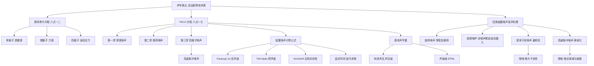
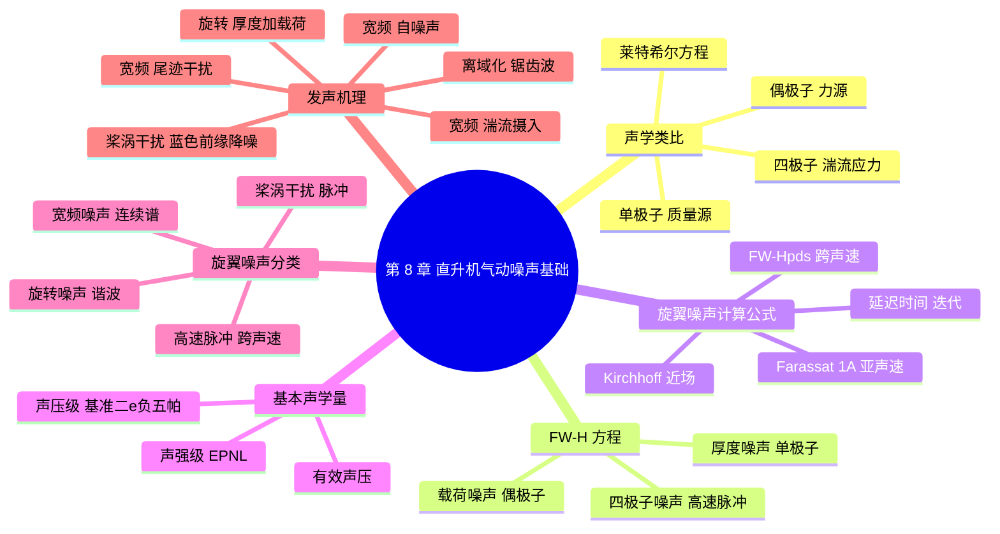

# 第 8 章 直升机气动噪声基础 · 思维导图

## 章节逻辑脉络

## 核心判断

1. FW-H 方程的三项与物理过程一一对应：质量流源项产生厚度噪声，表面力源项产生载荷噪声，湍流应力源项在高马赫数下表现为四极子噪声亦即高速脉冲噪声。
2. 旋转噪声是定常谐波噪声，由厚度与载荷叠加而成，悬停与前飞均出现；宽频噪声由桨叶表面随机湍流脉动力引起，是连续频谱。
3. 桨涡干扰噪声是直升机最刺耳的成分：桨尖涡与桨叶近距离干扰引起中高频脉冲载荷，强指向性，主要出现在下降等后倒角状态。
4. 高速脉冲噪声只在跨声速状态出现，本质是局部激波"离域化"辐射的锯齿波；当内外超声速区连通、离域马赫数被超过时噪声急剧上升。
5. 降噪思路由机理决定：桨涡干扰靠增大干扰角与减小涡强、干扰距离削弱；高速脉冲靠推迟离域马赫数、抑制激波远场辐射。

## 完整思维导图

[← 返回第 8 章正文](chapter8/README.md)
