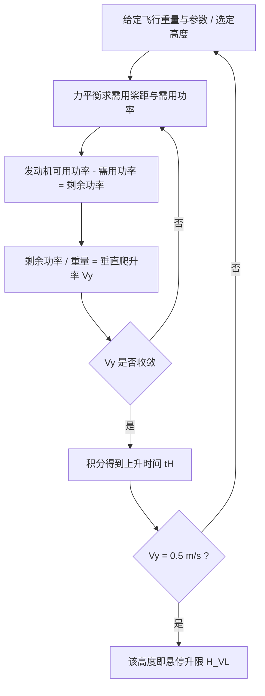

# 第 9 章 直升机飞行性能计算

> 对应原书书内 p205–p234。
> 本章是全书从"气动力分析"走向"整机性能预测"的转折：在前面旋翼空气动力学（叶素理论、涡流理论、滑流理论）已经能算出拉力与需用功率的前提下，本章把"力平衡"和"功率平衡"两条主线串起来，建立一套工程上实用的"功率法"，据此预测直升机的垂直上升、水平飞行速度范围、爬升、续航以及自转下滑等性能，并延伸到电动直升机的特殊处理。

## 本章导览

**一句话主线**：先建立力平衡（拉力要托住重量与废阻）→ 再建立功率平衡（可用功率要大于分解后的需用功率）→ 把"需用功率 = 诱导功率 + 型阻功率 + 废阻功率 + 爬升功率（ + 波阻功率）"随速度画出曲线，与发动机可用功率曲线求交点，交点就决定了速度范围、最大速度、升限、爬升率与航程航时。

**学习目标**

| # | 目标 | 对应小节 |
|---|---|---|
| 1 | 理解功率法的两条基本前提（力平衡、可用功率大于需用功率） | 9.1 |
| 2 | 掌握垂直飞行与前飞的力平衡关系，会用系数形式写出运动方程 | 9.2 |
| 3 | 了解废阻力的工程分解与估算方法 | 9.2.2 |
| 4 | 了解活塞式与涡轮轴式发动机的特性差异及高度/速度特性 | 9.3 |
| 5 | 掌握前飞需用功率的四项（五项）分解与随速度的变化规律 | 9.4 |
| 6 | 掌握垂直上升、水平速度边界、爬升、续航、自转的计算方法 | 9.5–9.9 |
| 7 | 了解电动直升机性能计算的简化特点 | 9.10 |

---

## 9.1 引言

直升机的飞行性能是用户向设计方提出使用技术要求的核心内容之一，涵盖面很广，本章只聚焦最基本的**垂直飞行性能**与**前飞性能**。

- 垂直飞行性能：悬停性能、最大垂直爬升速度、最短爬升时间、悬停升限等，主要由结构参数、旋翼运动参数与发动机性能决定。
- 前飞性能：平飞速度范围、斜向爬升性能、最大航程与最大航时、实用升限、自转下滑性能等，同样取决于结构、运动参数与发动机。

这些性能的计算比总体设计阶段"性能估算"要更详细、更精确；但最终数值仍须以系统试飞来确认。

本章统一采用**功率法**，其成立依赖两个基本前提：

1. 旋翼产生的拉力能够平衡重力与阻力；
2. 旋翼可用功率大于需用功率。

功率法的价值在于：只要旋翼的需用功率能够求出，就能通过"对比可用功率与需用功率"直接判断任意飞行状态是否可达，进而算出各项性能指标。

---

## 9.2 力平衡关系

性能计算的起点是"力要平衡"。根据功率法，定常飞行必须同时满足力平衡与功率平衡。本节先解决力平衡。

#### 9.2.1 垂直飞行过程中的力平衡关系

垂直飞行性能计算基于两条假设：

1. 把直升机当作**质点**，所有力作用于一点，暂不考虑力矩关系；
2. 假设运动**定常**，不考虑速度变化的加速过程。

定常垂直上升（或悬停）时，作用在直升机上的力全部沿铅垂方向，共三种：

- 旋翼拉力 $T$：向上，由旋翼旋转产生，是垂直上升和悬停的根本动力；
- 直升机重力 $G$：向下，$G = mg$；
- 气动阻力 $F_D$：向下，是相对机身向下的气流（旋翼下洗）流过机身等部件产生的阻力。

三者平衡关系为：

$$T = G + F_D$$

写成无量纲的系数形式：

$$C_T = C_G + C_D$$

其中废阻系数 $C_D$ 由各无升力部件叠加得到：

$$C_D = \frac{\sum C_{D,i} S_i}{\frac{1}{2}\rho V^2 \, S_{\text{disk}}}$$

由于旋翼下洗速度沿桨盘分布不均，机身各部位的迎风阻力应分别按各自相对气流速度计算，机体处诱导速度常近似取 $1.6\,v_i$。在诱导速度与爬升率算清之前，各部位吹风速度未知，工程上用**垂直吹风增重系数** $K_{VB}$ 把下洗流对机身的影响折算到全机废阻上：

$$G + F_D = K_{VB}\,G$$

通常 $K_{VB}$ 取 $1.02 \sim 1.05$，$p$ 为桨盘载荷。由需用拉力 $T$ 与旋翼参数，可经涡流理论算出诱导速度分布，并由滑流理论得到等效诱导速度，进而求得旋翼需用桨距角。

#### 9.2.2 常规飞行过程中的力平衡关系

直升机以航迹角 $\phi$ 做定常直线飞行时，取纵向平面内的力（前飞时旋翼与机身相互干扰较小，可忽略）。沿航迹方向（即飞行速度方向）与法线方向的力平衡为：

$$T\sin(-\alpha_s) - H_s\cos(-\alpha_s) - F_D - G\sin\phi = 0$$

$$T\cos(-\alpha_s) + H_s\sin(-\alpha_s) - G\cos\phi = 0$$

式中 $F_D$ 是除旋翼桨叶外"无升力其他部件"的空气阻力（主要是机身、桨毂、起落架的阻力），称为**废阻力**。将其写成系数形式：

$$C_T\sin(-\alpha_s) - C_H\cos(-\alpha_s) = C_D + C_G\sin\phi$$

$$C_T\cos(-\alpha_s) + C_H\sin(-\alpha_s) = C_G\cos\phi$$

由上式消去固定的重量系数 $C_G$，可得旋翼迎角与 $\dfrac{C_T}{\sigma}\cos\phi$、$\dfrac{C_H}{\sigma}$ 的关系。当 $\phi=0$（水平飞行）时近似有：

$$\frac{C_T}{\sigma}(-\alpha_s) \approx \frac{C_G}{\sigma}\frac{C_G}{C_T} + \frac{C_H}{\sigma}$$

作为初步近似，令旋翼迎角 $\alpha_s = 0$ 处的废阻力值即可，不致带来明显误差。后向力系数 $C_H$ 可用简单近似式估算：

$$\frac{C_H}{\sigma} \approx 1.1\,\frac{C_T}{\sigma}\mu$$

代入得平飞旋翼迎角的近似公式，并可进一步计算机身迎角 $\alpha_{\text{机身}} = \alpha_s + \delta_{sj}$（$\delta_{sj}$ 为旋翼轴前倾角）。

##### 废阻力的工程估算

直升机废阻力对最大飞行速度影响显著，近代直升机减小废阻（改善机身气动外形、给桨毂与起落架加整流罩、采用收放式起落架）正是为了提高速度。多数直升机 $\Sigma C_{D,i}S_i$ 在 $0.008\sim0.012$ 附近。废阻力按部件分类估算：

1. **流线型部件**（机身、发动机短舱、桨柱、尾面、短翼等）：阻力以附面层摩擦阻力为主，

   $$C_{D,i} = C_{Df}(1+k_3)I_c$$

   其中 $C_{Df}$ 为平板紊流摩擦阻力系数（取决于雷诺数 $Re$ 与表面粗糙度），$k_3$ 为三维系数（取决于 $L/D$），$I_c$ 计入部件间干扰，取不小于 $1.2$。考虑到外廓不平整与气流渗漏，算得的阻力系数再增大约 $20\%$。

   

   

2. **起落架**：不收放无整流罩轮式起落架阻力约占全机废阻 $25\%$，以压差阻力为主，

   $$C_{D,i} = C_{Dp}\,I_c$$

   其中 $I_c\approx1.25$，$C_{Dp}$ 对迎风平板取 $1.20$、柱形构件取 $0.3\sim0.5$、机轮取 $0.3$。撬式起落架废阻约为轮式的 $60\%$。

   

3. **桨毂**：尺寸虽小但气动外形差、靠近桨轴与机身且处于旋转中，干扰大，阻力约占全机废阻 $25\%$。铰接式旋翼桨毂结构复杂、尺寸较大，阻力高于无铰旋翼；加整流罩可降低废阻，但增重、增造价、不便维护。

   

4. **其他废阻力**：以上各项约占全机废阻 $90\%$。剩余部分用两类方法估计：机体突出物（鼓包、天线、灯、风门等）把已算总阻力再增 $5\%\sim10\%$；流经散热器、减速器、发动机的冷却空气的动量损失，其等效阻力系数与发动机可用功率成正比。

---

## 9.3 直升机发动机特性

以机械方式驱动旋翼的航空发动机分两类：**活塞式**与**涡轮轴式**。早期直升机（如直-5）多用活塞式，当代（如直-10、直-20）大多采用涡轮轴式。

#### 9.3.1 活塞式发动机的特性

- **优点**：单位耗油率低（单位 $\text{kg/(h·kW)}$），即每小时每千瓦耗油少。
- **缺点**：重量功率比（重量马力比）大；厂家习惯用轴马力 SHP 作功率单位（轴功率 = 扭矩 × 角速度）。
- **常用功率档位**：额定功率（设计规定值）、最大功率（可短时超载约 $110\%$）、巡航功率（耗油最低、约 $80\%$ 额定、可长期运转）。
- **高度特性**：空气密度随高度减小，出轴功率降低；带增压器的高空发动机在设计高度以下用恒压调节器保持进气压力恒定，功率基本不变，设计高度以上才随高度迅速下降。高度特性系数定义为不同高度出轴功率与海平面之比：

  $$\Lambda = \frac{P_M(H)}{P_{M0}} = f(H)$$

  活塞式发动机的 $\Lambda$ 随高度下降比大气相对密度 $\rho/\rho_0$ 略快（因摩擦功率不随高度改变）。
- **速度特性**：飞行速度起增压作用，但直升机速度低，速度增压带来的好处一般不明显。

#### 9.3.2 涡轮轴式发动机的特性

涡轮轴式分**定轴涡轮**（功率输出轴即燃气发生器旋转轴）与**自由涡轮**（功率轴由自由涡轮引出，与燃气发生器无机械联系）。自由涡轮式对直升机更有利：旋翼转速改变时功率降低很少，且扭矩特性对旋翼调节起稳定作用（转速偶然减小，发动机自动增大扭矩恢复平衡）。

- 与活塞式相比：单位耗油率约为活塞式的 $1.5$ 倍，但重量功率比约为活塞式的 $1/3$。
- 涡轮轴式在接近额定功率时耗油率最低，故宜装两台或以上以适应不同功率需求。
- **高度特性**：与"非高空"活塞式相似，随高度增加空气密度减小、出轴功率降低，但其功率下降比 $\rho/\rho_0$ 略慢（优于活塞式）；额定/额定转速对应其巡航状态。
- 所有特性曲线均对标准大气而言；大气温度影响极重要——温度升高时输出功率近乎直线下降。

---

## 9.4 功率平衡关系

力平衡只保证"拉得住"，功率平衡才保证"推得动"。定常飞行时旋翼可用功率须与需用功率（诱导、型阻、爬升、波阻等）保持相等。

可用功率由发动机出轴功率扣除尾桨、传动、冷却、液压、发电机及附件消耗得到，初步计算用功率传递系数 $\eta$：

$$P_{\text{avail}} = \eta\,P_M$$

垂直飞行时 $\eta \approx 0.78\sim0.85$，依发动机类型与设计特点而变。

#### 9.4.1 垂直飞行过程中的功率平衡关系

粗略估算时假定尾桨等其他损失、旋翼型阻功率与需用拉力不随爬升率变化（等于悬停值），则旋翼可用功率与型阻功率之差用于产生垂向速度。写成功率系数形式后，可由无量纲中间变量 $f_v$ 查得等效垂向速度与垂向速度 $V_y$。

#### 9.4.2 前飞过程中的功率平衡关系

将前飞力平衡方程沿速度方向乘 $V_0$ 得：

$$C_T(-\lambda_0) - C_H\mu = C_{D,\text{body}}\mu^3 + C_G\mu^2$$

其左端与叶素理论的旋翼需用功率公式后两项一致，物理意义清晰。前飞需用功率分解为：

- **废阻功率系数**：$C_{P,f} = C_{D,\text{body}}\mu^3 = \left(\sum C_{D,i}S_i\right)\mu^3$
- **爬升功率系数**：$C_{P,c} = C_G V_y$
- **波阻功率系数** $C_{P,b}$：当翼型迎面气流速度超过临界马赫数、出现局部激波后阻力剧增，按 $\psi=90^\circ$ 叶尖处 $M_a$ 超出 $M_{a,\text{DD}}$ 的量 $\Delta M_a$ 由翼型曲线查得波阻，再折算为 $C_{P,b}$。

平飞时爬升功率为零，若把波阻并入型阻，则平飞需用功率系数为：

$$C_{P,\text{req}} = C_{P,d} + C_{P,p} + C_{P,f}$$

其中：

- **诱导功率系数**：$C_{P,d} = C_T\lambda_d = C_T\lambda_{i0}\,\kappa_0(1+3\mu^2)$
- **型阻功率系数**：$C_{P,p} = C_{P0}(1+5\mu^2)$

各项随平飞速度的变化规律：

- 型阻功率随速度略增（体现在 $1+5\mu^2$ 中）；大速度时因前行桨叶激波、后行桨叶气流分离而显著增大。
- 诱导功率近似随平飞速度反比下降（拉力≈重量，修正系数 $\kappa = \kappa_0(1+3\mu^2)$ 变化不大）。
- 废阻功率随速度**立方**迅速增大；高速时机身低头姿态使废阻系数比巡航时更大。

三者之和即平飞需用功率。悬停时需用功率最大，诱导功率占 $70\%$ 以上；某中速处总功率最小（诱导、型阻各约占 $40\%$），是巡逻、待机的经济速度；大速度时废阻功率占 $40\%$ 以上、型阻 $35\%\sim40\%$、诱导仅 $15\%\sim20\%$。

随高度变化：密度减小使诱导速度须增大以保持拉力，诱导功率上升；废阻功率同比下降；型阻功率因桨距不断加大可能在大速度时反升。综合结果是——低速飞行功率随高度增大，中速减小，高速增大。

---

## 9.5 垂直上升性能

垂直飞行是直升机的特点之一，其垂直上升性能包括：① 垂直上升速度；② 悬停升限 $H_{VL}$（上升的极限高度）；③ 上升时间 $t_H$。计算中还常求出各高度对应的旋翼总距。

基本方法仍是功率法：给定飞行重量与已知参数，对不同高度由力平衡算出需用桨距与全机需用功率，由发动机可用功率算出**剩余功率**，剩余功率与重量之比即垂直爬升率 $V_y$，再积分得爬升时间，并得悬停升限。由于诱导速度、桨距、机体阻力都是爬升率的函数，计算过程含迭代。

随高度升高，发动机可用功率大幅下降，爬升率随之大幅减小；取 $V_y = 0.5\ \text{m/s}$ 对应的高度为**悬停升限**（理论极限 $V_y=0$ 的高度直升机一般飞不到）。上升时间表达式为：

$$t_H = \int_0^H \frac{dH}{V_y}$$

---

## 9.6 水平飞行速度限制

水平飞行速度并非越大越好，它同时受到**功率**与**气动失速/激波**两类约束。

#### 9.6.1 功率约束下的水平飞行速度

在某一计算高度的平飞需用功率曲线上，叠加上该高度发动机能输送给旋翼的可用功率曲线，两曲线的交点即功率平衡所确定的平飞极限速度。注意发动机出轴功率经尾桨、冷却、附件与传动损失后，只有一部分到达旋翼——用功率传递系数 $\eta$（前飞中随速度变化）。单旋翼带尾桨式直升机的 $\eta$ 典型曲线可供初算采用。

旋翼可用功率系数为：

$$C_{P,\text{avail}} = \frac{\eta\,P_M}{\rho\pi R^2(\Omega R)^3}$$

备齐修正系数 $\kappa_0, K_{p0}, K_{T0}, \kappa$ 与全机废阻系数后，按平飞计算流程得到各高度的极限速度。把各高度的最大/最小平飞速度连成**平飞速度曲线图**：

- 曲线与纵坐标交点即悬停升限；其下可悬停与垂直上升，其上空只能在前飞速度范围内（平飞速度功率限制）爬升。
- 曲线最高点即**理论动升限**，该高度上只能以固定速度平飞。

#### 9.6.2 失速和激波对最大飞行速度的限制

最大速度不仅受功率限制，还受后行桨叶气流分离（失速）与前行桨叶激波的限制。

- **失速限制**：气流分离最先出现在 $\psi=270^\circ$ 叶尖附近并随速度扩展，导致操纵系统交变载荷剧增、振动与操稳恶化，甚至失速颤振。工程上多依赖试飞或风洞试验按动载荷/根部弯矩判定；粗略估算用"容许失速区扩至 $\psi=270^\circ$、$r/R=0.7$"的判据：

  $$C_L(0.7,270) \le C_{L,\max}$$

  由涡流理论：

  $$C_L(0.7,270) = C_{L7}\,\frac{1+\mu}{1-\mu}$$

  故失速限定最大升力系数 $(C_{L7})_{\max} = C_{L,\max}\dfrac{1-\mu}{1+\mu}$；高速时简化为 $(C_{L7})_{\max}\approx C_{L,\max}/(1+4\mu)$。

- **激波限制**：前进桨叶 $\psi=90^\circ$、$r=0.7$ 处出现激波即视为极限，力矩突变使操纵性变坏、振动增大：

  $$0.7\Omega R + V_0\cos\alpha_s = M_{a,\text{cr}}\,a$$

  改写为：

  $$\mu_{\text{cr}} = \frac{M_{a,\text{cr}}}{V_{\text{tip}}/a} - 0.7$$

  其中 $M_{a,\text{cr}}$ 由翼型实验给出，且与 $C_L$ 相关；相应临界升力系数 $(C_{L7})_{\text{cr}}$ 由类似关系求得。

将失速与激波限制的最大速度边界叠加到功率限制得到的平飞速度曲线上，三条曲线围出直升机的**平飞速度包线**，限定了可达到的高度—速度范围。若旋翼设计较差，功率允许的飞行范围会被气流分离或激波大量削去，可用功率不能充分利用。

---

## 9.7 爬升性能计算

斜向爬升性能指不同高度下带前进速度时的最大爬升率 $V_y$ 与到达各高度的爬升时间 $t$，同时给出对应最大爬升率的前进速度及可能爬升的最大高度（平飞升限/动升限）。

计算在平飞性能基础上进行：随平飞速度增大，平飞需用功率先降后升，在最低点处剩余功率最大：

$$C_{P,\text{sur}} = C_{P,\text{avail}} - C_{P,\min}$$

实际上剩余功率并非严格等于爬升功率——平飞与爬升的旋翼/机身迎角、速度分布不同，废阻、诱导、型阻功率皆有差别。近似引入爬升修正系数 $K_{ps}$：

$$V_y = K_{ps}\,V_{y,\max}$$

单旋翼直升机 $K_{ps}\approx0.8\sim0.9$，多数机在平飞最小功率对应速度 $120\sim160\ \text{km/h}$ 处宜取 $0.85$。精确计算可用逐次近似：以式得 $V_y$ 初值，重算航迹角、气流速度、诱导功率、机身迎角与废阻功率，求 $V_y$ 二次近似，直至相邻两次差小于约 $0.1\ \text{m/s}$。

由各高度 $V_y$ 作 $H\text{–}V_y$ 曲线，即得最大爬升率边界；曲线最高点（$V_y=0$）为理论动升限，取 $V_y=0.5\ \text{m/s}$ 为**实用升限**。爬升时间：

$$t = \int \frac{dH}{V_y}$$

两点提醒：① 爬升到实用升限耗时长（几十分钟），应计入燃油消耗引起的重量变化；② 更精确的最大剩余功率点出现在"最大可用功率曲线平行线与需用功率曲线的切点"，可能略高于平飞最小功率速度（涡轮轴发动机有速度冲压使可用功率随速度增大）。

---

## 9.8 续航性能计算

续航性能包括**航时**（续航时间）与**航程**，是主要技术指标，也是确定燃油量的依据。它取决于可用燃油量与单位时间（或单位距离）油耗。

小时耗油量 $q_h$ 为飞行 $1\ \text{h}$ 的耗油量，由发动机特性：

$$q_h = C_e\,P_M$$

千米耗油量 $q_{km}$ 为飞行 $1\ \text{km}$ 的耗油量，与速度 $V$ 的关系：

$$q_{km} = \frac{q_h}{V} = \frac{C_e\,P_{\text{req}}}{V}$$

巡航中燃油消耗使重量变化明显，飞行重量取平均值：

$$G_{\text{ave}} = G - \frac{1}{2}G_{\text{fuel}}$$

可燃油量须扣除起飞、爬升、下降各阶段油耗、应急储备与油箱死油（估算时常扣 $30\ \text{min}$ 巡航油耗或总油量 $10\%\sim15\%$）。假定巡航功率不变，航时与航程为：

$$t = \frac{e\,G_{\text{fuel}}}{C_e\,P_{\text{eq}}}$$

$$L = \frac{e\,G_{\text{fuel}}}{C_e\,(P_{\text{eq}}/V)}$$

其中 $e$ 为燃油利用率，$P_{\text{eq}}$ 为巡航旋翼需用功率。

- **最大航时**（最久留空）：在 $C_e$ 不随速度变的近似下，取需用功率最小的平飞速度飞行，对应**经济速度**：

  $$t_{\max} = \frac{e\,G_{\text{fuel}}}{C_e\,P_{\text{req,min}}}$$

- **最大航程**（最远飞行）：取 $(P_{\text{req}}/V)$ 最小点，即在平飞需用功率曲线上由原点作切线、切点对应**有利速度**：

  $$L_{\max} = \frac{e\,G_{\text{fuel}}}{C_e\,(P_{\text{req}}/V)_{\min}}$$

由于需用功率与单位耗油率都随速度变化，实际 $t_{\max}$、$L_{\max}$ 应分别对应 $q_h$ 最小、$q_{km}$ 最小的状态，须据 $q_h\text{–}V$ 与 $q_{km}\text{–}V$ 曲线的最低点计算，并对最大航程速度校核失速、激波与结构限制。

---

## 9.9 自转性能计算

发动机空中停车后，若迅速减小桨距并适当操纵，直升机可进入定常自转下滑：发动机不供功率，下降损失位能，旋翼从下降相对来流获能，抵偿自身型阻、诱导与废阻功率，保持稳定旋转并产生拉力，维持自转下滑；接近地面几十米时瞬时增距使拉力突增、减小下降率，实现安全着陆。研究自转着眼于安全着陆的极限——最小下降率与最小下滑角。

自转下滑的力平衡与常规前飞式（旋翼迎角表达式）相同，只是航迹角 $\phi<0$、构造迎角 $\alpha_s>0$。功率平衡为：

$$P_{\text{req}} = (P_d + P_p + P_f) + P_{ps}$$

其中 $P_{ps}$ 为自转中须输出约 $5\%$ 功率带转尾桨及附件。由此下降率：

$$V_y = -1.05\times\frac{P_{\text{req}}}{G}$$

利用平飞 $P_{\text{req}}\text{–}V$ 曲线，可由上式做出自转下滑性能曲线。结论是：**最小下降率对应平飞的经济速度**（空中停留最久），**最小下滑角对应平飞的有利速度**（下滑距离最远）——飞行员应按着陆点情况选择状态。不同高度需用功率略有差异，$V_{y,\min}$ 随高度略有变化。

---

## 9.10 电动直升机

电动机相比涡轴与活塞发动机具有噪声小、效率高、节能环保等优点。当前全电直升机研究多集中于小型电动无人直升机（载荷常不足 $20\ \text{kg}$、续航低于 $30\ \text{min}$）；样机如西科斯基"萤火虫"、法国 Volta 等续航已突破 $30\ \text{min}$。大功率载人电动直升机仍处样机阶段。

全电直升机性能计算与传统动力类似，但高度对电动机参数影响小，可简化。续航时间：

$$T = \frac{A_E\,B_E\,G_B}{P_{Br}}$$

其中 $A_E$ 为电池比能量温度特性系数，$B_E$ 为常温比能量（$\text{W·h/kg}$），$G_B$ 为电池重量，$P_{Br}$ 为某高度电池输出功率。单位需用功率与电池输出功率关系：

$$P_{Br} = \zeta\,G\,P_{\text{req}}$$

$\zeta$ 为功率利用系数，$P_{\text{req}}$ 为单位需用功率（$\text{W/N}$）。于是最大续航时间：

$$T_{\max} = \frac{A_E\,B_E\,G_B}{\zeta\,G\,P_{\text{req,min}}}$$

最大航程同样由 $(P_{\text{req}}/V)_{\min}$ 决定：

$$L_{\max} = \frac{A_E\,B_E\,G_B}{\zeta\,G\,(P_{\text{req}}/V)_{\min}}$$

悬停升限按电池可用功率与悬停单位需用功率的功率平衡确定；垂直爬升速度由电池可用功率扣除悬停需用功率后求得，并需修正（含悬停诱导速度项），$V_{y2}=0.5\ \text{m/s}$ 对应高度即悬停升限。最大爬升率与最大飞行速度主要取决于电动系统特性。

**关键结论**：电池材料是决定全电直升机基本飞行性能的因素之一。当前多采用氢燃料电池、锂聚合物蓄电池等——氢燃料电池能量密度高、续航好但成本高；锂电池功率密度高、爬升好但能量密度低、续航差。现有电池能量密度约 $200\sim400\ \text{W·h/kg}$，部分锂聚合物理论值可达 $2500\sim3500\ \text{W·h/kg}$，若能实现，全电直升机适用性将大幅提升。

---

## 9.11 习题

1. 直升机一般使用什么发动机？简要描述其高度特性与速度特性，并对比推重比（重量功率比）与单位耗油率。
2. 从气动力与飞行性能等方面简要描述地面效应对直升机的影响。
3. 简要描述前飞需用功率曲线的形状，并说明不同阶段主要功率的占比。
4. 在已知需用功率曲线的情况下，如何得到不同高度功率限制的最大/最小飞行速度？并说明悬停升限与实用斜爬升升限的判断标准。
5. 前飞过程中机身废阻力一般包含哪些部分，各部分约占多少比例？
6. 简述已知前飞需用功率曲线时，如何获取前飞的经济速度与有利速度。
7. 某直升机重量 $G=7000\ \text{kg}$，旋翼直径 $D=21\ \text{m}$，转速 $n=180\ \text{r/min}$，实度 $\sigma=0.051$，在 $H=1000\ \text{m}$ 以巡航速度 $V=120\ \text{km/h}$ 平飞，近似取 $\mu=0.2$，废阻系数 $\Sigma C_{D,i}S_i=0.01$，旋翼轴前倾角 $\delta_{sj}=5^\circ$。求：(a) 废阻力与废阻功率；(b) 旋翼迎角 $\alpha_s$；(c) 机身迎角 $\alpha_{\text{机身}}$，并分析旋翼轴前倾安装的好处。

**整理者补充的追问**

- 功率法把"可用功率 = 需用功率"作为平衡条件，那么当可用功率曲线与平飞需用功率曲线在左侧没有交点时，物理上说明直升机在该高度失去了什么能力？
- 升限有"悬停升限（$V_y=0.5$）"与"理论/实用动升限"两种判据，它们分别对应哪一类飞行状态，为什么不用同一个 $V_y$ 阈值？
- 电动直升机的最大航时、航程公式在形式上与传统直升机几乎一致，差别只在于"可用功率来源"，那么电池相比燃油真正改变的性能约束是什么？

---

## 本章小结

1. **两条主线**：从"力平衡"（拉力托住重量与废阻）推进到"功率平衡"（可用功率覆盖分解后的需用功率），功率法由此统一处理各类性能。
2. **力平衡**：垂直飞行 $T=G+F_D$；前飞有航迹方向与法线方向两组方程，废阻力由流线型部件、起落架、桨毂及其他突出物/冷却流叠加，约占全机废阻的 $90\%$ 可由前三类估算。
3. **需用功率分解**：平飞需用功率 = 诱导 + 型阻 + 废阻（爬升功率在平飞为零，波阻并入型阻）；诱导功率随速度反比下降、型阻功率略增、废阻功率随速度立方上升，三者共同决定需用功率曲线"先降后升"的形状。
4. **速度边界**：平飞需用功率曲线与发动机可用功率曲线交点给出功率约束的极限速度；再叠加后行桨叶失速与前行桨叶激波限制，得到高度—速度包线。最大速度受"功率 + 失速 + 激波"三重约束。
5. **升限与爬升**：垂直上升取 $V_y=0.5\ \text{m/s}$ 为悬停升限；斜向爬升用剩余功率乘修正系数 $K_{ps}$ 得爬升率，取 $V_y=0.5$ 为实用动升限，积分得爬升时间。
6. **续航**：航时最长对应经济速度（需用功率最小），航程最远对应有利速度（$(P_{\text{req}}/V)$ 最小），二者来源于 $t=\dfrac{eG_{\text{fuel}}}{C_eP_{\text{eq}}}$ 与 $L=\dfrac{eG_{\text{fuel}}}{C_e(P_{\text{eq}}/V)}$ 的极值条件。
7. **自转**：发动机停车后靠下降位能驱动旋翼自转，下降率 $V_y\approx-1.05\,P_{\text{req}}/G$；最小下降率与经济速度对应、最小下滑角与有利速度对应。
8. **电动化**：性能公式与传统一致，但可用功率来自电池，电池比能量/比功率与温度是决定性约束，能量密度是当前瓶颈。

[查看本章思维导图 →](chapter9/mindmap.md)
