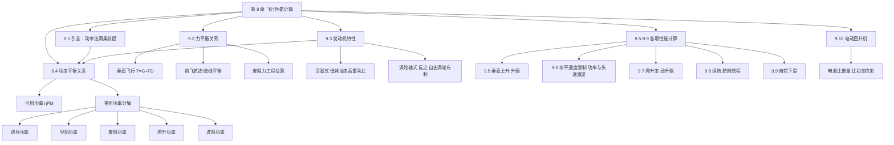
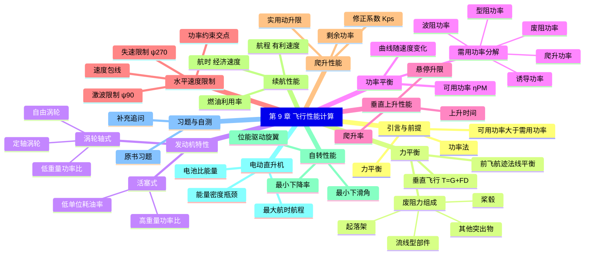

# 第 9 章 直升机飞行性能计算 · 思维导图

> 本章以"功率法"为核心，把旋翼空气动力学算出的拉力与需用功率，通过力平衡与功率平衡两条主线，转化为可预测的垂直上升、水平速度范围、爬升、续航与自转等整机性能。

## 章节逻辑脉络

## 核心判断

- 判断一：性能计算的抓手是"需用功率曲线 vs 可用功率曲线"的交点，交点决定速度范围的上下边界。
- 判断二：平飞需用功率曲线呈"先降后升"，最低点对应经济速度，原点切线切点对应有利速度。
- 判断三：最大速度同时受三重约束——功率、后行桨叶失速、前行桨叶激波，三者包络出高度—速度包线。
- 判断四：升限有两套判据——垂直方向的悬停升限取 $V_y=0.5\ \text{m/s}$，斜向的实用动升限也取 $V_y=0.5\ \text{m/s}$，但对应不同飞行状态。
- 判断五：自转下滑靠下降位能驱动旋翼，最小下降率与经济速度对应、最小下滑角与有利速度对应；电动化仅把可用功率来源换成电池，能量密度是瓶颈。

## 完整思维导图

[← 返回第 9 章正文](chapter9/README.md)
